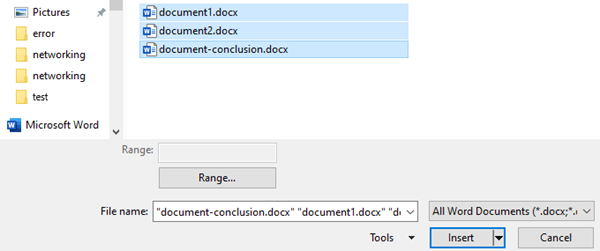

# How to merge multiple Word documents into one

[!INCLUDE [Branding name note](../../../includes/branding-name-note.md)]

If you need to cope with Word documents often during work, merger of multiple Word documents into one might be required sometimes. You can copy and paste the content directly when the info quantity is small. But what if it isn't that case?

> [!NOTE]
> The following method applies both to Word 2010 and Word 2007. Attention required: Formats will not be necessarily remained when you merge the documents. Please be careful of that.

1. Select the **Insert** tab to subtly merge documents.

   

2. Select **Object**, press a small triangle next to it, and then select **Text from File** from the dropdown menu.

   :::image type="content" source="./media/merge-word-documents/text-from-file.png" alt-text="Screenshot of the Text from File option.":::

3. After that, you can select files to be merged into the current document. By pressing and holding **Ctrl** to select more than one document.

    > [!NOTE]
    > Documents placed at the top will be merged in the first place. Therefore, please sort and number each target document in case that you want to keep a certain sequence for your documents.

   

If it doesn't work all the same, you can dig the [Forum](https://answers.microsoft.com/default.aspx) to see if any solution can be best for you.
