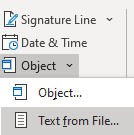

# How to merge multiple Word documents into one

[!INCLUDE [Branding name note](../../../includes/branding-name-note.md)]

If you need to cope with Word documents quite often during work, merger of multiple Word documents into one might be required sometimes. You can copy and paste the content directly when the info quantity is not large. But what if it is not that case?

**Insert** tab allows you to subtly merge documents.

Locate **Object**, press a small triangle next to it, and click **Text from File** from the dropdown menu.

After that, you can select files to be merged into the current document. By pressing and holding **Ctrl** to select more than one document.

> [!NOTE]
> Documents placed at the top will be merged in the first place. Therefore, please sort and number each target document in case that you want to keep a certain sequence for your documents.

This method applies both to Word 2010 and Word 2007. Attention required: Formats will not be necessarily remained when you merging the documents. Please be careful of that.

If it does not work all the same, you are suggested to dig the [Forum](https://answers.microsoft.com/default.aspx) to see if any solution can be best for you.

## We welcome all of your comments and suggestions

After your experience of EeeKB, if time allows, pls score this article in the feedback table at the page bottom. We will appreciate your help for our improvement. Any recommendation or good thoughts will be welcomed in "Additional Comments". (For faster solution to your problem, technical queries could be put into discussion in appropriate posts at the Microsoft Community)
