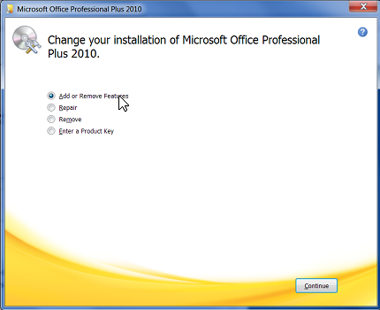
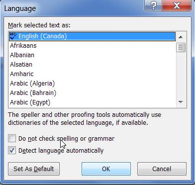

# Spell Check not working in Word 2010

[!INCLUDE [Branding name note](../../../includes/branding-name-note.md)]

## Symptoms

### Symptom 1

Spell Checker does not recognize misspelled words in Word 2010.

### Symptom 2

When you click the **Spelling & Grammar** button in the **Proofing** group on the **Review** tab in Word 2010, you receive one of the following messages: 

- The spelling and grammar check is complete.
- Proofing Tools are not installed for **default language**, try re-installing proofing tools.

## Cause

This might occur for any one of the following reasons:

- Proofing tools are not installed.
- The Speller EN-US add-in is disabled.
- The **Do not check spelling or grammar** check box is selected.
- Another language is set as default.
- The following subkey exists in the registry:**HKEY_CURRENT_USER\Software\Microsoft\Shared Tools\ProofingTools\1.0\Override\en-US**   
## Resolution

To resolve this problem, complete the methods that are provided in this article in the order in which they are presented. If you have previously tried one of these methods, and it did not help to resolve the problem, you can skip that method and proceed to the next one.

### Method 1: Install proofing tools  

To install the proofing tools, follow these steps:

1. Exit all programs.
2. Click **Start**, and then click **Control Panel**.
3. Follow the appropriate step for your operating system:  
   - In Windows 7, click **Uninstall a program** under **Programs**.
   - In Windows Vista, double-click **Programs and Features**.
   - In earlier versions of Windows, double-click **Add or Remove Programs**.

4. Click **Microsoft Office **Edition****, and then click **Change**.

    > [!NOTE]
    > In this step and in the following step, the placeholder **Edition **represents the Microsoft Office edition that is installed on the computer.
5. In the **Microsoft Office **Edition**** dialog box, click **Add or Remove Features**, and then click **Continue**.

    

6. Expand **Office Shared Features**, click the icon to the left of **Proofing Tools**, and then click **Run all from My Computer**.

    

### Method 2: Enable the speller EN-US add-in  
 
To enable the add-in, follow these steps:
 
1. Click the **File** tab, and then click **Options**.
2. On the left, click **Add-Ins**.
3. At the bottom of the **Word Options** dialog box, click the drop-down arrow under **Manage**, change the selection from **COM Add-ins** to **Disabled items**, and then click **Go**.

   :::image type="content" source="media/not-recognize-mispespelled-words-in-word/disabled-items.png" alt-text="Screenshot of selecting Disabled items in the Manage field.":::

4. In the **Disabled Items** dialog box, check whether **Speller EN-US (nlsdata0009.dll)** is available in the **Select the ones you which to re-enable** box.
5. If **Speller EN-US (nlsdata0009.dll)** is listed, click it, and then click **Enable**.
6. Click **Close**, and then click **OK**. 

### Method 3: Enable Check Spelling as you type  
 
To enable spell check as you type, follow these steps:
 
1. Click the **File** tab, and then click **Options**.
2. In the **Word Options** dialog box, click **Proofing**.
3. Make sure that the **Check spelling as you type** check box is selected in the **When correcting spelling and grammar in Word** section.

   :::image type="content" source="media/not-recognize-mispespelled-words-in-word/check-spelling.png" alt-text="Screenshot of selecting Check spelling as you type.":::

4. Make sure that all check boxes are cleared in the **Exception for** section.

   :::image type="content" source="media/not-recognize-mispespelled-words-in-word/cleared-boxes.png" alt-text="Screenshot of all check boxes cleared in the Exception for section.":::

5. Click **OK**.

### Method 4: Select language and clear "Do not check spelling or grammar"  
 
To clear the "Do not check spelling or grammar check box, follow these steps:
 
1. Select the entire contents of the document.
2. On the **Review** tab, click **Language** in the **Language** group, and then click **Set Proofing Language**.
3. In the **Language** dialog box, select the language that you want.
4. If the **Do not check spelling or grammar** check box is selected, click to clear the check box.

    
5. Click **OK**.

    

    > [!NOTE]
    > If this method fixes the problem, repeat steps 1 through 3 to reopen to the **Language** dialog box, and then click **Set As Default**

### Method 5: Modify the registry  

> [!IMPORTANT]
> This article contains information about how to modify the registry. Make sure that you back up the registry before you modify it. Make sure that you know how to restore the registry if a problem occurs.

To fix this problem yourself, follow these steps:

1. Click **Start**, and then click **Run**.
2. In the Run box, type regedit, and then press Enter.
3. Locate and then right-click the following registry subkey:

    **HKEY_CURRENT_USER\Software\Microsoft\Shared Tools\Proofing Tools\1.0\Override**
1. Click **Delete**.
1. Exit Registry Editor.
1. Exit and then restart Word.

## More information

If none of the methods in this article resolve the problem, try the following:

Remove and then restore the battery at the bottom of the laptop. If the problem persists, replace the battery.

This problem has been reported only on the following Dell laptops:

- Inspiron 1501
- Vostro 1000
