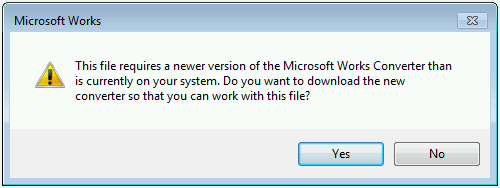

# "Do you want to download the new converter?" error when you try to open a .wps file in Word

## Symptoms

Microsoft Office no longer includes the Microsoft Works Converter when it ships. If you try to open a Works word processor file (.wps) in Microsoft Word, Word tries to read the file as a text file. If you upgraded from an earlier version of Word, you may still have the .wps file format in the list of available files that you can open. However, Word no longer opens these files.

When this issue occurs, you receive the following error message:

```adoc
This file requires a newer version of the Microsoft Works Converter than is currently on your system. Do you want to download the new converter so that you can work with this file?
```



## Cause

This issue occurs because Works Converter is discontinued and is no longer available.

## Workaround

If you have to convert files that are in the .wps format to Microsoft Word format, you can use the Microsoft Office 2010 version of Word.

## More Information

The Microsoft Download Center page for Microsoft Works is no longer available.

Office 2010 was the last version of Office that included Works Converter.
