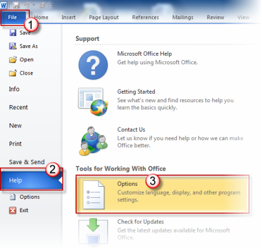
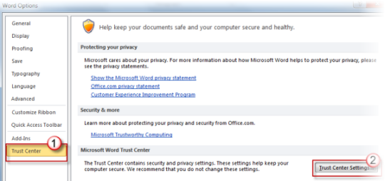
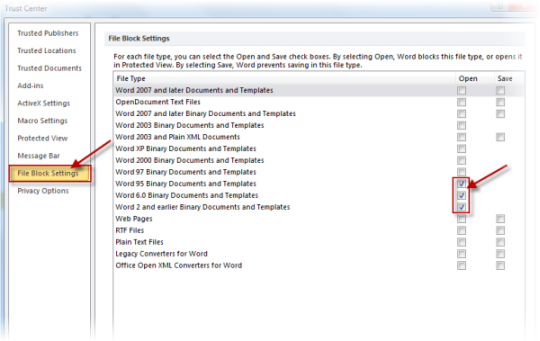

# Opening a file is blocked by your registry policy setting or File Block settings in Word

[!INCLUDE [Branding name note](../../../includes/branding-name-note.md)]

##  Symptoms

Error messages you may receive when you open a file in Microsoft Word. 

Error message 1

> You are attempting to open a file type that is blocked by your registry policy setting.

Error message 2

> You are attempting to open a file that was created in an earlier version of Microsoft Office. This file type is blocked from opening in this version by your registry policy setting.

Error message 3

> You are attempting to open a file type File_Type that has been blocked by your File Block settings in the Trust Center.

##  Resolution

To fix this issue, disable the restriction on opening documents of certain types.

### Method 1: Disable the restriction by yourself

**Word 2013 and Word 2010**
 
1. Click the **File** tab.    
2. Under **Help**, click **Options**.

   
1. Click **Trust Center**, and then click **Trust Center Settings**.

       
4. In the **Trust Center**, click **File Block Settings**.    
5. To enable the opening of a file that is blocked, clear the check box for that file type.
 

6. Click **OK** two times.    

**Word 2007** 

To disable this restriction in Word 2007, change the value of the FileOpenBlock subkey.   
To disable or enable the file restriction yourself, follow these steps: 
 
1. Exit Word.    
2. Click **Start**, click **Run**, type regedit in the **Open** box, and then click **OK**.    
3. Locate and then click the following registry subkey: **HKEY_CURRENT_USER\Software\Policies\Microsoft\Office\12.0\Word\Security\FileOpenBlock** 
    
   If the FileOpenBlock subkey does not exist, you must create it. To do this, follow these steps:
   1. Select the **Security** subkey.    
   2. On the **Edit** menu, point to **New**, and then click **Key**.    
   3. Type FileOpenBlock, and then press ENTER.    
     
4. After you select the subkey that is specified in step 3, locate the DWORD value.

   Note If this value does not exist, you must create it. To do this, follow these steps:  
    1. On the **Edit** menu, point to **New**, and then click **DWORD Value**.    
    2. Type the DWORD value for which you want to disable the restriction, and then press ENTER. For example, type FilesBeforeVersion.    
 
   You may check the different DWORD values in the "More Information" section of this article based on the version of Word that you are running. For example, if the opening of files that were saved in earlier file formats is restricted, locate the FilesBeforeVersion DWORD value in the registry for the FileOpenBlock subkey. When you change the value of FilesBeforeVersion from 1 to 0, you can open files that were saved in earlier file formats.    
5. Right-click the DWORD value that you want, and then click **Modify**.    
6. In the **Value data** box, type 0, and then click **OK**.    
7. On the **File** menu, click **Exit** to exit Registry Editor.    

### Method 2 Using Administrative Template files and the Office Customization Tool to disable the restriction

#### Word 2013, Word 2010, and Word 2007  

Download the Administrative Template files and Office Customization Tool from the following websites: 
[Office 2013 Administrative Template files (ADM, ADMX/ADML) and Office Customization Tool](https://www.microsoft.com/download/details.aspx?id=35554)
 [Office 2010 Administrative Template files (ADM, ADMX/ADML) and Office Customization Tool](https://www.microsoft.com/downloads/en/details.aspx?familyid=64b837b6-0aa0-4c07-bc34-bec3990a7956)
 [2007 Office system (SP2) Administrative Template files (ADM, ADMX, ADML) and Office Customization Tool](https://www.microsoft.com/downloads/en/details.aspx?familyid=73d955c0-da87-4bc2-bbf6-260e700519a8)

Note This update provides updated Group Policy template files either to enable an override of the files that are blocked by default or to block additional file types.

The opening of the following file types can be controlled through Word 2013 and Word 2010: File Block Settings   
 
- Word 2007 and later documents and templates    
- OpenDocument text files    
- Word 2007 and later binary documents and templates    
- Word 2003 binary documents and templates    
- Word 2003 and plain XML documents    
- Word XP binary documents and templates    
- Word 2000 binary documents and templates    
- Word 97 binary documents and templates    
- Word 95 binary documents and templates    
- Word 6.0 binary documents and templates    
- Word 2 and earlier binary documents and templates    
- Webpages    
- RTF files    
- Plain text files    
- Legacy converters for Word    
- Open XML converters for Word    
- PDF files (available for Word 2013 only)
    
 Word 2007: Block opening of files before version   
 
- Word 1.**x** for Windows    
- Word 4.**x** for Macintosh    
- Word 1.2 for Windows Japan    
- Word 1.2 for Windows Korea Word 5.x for Macintosh    
- Word 1.2 for Windows Taiwan Word 2.x for Windows    
- Word 2.**x** for Windows BiDi Word 2.x for Windows Japan Word 2.x for Windows Korea    
- Word 2.**x** for Windows Taiwan Word 6.0 for Windows    
- Word 6.0 for Macintosh Word 95 Released Word 95 Beta    
- Word 97 for Windows Word 98 for Macintosh Word 2001 for Macintosh    
- Word X for Macintosh Word 2000 Word 2002    
- Word 2003 Word 2004 for Macintosh    
- Word 2003 as saved by Word 2007    
 
 The file type can be selected only if the **Enabled** option is selected to select a file type.      
To fix this issue if you do not want to disable the restriction: 
### Method 3 Use a trusted location, or create an exempt location
**Word 2013, Word 2010, and Word 2007**  

If you trust the file that you want to open, you can open that file even if the file type is blocked by the registry. You can override the registry policy settings by moving the file to a trusted location.

For more information about how to create, to remove, or to change a trusted location for files, go to one of the following websites: 

[Plan Trusted Locations settings for Office 2013](https://technet.microsoft.com/library/cc179039%28office.14%29.aspx)

 [Plan Trusted Locations settings for Office 2010](https://technet.microsoft.com/library/cc179039%28office.14%29.aspx)

**Word 2003**  

In Word 2003, there are no trusted locations. You can create an exempt location to override the registry policy settings.

To create an exempt location, follow these steps  
 
1. Exit Word 2003.    
2. Click **Start**, click **Run**, type regedit in the **Open** box, and then click **OK**.    
3. Locate and then click one of the following registry subkeys: **HKEY_CURRENT_USER\Software\Microsoft\Office\11.0\Common**
 **HKEY_CURRENT_USER\Software\Policies\Microsoft\Office\11.0\Common**     
4. Point to **New** on the **Edit** menu, and then click **Key**.    
5. Type OICEExemptions for the name of the key.    
6. Point to **New** on the **Edit** menu, and then click **String Value**.    
7. Type a string name, and then press ENTER. For example, type ExemptDirectory.    
8. Right-click the string name that you typed in step 7, and then click **Modify**.    
9. In the **Value data** box, type the path of the directory that contains the file, and then click **OK**. For example, if your document is in the C:\My Documents folder, type C:\My Documents in the **Value data** box.

   Note You must create the folder. Subfolders are not automatically exempt. For additional folders that you would like to make exempt, repeat steps 6 to 9 by creating string values such as "ExemptDirectory1," and "ExemptDirectory2."    
10. On the **File** menu, click **Exit** to exit Registry Editor.    
     
Note For information about a similar error message when you save a file in Word, see [Error message when you try to save a document in Word 2007 or in Word 2003: "You are attempting to save a file that is blocked by your registry policy setting".](https://support.microsoft.com/help/945800)  

##  Cause

This issue may occur if one of the following conditions is true:

- You are using Word 2013 or Word 2010, and you try to open a file that was saved in one of the following earlier Word formats. (Word 2013 and Word 2010 do not support documents that were saved in the following Word formats.) 
  - Microsoft Word for Windows 1.**x**   
  - Microsoft Word for Windows 2.**x**   
  - Microsoft Word for the Macintosh 4.**x**   
  - Microsoft Word for the Macintosh 5.**x**   
  - Microsoft Word 6.0 Binary Documents and Templates    
  - Microsoft Word 95 Binary Documents and Templates    
   
- You are using Word 2007, and you try to open a file that was saved in one of the following earlier Word formats. (Word 2007 does not support documents that were saved in the following Word formats.) 
  - Microsoft Word for Windows 1.**x**   
  - Microsoft Word for Windows 2.**x**   
  - Microsoft Word for the Macintosh 4.**x**   
  - Microsoft Word for the Macintosh 5.**x**   
   
- An administrator restricted the kinds of documents that you can open or save in Word 2007 or in Word 2003. An administrator can set a registry key to restrict this functionality. 

  For Word 2007, the registry key can be set in the 2007 Office System Administrative Templates. For more information, see the "Word 2007" subsection of the "More Information" section.

  For Word 2003, security update 934181 enables the administrator to block the ability to save or to open files in Word 2003. For more information, see the "Word 2003" subsection of the "More Information" section.   

##  More Information

### How to restrict files in Microsoft Word
**Word 2013** 

 To restrict the kinds of files that you can open or save in Word 2013, an administrator can use the 2013 Office System Administrative Templates to configure the registry on the client computer.

Notes 
 
- To download the 2013 Office System Administrative Templates, go to the following Microsoft website:    
- For more specific information about how to use settings to block the opening and saving of file formats in Office 2013 programs, go to the following Microsoft website, and then see the "Group Policy overview for Office 2013" topic.   
 
**Word 2010** 

 To restrict the kinds of files that you can open or save in Word 2010, an administrator can use the 2010 Office System Administrative Templates to configure the registry on the client computer.

Notes 
 
- To download the 2010 Office System Administrative Templates, go to the following Microsoft website:    
- For more specific information about how to use settings to block the opening and saving of file formats in the 2010 Office programs, go to the following Microsoft website, and then see the "Group Policy overview for Office 2010" topic.
    
**Word 2007**  

 To restrict the types of files that you can open or save in Word 2007, an administrator can use the 2007 Office System Administrative Templates to configure the registry on the client computer.

The following table contains the DWORD values that an administrator can add to the registry to restrict certain file types by using the FileOpenBlock subkey. Additionally, the table contains the corresponding file types that are restricted.  

|DWORD value| File types that are restricted |
|--|--|
|OpenXmlFiles|.docx, .dotx, .docm, .dotm, .xml (Word Flat Open XML) |
|BinaryFiles|.doc, .dot |
|HtmlFiles|.htm, .html, .mht, .mhtml |
|XmlFiles|.xml (Word 2003) |
|RtfFiles|.rtf, .doc (Word 95), .doc (Word 97 release version) |
|Converters|All file formats that are available by using a text converter |
|TextFiles|.txt |
|InternalFiles|All Word file types that have a non-RTM nFib value |
|FilesBeforeVersion|All Word files that have an nFib value lower than the minimum nFib value as set by an administrator |
|||

Notes 
 
- To download the 2007 Office System Administrative Templates, go to the following Microsoft website:    
- For more specific information about how to use settings to block the opening and saving of file formats in the 2007 Office programs, go to the following Microsoft website, and then see the "Enforce settings by using Group Policy in the 2007 Office system" topic.
-     
**Word 2003** 
 
 An administrator can restrict the types of files that you can open or save in Word 2003. This ability was not provided in Microsoft Office 2003 when it was originally released. To restrict the types of files that can be opened or saved in Word 2003, install security update 934181.

For more information about security update 934181, click the following article number to view the article in the Microsoft Knowledge Base:
> [Description of the security update for Word 2003: May 8, 2007 ](https://support.microsoft.com/help/934181) 

To restrict the types of files that you can open or save in Word 2003, an administrator can use one of the following methods: 
 
- Use the updated Office 2003 Administrative Templates to configure the registry on the client computer.    
- Modify the registry by adding a registry key setting on the client computer. 

To download the Office 2003 Service Pack 3 Administrative Template (ADM), OPAs, and Explain Text Update, go to the following Microsoft website:  

 The following table contains the DWORD values that an administrator can add to the registry to restrict certain file types by using the FileOpenBlock subkey. Additionally, the table contains the corresponding file types that are restricted.  

|DWORD value| File types that are restricted |
|--|--|
|BinaryFiles|.doc, .dot |
|HtmlFiles|.htm, .html, .mht, .mhtml |
|XmlFiles|.xml (Word 2003) |
|RtfFiles|.rtf, .doc (Word 95), .doc (Word 97 release version) |
|Converters|All file formats that are available by using a text converter (including the Office Compatibility Pack) |
|TextFiles|.txt |
|WllFiles|.wll |
|InternalFiles|All Word file types that have a non-RTM nFib value |
|FilesBeforeVersion|All Word files that have an nFib value lower than the minimum nFib value as set by an administrator |
|||

To enable the FileOpenBlock subkey settings, follow these steps: 
 
1. Exit Word 2003.    
2. Install update 934181 if it is not installed.    
3. Click **Start**, click **Run**, type regedit in the **Open** box, and then click **OK**.    
4. Locate and then click one of the following registry subkeys: **HKEY_CURRENT_USER\Software\Microsoft\Office\11.0\Word\Security\FileOpenBlock**
 **HKEY_CURRENT_USER\Software\Policies\Microsoft\Office\11.0\Word\Security\FileOpenBlock** 
 
   If the FileOpenBlock subkey does not exist, follow these steps to create it:  
   1. Click to select the **Security** subkey.    
   2. On the **Edit** menu, point to **New**, and then click **Key**.    
   3. Type FileOpenBlock, and then press ENTER.    
     
5. On the **Edit** menu, point to **New**, and then click **DWORD Value**.    
6. Type the DWORD value that you want to restrict, and then press ENTER. For example, type BinaryFiles to restrict the opening of .doc and .dot file types.    
7. Right-click the DWORD value that you typed in step 6, and then click **Modify**.    
8. In the **Value data** box, type 1, and then click **OK**.    
9. On the **File** menu, click **Exit** to exit Registry Editor.    