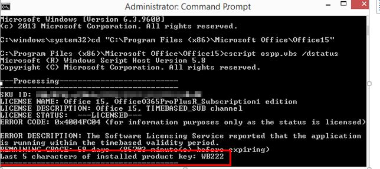
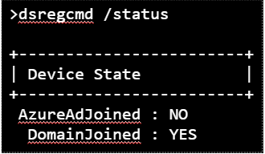
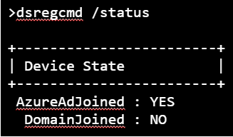
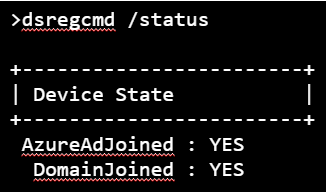
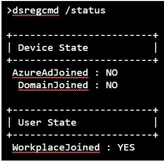

# Reset Microsoft 365 Apps for enterprise activation state

This article is written and maintained by [Eric Splichal](https://social.technet.microsoft.com/profile/Splic-MSFT), Support Escalation Engineer and [Matt Philipenko](https://social.technet.microsoft.com/profile/MattPhil+-+MSFT), Sr Premier Field Engineer.

It's common for users to switch devices or for an enterprise to add or change M365 or O365 tenants. Another scenario is when enterprise organizations roam licenses or credentials to simplify the sign-in process. After a user is activated, multiple locations must be cleared to reset the application to a clean state.

> [!NOTE]
> To automatically perform all of the checks listed below and run the appropriate scripts needed to reset the activation state, you can download and run the [Microsoft Support and Recovery Assistant](https://aka.ms/SaRA-OfficeActivation-Reset).

## Step 1: Remove Office 365 license for subscription -based installations

> [!NOTE]
> If Shared Computer Activation (SCA) is enabled and running, you shouldn't see any product keys installed during the procedure. If you're trying to set up SCA on a computer, make sure to clean up existing keys first.

Here's how to remove the Office 365 license:

> [!NOTE]
> The `ospp.vbs` script is in the \<Program Files\Microsoft Office\Office16> folder. If the 32-bit version of Office is installed on a 64-bit operating system, the script is in the \<Program Files (x86)\Microsoft Office\Office16 folder>. Before running the `ospp.vbs` command, set the correct directory by using one of these commands, based on your Office version:
>
> - `cd C:\Program Files (x86)\Microsoft Office\Office16`
> - `cd C:\Program Files\Microsoft Office\Office16`

1. In an elevated command window, run the cd command based on your install location:

   ```console
   cd "C:\Program Files (x86)\Microsoft Office\Office16"
   ```

   or

   ```console
   cd "C:\Program Files\Microsoft Office\Office16"
   ```

1. Run the following script command:

   ```vbs
   cscript ospp.vbs /dstatus
   ```

   The `ospp.vbs` command generates a report of the licenses currently in use. The output is in this format:

   

   > [!NOTE]
   > The report could include multiple licenses. If the output contains a "No installed Product Keys" message after you run `ospp.vbs /dstatus`, skip the section below and go to "[Step 2: Remove cached identities in HKCU registry](#step-2-remove-cached-identities-in-hkcu-registry)".

   Take note of the **Last 5 characters of the installed product key**.

1. If a partial product key is returned from `/dstatus`, run the following command:

   ```vbs
   cscript ospp.vbs /unpkey:"Last 5 of installed product key"
   ```

   For example:

   ```vbs
   cscript ospp.vbs /unpkey:WB222
   ```

   Repeat the command until all keys are removed.

   

   If the output contains the message "product key uninstall successful", close the Command Prompt window and go to Step 2.

> [!NOTE]
> For Shared Computer Activation (SCA), remove the tokens listed here:
%localappdata%\Microsoft\Office\16.0\Licensing

## Step 2: Remove cached identities in HKCU registry

> [!WARNING]
> Follow this section's steps carefully. Incorrect registry entries can cause serious system issues. As a precaution, [back up the registry for restoration](https://support.microsoft.com/help/322756/how-to-back-up-and-restore-the-registry-in-windows).

In Registry Editor, locate the following registry:

`HKEY_CURRENT_USER\Software\Microsoft\Office\16.0\Common\Identity\Identities`

Remove all identities under the `Identities` registry entry.

> [!NOTE]
> If you have Shared Computer Licensing enabled, remove the same identities from the registry `HKEY_USERS\The user's SID`.

## Step 3: Remove the stored credentials in Credential Manager

1. Open **Control Panel** > **Credential Manager**.
1. Remove all Windows credentials listed for Office16 by selecting the drop-down arrow and Remove.

   :::image type="content" source="./media/reset-office-365-proplus-activation-state/remove-credentials.png" alt-text="Screenshot of removing stored credentials in the Credential Manager.":::

## Step 4: Clear persisted locations

Clear the following persisted locations if they exist:

### Credential Manager

- `%appdata%\Microsoft\Credentials`
- `%localappdata%\Microsoft\Credentials`
- `%appdata%\Microsoft\Protect`
- `HKEY_CURRENT_USER\Software\Microsoft\Protected Storage System Provider`

### Office 365 activation tokens and identities

- `%localappdata%\Microsoft\Office\16.0\Licensing`
- `%localappdata%\Microsoft\Office\Licenses` (Microsoft 365 Apps for enterprise version 1909 or later)
- `HKEY_CURRENT_USER\Software\Microsoft\Office\16.0\Common\Identity`
- `HKEY_USERS\The user's SID\Software\Microsoft\Office\16.0\Common\Identity`

## OLicenseCleanup.vbs

The four steps above can be automated using [OLicenseCleanup.vbs](https://download.microsoft.com/download/e/1/b/e1bbdc16-fad4-4aa2-a309-2ba3cae8d424/OLicenseCleanup.zip). Simply download and run the script with elevated privileges.

## Clear Office credentials and activation state for managed devices

The above steps reset the Office activation for unmanaged devices (Domain Joined aka DJ). In a managed environment, more locations store credentials.

Devices are considered managed if they're Azure AD Joined (AADJ), Hybrid Azure AD Joined (HAADJ), or Workplace Joined (WPJ). These configurations use Web Account Management (WAM), which stores credentials in different locations.

Here's how to find out if a device is DJ, AADJ, HAADJ, or WPJ:

1. Open a command prompt as an administrator.
2. Type `dsregcmd /status`.

   Domain Joined (DJ):

   

   Azure AD Joined (AADJ):

   

   Hybrid Azure AD Joined (HAADJ):

   

   Workplace Joined (WPJ):

   

In scenarios where all stored credentials (such as domain/tenant migration) must be cleared, clear the additional WAM locations.

To clear all WAM accounts associated with Office on the device, download and run the [signoutofwamaccounts.ps1](https://download.microsoft.com/download/f/8/7/f8745d3b-49ad-4eac-b49a-2fa60b929e7d/signoutofwamaccounts.zip) script with elevated privileges.

> [!NOTE]
>
> - This script will remove tokens and accounts associated with Office, this is a safe operation. Single sign-on (SSO) of other applications will remain untouched, as well as the device state.
> - This script is only compatible with Windows 10 version 1803 and later. If the OS isn't compatible, you'll receive a message saying the tool isn't supported on that version of Windows.
> - Signoutofwamaccounts.ps1 can be ran separately or in conjuction with OLicenseCleanup.vbs. If you place signoutofwamaccounts.ps1 in the same location as OLicenseCleanup.vbs, running only OLicenseCleanup.vbs will also execute Signoutofwamaccounts.ps1.

## Clear credentials from Workplace Join

To manually clear Workplace Joined accounts, go to **Access Work or School** on the device and select **Disconnect** to remove the device from WPJ.

:::image type="content" source="./media/reset-office-365-proplus-activation-state/disconnect.png" alt-text="Select Disconnect in Access Work or School.":::

To automate WPJ removal, download [WPJCleanUp.zip](https://download.microsoft.com/download/8/e/f/8ef13ae0-6aa8-48a2-8697-5b1711134730/WPJCleanUp.zip), extract the folder, and run WPJCleanUp.cmd.

> [!NOTE]
> This tool removes all SSO accounts in the current Windows logon session. After this operation, all applications in the current logon session will lose SSO state, and the device will be unenrolled from management tools (MDM) and unregistered from the cloud. The next time an application tries to sign in, users will be asked to add the account again.

Additional Information: [Plan your hybrid Azure Active Directory join implementation](/azure/active-directory/devices/hybrid-azuread-join-plan)
