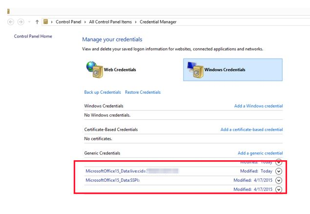

# Reset Office 365 ProPlus activation state

This article is written and maintained by [Matt Philipenko](https://social.technet.microsoft.com/profile/MattPhil+-+MSFT), Sr Premier Field Engineer.

It's very common for users to switch devices or for an enterprise to add or change Microsoft Office 365 tenants. Another scenario is when enterprise organizations roam licenses or credentials to simplify the sign- in process. After an Office 365 user is activated, there are multiple locations that must be cleared to reset the application to a clean state.

## Step 1: Remove Office 365 license for subscription -based installations

> [!NOTE]
> If Shared Computer Activation (SCA) is enabled and running, you should not see any product keys installed when you follow this procedure. However, if you are trying to set up SCA on a computer, make sure that you first clean up any existing keys.

To remove the Office 365 license, follow these steps:

1. Run the following cscript command:

   ```vbs
   cscript ospp.vbs /dstatus
   ```
   
   > [!NOTE]
   > The opss.vbs script is in the Program Files\Microsoft Office\Office16 folder. If you installed the 32-bit version of Office on a 64-bit operating system, the script is in the Program Files (x86)\Microsoft Office\Office16 folder. Before you run the "ospp.vbs" command, you may have to change to the correct directory by using one of the following commands, based on your Office  versions:
   > - `cd C:\Program Files (x86)\Microsoft Office\Office16`
   > - `cd C:\Program Files/Microsoft Office/Office16`

   The "ospp.vbs" command generates a report of the current licenses that are in use. The output resembles the following example:

   

   > [!NOTE]
   > You might see multiple licenses in the report. However, if the output contains a "No installed Product Keys" message after you run `ospp.vbs /dstatus`, you can skip "Step 2: Remove cached identities in HKCU registry" and go to Step 3.

1. Note the value for **Last 5 characters of installed product key**.
1. Run the following command:

   ```vbs
   cscript ospp.vbs /unpkey:"Last 5 of installed product key"
   ```
   
   For example:

   ```vbs
   cscript ospp.vbs /unpkey:WB222
   ```

   Repeat the command if it is necessary until all keys are removed.

   
   
   If the output contains a "product key uninstall successful" message, you can close the Command Prompt window and go to Step 2.

## Step 2: Remove cached identities in HKCU registry

> [!WARNING]
> Follow the steps in this section carefully. Serious problems can occur if you modify the registry incorrectly. Before you modify it,  [back up the registry for restoration](https://support.microsoft.com/help/322756/how-to-back-up-and-restore-the-registry-in-windows) in case problems occur.

In Registry Editor, locate the following registry:

**HKEY_CURRENT_USER\Software\Microsoft\Office\16.0\Common\Identity\Identities**

Remove all the identities under the Identities registry entry.

> [!NOTE]
> If you have Shared Computer Licensing enabled, remove the same identities from the registry **HKEY_USERS\The user's SID**.

## Step 3: Remove the stored credentials in Credential Manager

1. Open **Control Panel** > **Credential Manager**.
1. Remove all Windows credentials that are listed for Office16. To remove the credentials, select the drop-down arrow and then select **Remove**.

   

For Shared Computer Licensing scenarios, you must remove the tokens and identities that are listed as follows:

**Appdata\local\Microsoft\Office\16.0\Licensing**

## Step 4: Clear persisted locations

Clear the following persisted locations:

**Credential Manager**

- Appdata\Roaming\Microsoft\Credentials
- Appdata\Local\Microsoft\Credentials
- Appdata\Roaming\Microsoft\Protect
- HKEY_CURRENT_USER\Software\Microsoft\Protected Storage System Provider

**Office 365 activation tokens and identities**

- Appdata\local\Microsoft\Office\16.0\Licensing
- %localappdata%\Microsoft\Office\Licenses (Office 365 ProPlus version 1909 or later)
- HKEY_CURRENT_USER\Software\Microsoft\Office\16.0\Common\Identity
- HKEY_USERS\The user's SID\Software\Microsoft\Office\16.0\Common\Identity

These steps reset the activation state for Office 365 ProPlus. After the locations are cleared, the activation flow will represent an initial activation.

The four steps can be automated by using a script. To do this, copy the following content, save the content as a .vbs file, and then run the .vbs file.

```vbs
'*******************************************************************************
' Name: OLicenseCleanup.vbs - v 1.23
' Author: Microsoft Customer Support Services
' Copyright (c) Microsoft Corporation
' 
' Removes all licenses for Office 2013 and 2016 
' from the (Office) Software Protection Platform
'*******************************************************************************
'Option Explicit

Dim oProductInstances, oWmiLocal, oReg, oWShell, oFso
Dim sQuery, sTemp, sLogDir, sOSinfo, sProfilesDirectory
Dim f64, fO64, fCScript, fQuiet, fClearO15, fClearO16, fSafeForRoamingUsers
Dim fClearUserIdentityCache
Dim LogStream

Const SKUFILTER = "O365" 'Removes all licenses that contain O365 in their name
'Note: SKUFILTER = "" 'Removes all licenses 
'      SKUFILTER = "NOTO365" 'Removes all licenses that do not contain O365 in their name


fQuiet		= True
fClearO15	= True
fClearO16	= True
fClearUserIdentityCache = False
sLogDir		= "" 'Custom log folder/directory. No trailing "\" in the path!

'Set this to False if the script needs to run more than once and you don't 
'have roaming profile users
fSafeForRoamingUsers = True  


'*******************************************************************************


Const OfficeAppId = "0ff1ce15-a989-479d-af46-f275c6370663"  'Office 2013/2016
Const HKLM  = &H80000002
Const SCRIPTVERSION = "1.23"


' MAIN
On Error Resume Next
Set oWShell 	= CreateObject("WScript.Shell")

Initialize
LogH2 "Cleanup start"
CleanOSPP SKUFILTER
ResetUserKey "Common\Identity", "" '"ResetIdentity"
ResetUserKey "Common\Internet\WebServiceCache", "" '"ResetWebServiceCache
ResetUserKey "Common\ServicesManagerCache", "" '"ResetServicesManagerCache"
ResetUserKey "Common\Licensing", "" '"ResetUserLicense"
ResetUserKey "Registration", "" '"ResetUserRegistration"
ClearCredmanCache
ClearSCALicCache
ClearConfigUser
ClearVNextLicCache
If fClearUserIdentityCache Then ClearIdentityCache

LogH2 "Cleanup end"
' END

'-------------------------------------------------------------------------------
'   Initialize
'
'   Initialize script settings
'-------------------------------------------------------------------------------
Sub Initialize
    Dim ComputerItem, Item
    Dim sOsVersion

    'Check if we're running as 32 bit process on a 64 bit OS
    If InStr(LCase(wscript.path), "syswow64") > 0 Then RelaunchAs64Host

    Set oWmiLocal 	= GetObject("winmgmts:\\.\root\cimv2")
    Set oReg 		= GetObject("winmgmts:\\.\root\default:StdRegProv")
    Set oFso		= CreateObject("Scripting.FileSystemObject")

    sTemp = oWShell.ExpandEnvironmentStrings("%TEMP%")
    fCScript = (UCase(Mid(Wscript.FullName, Len(Wscript.Path) + 2, 1)) = "C")

    ' get Win32_OperatingSystem details
    '----------------------------------
    Set ComputerItem = oWmiLocal.ExecQuery("Select * from Win32_OperatingSystem")
    For Each Item in ComputerItem 
        sOSinfo = sOSinfo & Item.Caption 
        sOSinfo = sOSinfo & Item.OtherTypeDescription
        sOSinfo = sOSinfo & ", " & "SP " & Item.ServicePackMajorVersion
        sOSinfo = sOSinfo & ", " & "Version: " & Item.Version
        sOsVersion = Item.Version
        sOSinfo = sOSinfo & ", " & "Codepage: " & Item.CodeSet
        sOSinfo = sOSinfo & ", " & "Country Code: " & Item.CountryCode
        sOSinfo = sOSinfo & ", " & "Language: " & Item.OSLanguage
    Next

    DetectOSBitness
    DetectOfficeBitness
    CreateLog

    LogOnly "Remove O15 Lic: " & fClearO15
    LogOnly "Remove O16 Lic: " & fClearO16
    LogOnly "Quiet mode:     " & fQuiet

    RegReadExpStringValue HKLM, "SOFTWARE\Microsoft\Windows NT\CurrentVersion\ProfileList", "ProfilesDirectory", sProfilesDirectory
    If NOT oFso.FolderExists(sProfilesDirectory) Then 
        sProfilesDirectory  = oFso.GetParentFolderName(oWShell.ExpandEnvironmentStrings("%userprofile%"))
    End If
    LogOnly "Users profile location: " & sProfilesDirectory

End Sub


'-------------------------------------------------------------------------------
'   ClearConfigUser
'
'   clear HKLM cached user license id
'-------------------------------------------------------------------------------
Sub ClearConfigUser
    Dim value
    Dim sConfigKey, sRetVal, sCmd
    Dim arrNames, arrTypes

    If NOT fClearO16 Then Exit Sub

    sConfigKey = "SOFTWARE\Microsoft\Office\ClickToRun\Configuration"

    If RegEnumValues(HKLM, sConfigKey, arrNames, arrTypes) Then
        For Each value in arrNames
            If (InStr(LCase(value), LCase(".EmailAddress")) > 0) Or (InStr(LCase(value), LCase(".TenantId")) > 0) Or (LCase(value) = "productkeys") Then
                sCmd = "REG DELETE HKLM\" & sConfigKey & " /v " &  value & " /f"
                sRetVal = oWShell.Run(sCmd, 0, True)
                Log "Remove entry: HKLM\" & sConfigKey & "\" & value 
            End If
        Next
    End If
End Sub 'ClearConfigUser

'-------------------------------------------------------------------------------
'   ClearSCALicCache
'
'   clear local license cache for SharedComputerActivation 
'-------------------------------------------------------------------------------
Sub ClearSCALicCache
	Dim sLocalAppData, sValue
	
	sLocalAppData = oWShell.ExpandEnvironmentStrings("%localappdata%")
    If fClearO15 Then ClearFolder sLocalAppData & "\Microsoft\Office\15.0\Licensing"
    If fClearO16 Then ClearFolder sLocalAppData & "\Microsoft\Office\16.0\Licensing"
    
    'Check for custom token location
    If RegReadStringValue(HKLM, "Software\Microsoft\Office\16.0\Common\Licensing", "SCLCacheOverrideDirectory", sValue) Then
    	ClearSCAFolder sValue
    End If

End Sub 'ClearSCALicCache

'-------------------------------------------------------------------------------
'   ClearVNextLicCache
'
'   clear local license cache for vNext 
'-------------------------------------------------------------------------------
Sub ClearVNextLicCache
	Dim sLocalAppData, sValue
	
	sLocalAppData = oWShell.ExpandEnvironmentStrings("%localappdata%")
    ClearFolder sLocalAppData & "\Microsoft\Office\Licenses"
    
End Sub 'ClearSCALicCache

'-------------------------------------------------------------------------------
'   ClearIdentityCache
'
'   clear users Windows Identity cache
'-------------------------------------------------------------------------------
Sub ClearIdentityCache
	Dim sLocalAppData, sValue
	
	sLocalAppData = oWShell.ExpandEnvironmentStrings("%localappdata%")
    ClearFolder sLocalAppData & "\Microsoft\IdentityCache\1\UD"

End Sub 'ClearIdentityCache

'-------------------------------------------------------------------------------
'   ClearUsersRecursive
'
'   Recursively clear from all local user profiles
'-------------------------------------------------------------------------------
Sub ClearUsersRecursive (sFolder)
	Dim sValue
    Dim oFolder, fld
	
	Set oFolder = oFso.GetFolder(sFolder)
	' exclude system protected link folders
    If CBool(oFolder.Attributes AND 1024) Then Exit Sub

    On Error Resume Next
    For Each fld In oFolder.SubFolders
        If Err <> 0 Then
		    Err.Clear
        Else
            ClearUsersRecursive fld.Path
        End If
	Next

End Sub 'ClearUsersRecursive

'-------------------------------------------------------------------------------
'   ClearFolder
'
'   clears/deletes the passed in folder
'-------------------------------------------------------------------------------
Sub ClearFolder(sDelFld)
	Dim fld, attr
	Dim sCmd
	
    If oFso.FolderExists(sDelFld) Then
	    Set fld = oFso.GetFolder(sDelFld)
	    'ensure to remove read only flag
	    attr = fld.Attributes
	    If CBool(attr And 1) Then fld.Attributes = attr And (attr - 1)
	    'delete folder
	    fld.Delete True
	    Set fld = Nothing
	
	    'check if removal succeeded. If not try to RD
	    If oFso.FolderExists(sDelFld) Then
            sCmd = "cmd.exe /c rd /s " & chr(34) & sDelFld & chr(34) & " /q"
            Log "Remove folder: " & sDelFld
            oWShell.Run sCmd, 0, True
        End If
    End If
End Sub

'-------------------------------------------------------------------------------
'   ClearCredmanCache
'
'   clear Office credentials from Windows Credentials Manager Cache
'-------------------------------------------------------------------------------
Sub ClearCredmanCache
	Dim oExec, line, key
	Dim sCmd, sRetVal, sCmdOut, sLine
	Dim arrLines, dicRemoveCreds
	
	Set dicRemoveCreds = CreateObject("Scripting.Dictionary")
	
	dicRemoveCreds.Add "MicrosoftOffice1", "MicrosoftOffice1*"
	dicRemoveCreds.Add "msteams", "msteams*"
	dicRemoveCreds.Add "Microsoft_OC", "Microsoft_OC*"
	dicRemoveCreds.Add "OneDrive Cached", "OneDrive*"
	
	For Each key In dicRemoveCreds.Keys
		sCmd = "cmdkey.exe /list:" & dicRemoveCreds.Item(key)
	    Set oExec = oWShell.Exec(sCmd)
	    sCmdOut = oExec.StdOut.ReadAll()
	    Do While oExec.Status = 0
	         WScript.Sleep 100
	    Loop
	    arrLines = Split(sCmdOut)
		For Each line In arrLines
			If (InStr(line, key) > 0 Or InStr(line, "OneDrive"))And Not InStr(line, dicRemoveCreds.Item(key)) > 0 Then 
				fBuildString = True
			End If	
			If fBuildString And Len(line) < 1 Then 
				fBuildString = False
				RunCmdkey sLine
			End If
			If fBuildString Then
				sLine = sLine & " " & line
			End If
		Next
	Next 'key
End Sub 'ClearCredmanCache


'-------------------------------------------------------------------------------
'   RunCmdkey
'
'   call CmdKey.exe to remove the credentials from CredMan
'-------------------------------------------------------------------------------
Sub RunCmdkey (sLine)
	Dim sCmd, sRetVal
	
	sLine = Replace(sLine, vbCrLf, "")
	sLine = Replace(sLine, vbLf, "")
	sLine = Trim(sLine)
	sCmd = "cmdkey.exe /delete:" & Chr(34) & sLine & Chr(34)
    Log "Remove from CredmanCache: " & sLine
    Log "Execute removal command: " & sCmd
	sRetVal = oWShell.Run(sCmd, 0, True)
	Log sRetVal
	sLine = ""
End Sub

'-------------------------------------------------------------------------------
'   ResetUserKey
'
'   attempts to delete the passed in key by direct delete and
'   adds it to UserSetting scope  to be reset on next application launch
'-------------------------------------------------------------------------------
Sub ResetUserKey(sRegKey, sCustomName)
	Dim sSettingsKey, sCount, sRetVal, sCmd, sCUserKey, sSquirrelKey, sKey
	Dim key
	Dim iCount
	Dim arrKey

	If fClearO15 Then ResetUserKeyEx sRegKey, sCustomName, "15"
    If fClearO16 Then ResetUserKeyEx sRegKey, sCustomName, "16"

End Sub 'ResetUserKey

'-------------------------------------------------------------------------------
'   ResetUserKeyEx
'
'   executes the version specific tasks for ResetUserKey
'-------------------------------------------------------------------------------
Sub ResetUserKeyEx(sRegKey, sCustomName, iVM)
	Dim sSettingsKey, sCount, sRetVal, sCmd, sCUserKey, sSquirrelKey, sKey
	Dim key
	Dim iCount
	Dim arrKey

    If sCustomName = "" Then sCustomName = "CustomUserReset"
    
    ' attempt direct delete
    sCUserKey = "HKCU\Software\Microsoft\Office\" & iVM & ".0\" & sRegKey
    Log "Remove key " & sCUserKey
    sCmd = "REG DELETE " & sCUserKey & " /f"
    sRetVal = oWShell.Run(sCmd, 0, True)
    
    'create user settings key to cover reset for other profiles
    sSettingsKey = "SOFTWARE\Wow6432Node\Microsoft\Office\" & iVM & ".0\User Settings"
    If (f64 And fO64) Or (Not f64) Then sSettingsKey = "SOFTWARE\Microsoft\Office\" & iVM & ".0\User Settings"

    sSquirrelKey = sCustomName & "\Delete\Software\Microsoft\Office\" & iVM & ".0\" & sRegKey
    arrKey = Split(sSquirrelKey, "\")
    sKey = sSettingsKey
    For Each key In arrKey
    	sKey = sKey & "\" & key
    	oReg.CreateKey HKLM, sKey 
    Next

    iCount = 1
    If Not fSafeForRoamingUsers Then
    	If RegReadDWordValue(HKLM, sSettingsKey & "\" & sCustomName, "Count", sCount) Then iCount = CInt(sCount) + 1
    End If
    oReg.SetDWordValue HKLM, sSettingsKey & "\" & sCustomName, "Count", iCount
    oReg.SetDWordValue HKLM, sSettingsKey & "\" & sCustomName, "Order", 1
    LogOnly "Add SettingsKey: HKLM\" & sKey
    LogOnly "Count: " & iCount

End Sub 'ResetUserKeyEx

'-------------------------------------------------------------------------------
'   CleanOSPP
'
'   unpkeys the licenses from OSPP
'-------------------------------------------------------------------------------
Sub CleanOSPP (sFilter)
    Dim pi
    Dim oProductInstances

	' Initialize the software protection platform object with a filter on Office 2013/2016 products
	If GetVersionNT > 601 Then
	    Set oProductInstances = oWmiLocal.ExecQuery("SELECT ID, ApplicationId, PartialProductKey, Description, Name, ProductKeyID FROM SoftwareLicensingProduct WHERE ApplicationId = '" & OfficeAppId & "' " & "AND PartialProductKey <> NULL")
	Else
	    Set oProductInstances = oWmiLocal.ExecQuery("SELECT ID, ApplicationId, PartialProductKey, Description, Name, ProductKeyID FROM OfficeSoftwareProtectionProduct WHERE ApplicationId = '" & OfficeAppId & "' " & "AND PartialProductKey <> NULL")
	End If
	
	' Remove all licenses
	For Each pi in oProductInstances
	    Log "License: " & pi.Name
	    If NOT IsNull(pi) Then
	        If InStr(pi.Name, sFilter) > 0 Or sFilter = "" Then
		        Log "Uninstall ProductKey: " & pi.Name & " - Key: " & pi.ProductKeyID
		        pi.UninstallProductKey(pi.ProductKeyID)
	        End If
	        If UCase(sFilter) = "NOTO365" Then
		        If Not InStr(pi.Name, "O365") > 0 Then
			        Log "Uninstall ProductKey: " & pi.Name & " - Key: " & pi.ProductKeyID
			        pi.UninstallProductKey(pi.ProductKeyID)
	        End If
	        End If
	    End If
	Next 'pi
End Sub 'CleanOSPP

'-------------------------------------------------------------------------------
'   DetectOfficeBitness
'
'   detect bitness of Office
'-------------------------------------------------------------------------------
Sub DetectOfficeBitness ()
	Dim sOPlatform, sInstallRootPath

	fO64 = False
	If Not f64 Then Exit Sub
	If RegReadStringValue(HKLM, "SOFTWARE\Microsoft\Office\ClickToRun\Configuration", "platform", sOPlatform) Then
		fO64 = (sOPlatform = "x64")
		Exit Sub
	End If
	If RegReadStringValue(HKLM, "SOFTWARE\Microsoft\Office\15.0\ClickToRun\Configuration", "platform", sOPlatform) Then
		fO64 = (sOPlatform = "x64")
		Exit Sub
	End If
	If RegReadStringValue(HKLM, "SOFTWARE\Microsoft\Office\ClickToRun\propertyBag", "Platform", sOPlatform) Then
		fO64 = (sOPlatform = "x64")
		Exit Sub
	End If
	If RegReadStringValue(HKLM, "SOFTWARE\Microsoft\Office\15.0\ClickToRun\propertyBag", "Platform", sOPlatform) Then
		fO64 = (sOPlatform = "x64")
		Exit Sub
	End If
	If RegReadStringValue(HKLM, "SOFTWARE\Wow6432Node\Microsoft\Office\Common\InstallRoot", "Path", sInstallRootPath) Then
		'fO64 = Not (InStr(sInstallRootPath, "(x86)") > 0)
		fO64 = False
		Exit Sub
	End If
	If RegReadStringValue(HKLM, "SOFTWARE\Wow6432Node\Microsoft\Office\15.0\Common\InstallRoot", "Path", sInstallRootPath) Then
		'fO64 = Not (InStr(sInstallRootPath, "(x86)") > 0)
		fO64 = False
		Exit Sub
	End If
	If RegReadStringValue(HKLM, "SOFTWARE\Microsoft\Office\Common\InstallRoot", "Path", sInstallRootPath) Then
		'fO64 = Not (InStr(sInstallRootPath, "(x86)") > 0)
		fO64 = True
		Exit Sub
	End If
	If RegReadStringValue(HKLM, "SOFTWARE\Microsoft\Office\15.0\Common\InstallRoot", "Path", sInstallRootPath) Then
		'fO64 = Not (InStr(sInstallRootPath, "(x86)") > 0)
		fO64 = True
		Exit Sub
	End If

End Sub 'DetectOfficeBitness

'-------------------------------------------------------------------------------
'   DetectOSBitness
'
'   detect bitness of the operating system
'-------------------------------------------------------------------------------
Sub DetectOSBitness ()
	Dim ComputerItem, item
	
    Set ComputerItem = oWmiLocal.ExecQuery("Select * from Win32_ComputerSystem")
    For Each item In ComputerItem
        f64 = Instr(Left(item.SystemType, 3), "64") > 0
    Next
End Sub 'DetectOSBitness

'-------------------------------------------------------------------------------
'   GetVersionNT
'
'   Calculate the VerionNT number as integer 
'-------------------------------------------------------------------------------
Function GetVersionNT ()
    Dim sOsVersion
    Dim arrVersion
    Dim qOS
    Dim oOsItem

    Set qOS = oWmiLocal.ExecQuery( "Select * from Win32_OperatingSystem")
    For Each oOsItem in qOS 
        sOsVersion = oOsItem.Version
    Next
    arrVersion = Split( sOsVersion, GetDelimiter( sOsVersion))
    GetVersionNT = CInt( arrVersion( 0)) * 100 + CInt( arrVersion( 1))
End Function

'-------------------------------------------------------------------------------
'   GetDelimiter
'
'   Returns the delimiter in a version string 
'-------------------------------------------------------------------------------
Function GetDelimiter (sVersion)
    Dim iCnt, iAsc

    GetDelimiter = " "
    For iCnt = 1 To Len(sVersion)
        iAsc = Asc(Mid(sVersion, iCnt, 1))
        If Not (iASC >= 48 And iASC <= 57) Then 
            GetDelimiter = Mid(sVersion, iCnt, 1)
            Exit Function
        End If
    Next 'iCnt
End Function

'-------------------------------------------------------------------------------
'   RegReadDWordValue
'
'   Check if a string value exists and return on zero if not
'-------------------------------------------------------------------------------
Function RegReadDWordValue(hDefKey, sSubKeyName, sName, sValue)
    Dim RetVal
    
    RetVal = oReg.GetDWORDValue(hDefKey, sSubKeyName, sName, sValue)
    RegReadDWordValue = (RetVal = 0)
    
End Function 'RegReadDWordValue

'-------------------------------------------------------------------------------
'   RegReadStringValue
'
'   Check if a string value exists and return on zero if not
'-------------------------------------------------------------------------------
Function RegReadStringValue(hDefKey, sSubKeyName, sName, sValue)
    Dim RetVal
    
    RetVal = oReg.GetStringValue(hDefKey, sSubKeyName, sName, sValue)
    RegReadStringValue = (RetVal = 0)
    
End Function 'RegReadSringValue

'-------------------------------------------------------------------------------
'   RegReadExpStringValue
'
'   Check if an expanded string value exists and return on zero if not
'-------------------------------------------------------------------------------
Function RegReadExpStringValue(hDefKey, sSubKeyName, sName, sValue)
    Dim RetVal
    
    RetVal = oReg.GetExpandedStringValue(hDefKey, sSubKeyName, sName, sValue)
    RegReadStringValue = (RetVal = 0)
    
End Function 'RegReadSringValue

'-------------------------------------------------------------------------------
'   RegEnumValues
'
'   Enumerate a registry key to return all values
'-------------------------------------------------------------------------------
Function RegEnumValues(hDefKey, sSubKeyName, arrNames, arrTypes)
    Dim RetVal
    
    RetVal = oReg.EnumValues(hDefKey, sSubKeyName, arrNames, arrTypes)
    RegEnumValues = (RetVal = 0) AND IsArray(arrNames) AND IsArray(arrTypes)
End Function 'RegEnumValues

'-------------------------------------------------------------------------------
'   RelaunchAs64Host
'
'   Relaunch self with 64 bit CScript host
'-------------------------------------------------------------------------------
Sub RelaunchAs64Host
    Dim Argument, sCmd
    Dim fQuietRelaunch

    fQuietRelaunch = False
    sCmd = Replace(LCase(wscript.Path), "syswow64", "sysnative") & "\cscript.exe " & Chr(34) & WScript.scriptFullName & Chr(34)
    If fQuiet Then fQuietRelaunch = True
    If Wscript.Arguments.Count > 0 Then
        For Each Argument in Wscript.Arguments
            sCmd = sCmd  &  " " & chr(34) & Argument & chr(34)
            Select Case UCase(Argument)
            Case "/Q", "/QUIET"
                fQuietRelaunch = True
            End Select
        Next 'Argument
    End If
    sCmd = sCmd & " /ChangedHostBitness"
    If fQuietRelaunch Then
        sCmd = Replace (sCmd, "\cscript.exe", "\wscript.exe")
        Wscript.Quit CLng(oWShell.Run (sCmd, 0, True))
    Else
        Wscript.Quit CLng(oWShell.Run (sCmd, 1, True))
    End If

End Sub 'RelaunchAs64Host

'-------------------------------------------------------------------------------
'   CreateLog
'
'   Create the removal log file
'-------------------------------------------------------------------------------
Sub CreateLog
    Dim DateTime
    Dim sLogName
    
    On Error Resume Next
    ' create the log file
    Set DateTime = CreateObject("WbemScripting.SWbemDateTime")
    DateTime.SetVarDate Now, True
    If sLogDir = "" Then sLogDir = sTemp
    sLogName = sLogDir & "\" & oWShell.ExpandEnvironmentStrings("%COMPUTERNAME%")
    sLogName = sLogName &  "_" & Left(DateTime.Value, 14)
    sLogName = sLogName & "_OLicenseClean.txt"
    Err.Clear
    Set LogStream = oFso.CreateTextFile(sLogName, True, True)
    If Err <> 0 Then 
        Err.Clear
        sLogDir = sTemp
        sLogName = sLogDir & "\" & oWShell.ExpandEnvironmentStrings("%COMPUTERNAME%")
        sLogName = sLogName &  "_" & Left(DateTime.Value, 14)
        sLogName = sLogName & "_oLicenseClean.txt"
        Set LogStream = oFso.CreateTextFile(sLogName, True, True)
    End If
    On Error Goto 0

    LogH2 "Microsoft Customer Support Services - Office License Reset Utility" & vbCrLf & vbCrLf & _
        	"Version: " & vbTab & SCRIPTVERSION & vbCrLf & _
        	"64 bit OS: " & vbTab & f64 & vbCrLf & _
        	"64 bit Office: " & vbTab & fO64 & vbCrLf & _
        	"Cleanup start: " & vbTab & Time 
    LogH2	"OS Details: " & sOSinfo & vbCrLf
End Sub 'CreateLog

'-------------------------------------------------------------------------------
'   LogH
'
'   Write a header log string to the log file
'-------------------------------------------------------------------------------
Sub LogH (sLog)
    LogStream.WriteLine ""
    sLog = sLog & vbCrLf & String(Len(sLog), "=")
    If NOT fQuiet AND fCScript Then wscript.echo ""
    If NOT fQuiet AND fCScript Then wscript.echo sLog
    LogStream.WriteLine sLog
End Sub 'Logh

'-------------------------------------------------------------------------------
'   LogH1
'
'   Write a header log string to the log file
'-------------------------------------------------------------------------------
Sub LogH1 (sLog)
    LogStream.WriteLine ""
    sLog = sLog & vbCrLf & String(Len(sLog), "-")
    If NOT fQuiet AND fCScript Then wscript.echo ""
    If NOT fQuiet AND fCScript Then wscript.echo sLog
    LogStream.WriteLine sLog
End Sub 'LogH1

'-------------------------------------------------------------------------------
'   LogH2
'
'   Write w/o indent Cmd window and the log file
'-------------------------------------------------------------------------------
Sub LogH2 (sLog)
    If NOT fQuiet AND fCScript Then wscript.echo sLog
    LogStream.WriteLine ""
    LogStream.WriteLine sLog
End Sub 'LogH2

'-------------------------------------------------------------------------------
'   Log
'
'   Echos the log string to the Cmd window and the log file
'-------------------------------------------------------------------------------
Sub Log (sLog)
    If NOT fQuiet AND fCScript Then wscript.echo sLog
    If sLog = "" Then
        LogStream.WriteLine
    Else
        LogStream.WriteLine "   " & Time & ": " & sLog
    End If
End Sub 'Log

'-------------------------------------------------------------------------------
'   LogOnly
'
'   Commits the log string to the log file
'-------------------------------------------------------------------------------
Sub LogOnly (sLog)
    If sLog = "" Then
        LogStream.WriteLine
    Else
        LogStream.WriteLine "   " & Time & ": " & sLog
    End If
End Sub 'Log
```
