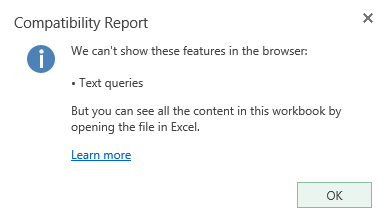
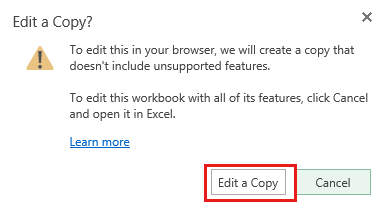
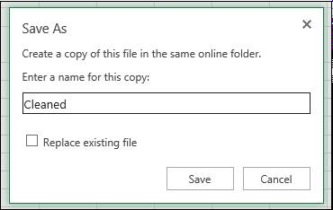
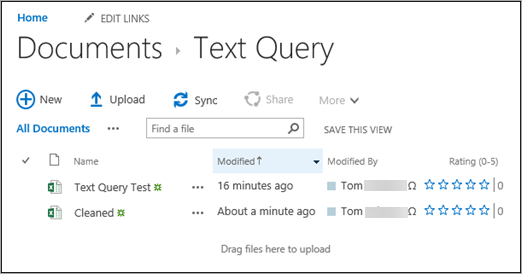
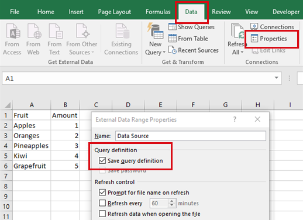
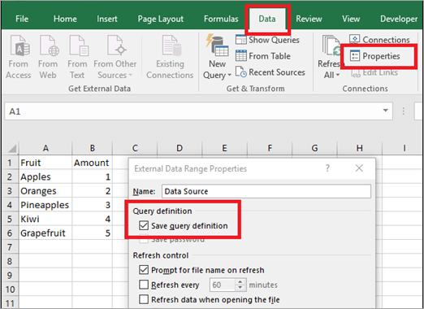

# Compatibility Report about text queries in Excel Online

This article was written by [Tom Schauer](https://social.technet.microsoft.com/profile/Tom+Schauer+-+MSFT), Technical Specialist.

## Symptoms

When you try to edit a workbook that contains text queries in Microsoft Excel Online, you may receive a Compatibility Report which states:

> We can't show these features in the browser:
> - Text queries

## Cause

This issue occurs because Excel Online doesn't support text queries. 

## Resolution

To resolve the issue, use one of the following workarounds:

### Method 1: Create a copy of the workbook in Excel Online to remove the unsupported feature

1. Select **Edit Workbook** > **Edit in Excel Online** in the workbook.
1. In the prompt dialog box, select **Edit a Copy**.

   

1. Type a new file name for this copy, and then click **Save**.

   

A copied workbook that doesn't contain any unsupported features will be created through this method. It will be saved to the same directory as the original workbook.

### Method 2: Remove the query definition directly

1. Right-click the table and select **Data Range Properties**.
1. Clear the **Save query definition** check box in the **External Data Range Properties** dialog box.

   

1. On the **Data** tab, select **Properties**, and then clear the **Save query definition** check box in the **External Data Range Properties** dialog box.

   

### Method 3: Edit the Excel file in the desktop app

If you have it available, open the Excel file in the desktop app, where you will be able to edit the workbook with the text query. 

## More information

Still need help? Go to [Microsoft Community](https://answers.microsoft.com/).