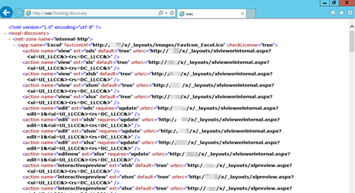

# Configuration for Office Online Server authentication with external users

When you configure Microsoft Office Web Apps or Office Online Server to work with external users, if external users don't want to be prompted for authentication, one major consideration is that the Office web app calls need to be passed through the external firewall/reverse proxy.

## Cause

Office Web Apps communicates directly with both the client and the file host, such as SharePoint, Skype for Business and Exchange. The client user does not authenticate with Office Web Apps.  Authentication is handled with the file host. Then the file host communicates with the client, and then redirect to Office Web Apps. After that, Office Web Apps communicates with the file host by using OAuth to request the file contents to render within the desired web app.

## Resolution

To avoid an authentication prompt, configure the firewall/reverse proxy to allow Office web apps to be accessible anonymously over HTTPS.

This means that your Office web apps incoming traffic authentication rules should be configured either as anonymous or pre-authenticated to avoid any authentication challenge.

When using pre-authentication, to prevent a second authentication prompt for SharePoint users, make sure that the session cookie that's issued for SharePoint also applies to your Office web apps.  

To verify it, go to your hosting/discovery page through "http(s)://wacexternalurl/hosting/discovery", and you can see the following:

If an authentication page appears, proceed by browsing your SharePoint site.  Leave the SharePoint page open, then browse the hosting/discovery page again. If you have your session cookie configured correctly, the hosting/discovery should open without an authentication prompt.

If you are still redirected to an authentication page, it's likely means the security token from the authentication provider isn't covering the request to the Office Web Apps server. As soon as you've configured your security firewall/reverse proxy to allow for pre-auth or anonymous authentication, you should be able to view documents in a web browser.