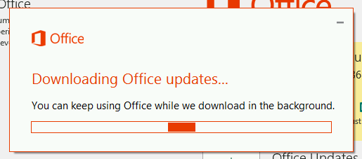
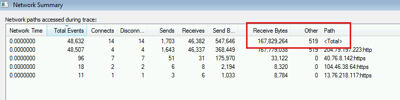

# How to check the size of this month's Office ProPlus update

This article was written by [Eric Splichal](https://social.technet.microsoft.com/profile/Splic-MSFT), Support Escalation Engineer.

Microsoft Office 365 updates are designed to be very network bandwidth friendly. There is Binary Delta Compression that occurs as long as the computers are staying current and Office has built in throttles to prevent every computer from trying to update at the same time. However, IT admins will sometimes still have to monitor the size of the monthly updates closely. Here are the steps about how to determine how large the update for Office ProPlus:

1. Download and install [Process Monitor](/sysinternals/downloads/procmon).
1. When you start Process Monitor, the filter menu may auto load. However, if it doesn't, select **Filter** > **filter** to open the filter menu. Also, exclude the following Event Classes:

   - Registry
   - File System
   - Process

   And only include the "OfficeClicktoRun.exe" process name. Your filter should resemble the following:

   
1. Start Process Monitor, and then start the manual update process by clicking Update Now in the File > Account menu of any Office Click-to-Run app. You see the updates downloading and data filling in the Procmon log.

   

1. After the update finishes, stop the Procmon trace, and then check for the network traffic summary by going to **Tools** > **Network Summary**.

   

In this example, the Office ProPlus are on the July version of Semi-Annual Channel (16.0.6741.2056) and then updated to the August version (16.0.6741.2063). As you can see, this update is 167,829,264 bytes, or approximately 167 MB of data.
