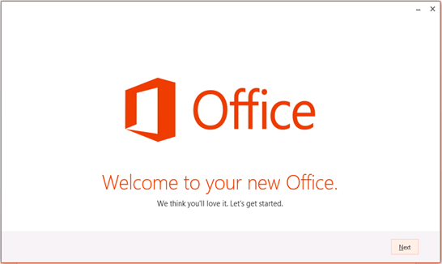
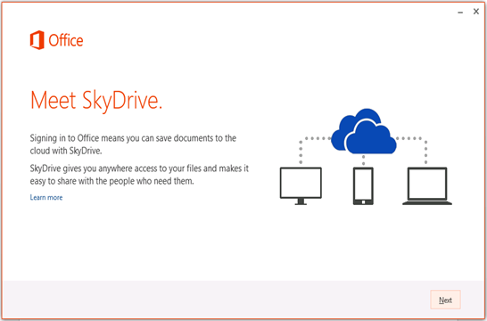
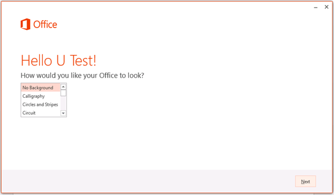
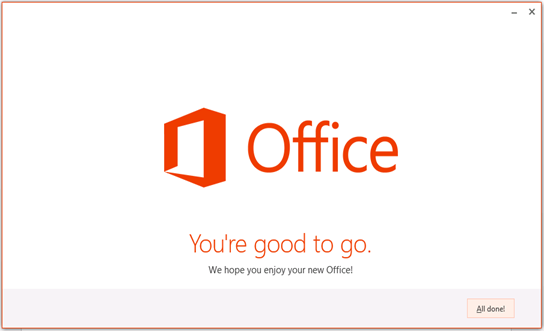
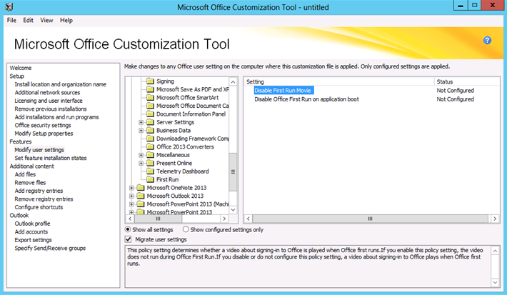
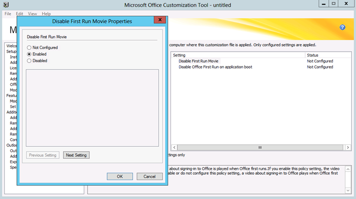
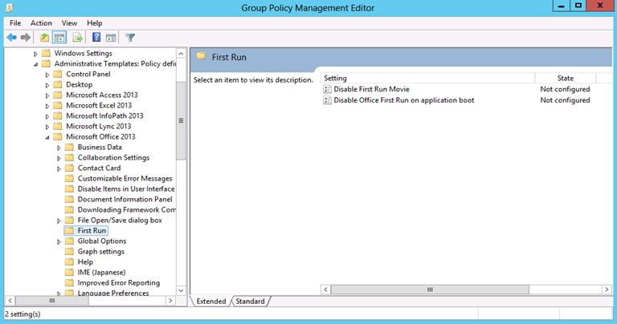
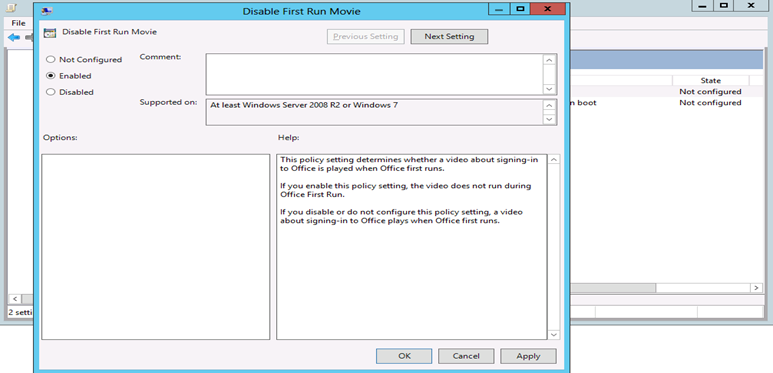
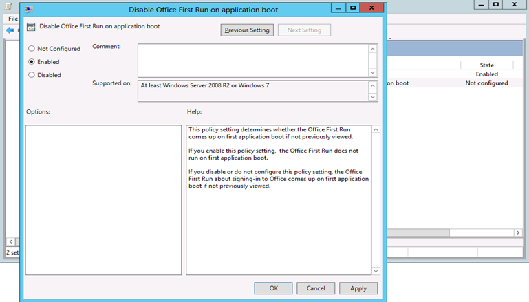

# How to manage the First Run screens that appear when Office 2013 applications are first started

This article was written by [Jalal Babool](https://social.technet.microsoft.com/profile/JalalB+-+MSFT), Senior Support Ability Project Manager.

## Summary

Microsoft Office 2013 shows the following screens when an application is started for the first time. This article describes how to disable these First Run screens by using the Office Customization Tool (OCT) or Group Policy Management Editor.

## More Information

### Use Office Customization Tool (OCT)

> [!NOTE]
> The OCT can only be used with Windows Installer based source files for Office 2013.

1. Open the OCT as an administrator, locate the **Features** section, and then select **Modify user settings** > **Microsoft Office 2013** > **First Run** > **Disable First Run Movie**.
 
   

1. Set **Disable First Run Movie** to **Enabled**.

   

1. Select **Disable First Run on application boot**, and then set it to **Enabled**.

   

1. Save the resulting MSP file and use it as part of the Office 2013 deployment.

### Use Group Policy Management Editor

1. Download [Office 2013 Administrative Template files](https://www.microsoft.com/download/details.aspx?id=35554
) if you have not already downloaded.
1. Copy the ADMX files to %systemroot%\PolicyDefinitions, and then copy the ADML files to the language specific folder (such as en-us) under %systemroot%\PolicyDefinitions.
1. In Group Policy Management Editor, locate **User Configuration** > **Policies** > **Administrative Templates: Policy definitions** > **Microsoft Office 2013** > **First Run**.

   

1. Set both **Disable First Run Movie** and **Disable Office First Run on application boot** to **Enabled**.

   

   