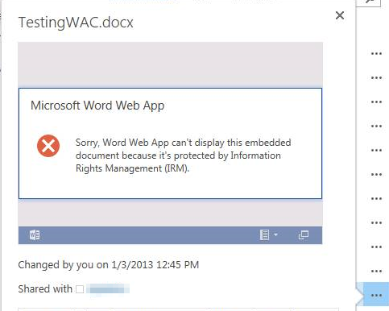

# Office Online limitations and features with Information Rights Management (IRM)

This article was written by [Dan Fox](https://social.technet.microsoft.com/profile/Dan+F.+-+MSFT), Support Escalation Engineer.

Office Online and Office Web Apps offer the read-only capability for SharePoint document libraries with Information Rights Management (IRM) enabled.  Protected documents where the IRM or Azure Information Policy protection is applied from Office applications are not supported by Office Online and Office Web Apps.

Office Web Apps relies on the document host system (like SharePoint) to communicate with Rights Management servers because it has no means to directly communicate with Rights Management servers. IRM protection prevents Office Web Apps from allowing editing of IRM protected documents.

Documents that have any IRM permissions modification or protection added from Office applications and are stored on a document management system can't be opened by Office Web Apps. This is true with IRM protected documents that are stored on other third-party host systems.

**Limitations**

Office Web Apps doesn't support the following features that are generally offered for non-IRM protected documents.  These features are currently suppressed from the user interface:

- Edit in browser
- Print
- Save
- Copy selection
- Add comments

**Error with preview in a browser**

When users try to preview an IRM protected document by using Office Web Apps, users may receive an error as follows:

**Sorry, Word Web App can't display this embedded document because it's protected by Information Rights Management (IRM).**

To fix this issue, remove the IRM setting and then preview the document again. If the preview is displayed, apply the IRM setting in the document library again.