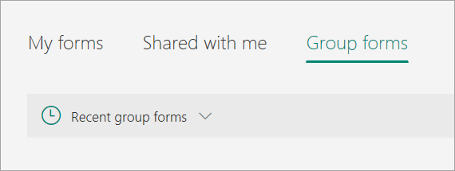
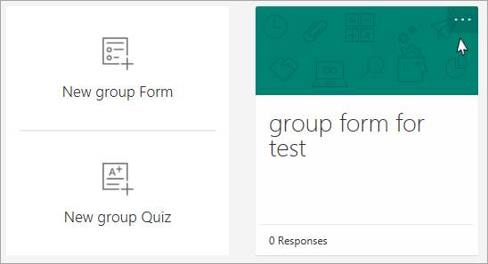
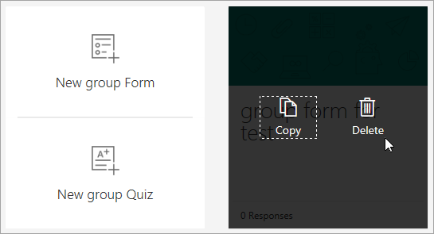
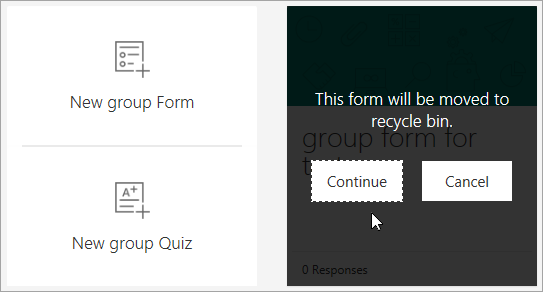

# Cannot delete a group form from Microsoft Teams

## Symptoms

For a group form that is created in Microsoft Teams, you are unable to directly delete it from Microsoft Teams.

## Resolution

To delete the group form from Microsoft Forms, follow these steps:

1. Sign in to [Microsoft Forms](https://forms.office.com/).
1. Select **Group Forms** > **Recent group forms**.

   
1. Select the group with the form that you want to delete.
1. Select the ellipses button in the upper right corner of the form thumbnail.

   

1. Select **Delete**.

   

1. Select **Continue**.

   