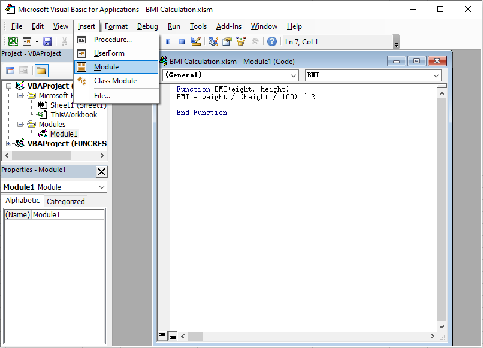
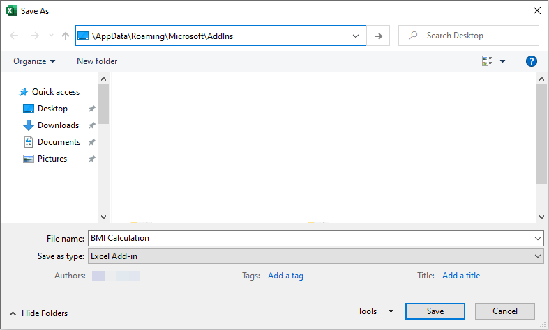
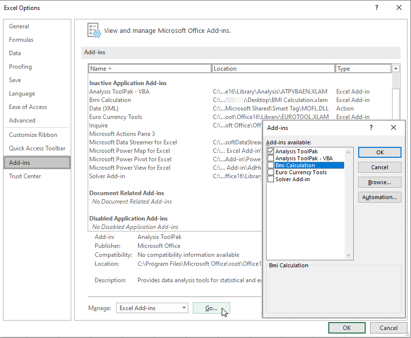
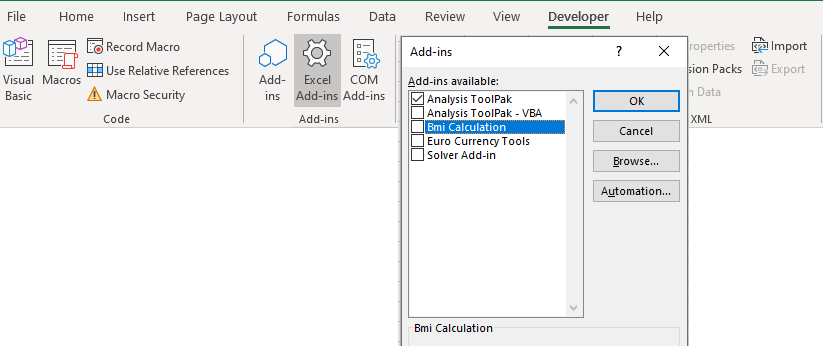

# Create An Excel Add-In to Calculate Body Mass Index (BMI)

This article was written by [Raddini Rahayu](https://mvp.microsoft.com/en-us/mvp/raddini%20gusti%20rahayu-4038228), Microsoft MVP.

## Introduction 

Excel Add-In is a file that contains code of VBA to adds additional Excel function which doesn't exist in Excel function by default.This file is saved in .xlam format and always loaded when Excel starts up. The additional or custom Excel function can also be called a UDF (User Defined Function)that is a custom function which is created by user.

In using Add-In, at first you must install it on your computer then it will always be used for all workbook. In this article, you will be shown how to create custom function in the Add-In using VBA code, save file that contains Add-In, install the Add-In, using custom function from Add-In and uninstall the Add-In.

## Case 

In this case below, I will share about how to create a custom function to calculate BMI (Body Mass Index).

Body Mass Index is a simple index of weight and height that is commonly used to classify underweight, overweight and obesity in adults. BMI values ​​are age-independent and same for both sexes. The classifications of BMI are showed in the following table: 


The BMI scale used here is only suitable for adults aged 20-65 and here is the calculation:


## What To Do 

### Step 1: Coding VBA Code

1. Open Microsoft Excel, then press Alt+F11on keyboard, so VBE ( Visual Basic Editor) window is displayed.

2. Open a module by selecting Module on Insert menu and write this script:
    ```vb
    Function BMI(weight, height) BMI = weight / (height / 100) ^ 2 End Function
    ```
    

3. Close the VBE window and back to Excel. Then save the file with click on Save button or press CTRL+S on your keyboard, so the Save as dialog box is displayed.

### Step 2: Save The Excel Workbook

1. Fill the name that you want named to at the File Name box. Here I name it BMI Calculation.

2. For the file type, choose Excel Add-In (.xlam) format. Then close the workbook.

       

    > [!NOTE]
    > You can save your Add-In file anywhere you want. But if you want it to be listed on Excel bulit-in, you should save it into the default location. On my computer with Windows 7 operating system, the default location for any versions of Microsoft Excel is:
    C:\Users\RADDINI\AppData\Roaming\Microsoft\AddIns

Until this step, we have finished create a custom function that is saved in Excel Add-In file. Next we need to install it and then we can use the Add-In.

### Step 3: Install The Add-In

1. Open Microsoft Excel and select Options by clicking File tab, so Excel Options dialog box is displayed.

2. In the Excel Options dialog box, click on Add-Ins tab. Find the Manage option below, choose Excel Add-Ins then click Go.

3. Also, you can display the Add-Ins dialog box by click on Developer tab then click Add-Ins.

4. On the Add-Insdialog box, find the Add-In that we want installed to (in this case is BMI calculation), make sure the BMI calculation checkbox is unchecked. Then click OK.

    
    
    
   
    > [!NOTE]
    > This step is applied to the file which is saved in default Add-Ins location. If you want to installing Add-In that is saved in another location, you should click on Browse button in the Add-Ins dialog box. When Browse dialog box is displayed, go to the file location, choose the Add-In file and then click Open.

Now, BMI calculation custom function has installed and ready to use.

### Step 4: Use The Function

Now, we can use the custom function that we have created. To testing this BMI function, write on the cell B1: =BMI(55,170) , then Press Enter. If the Result is 19.03, it means our custom function is working well. Also you can try calculate your BMI then find out your BMI classification by looking at BMI Classification table.


### Step 5: Uninstall The Add-In

However, every Add-In which have installed on Excel, will always running when Excel get started. Excel load time may takes longer than Excel without Add-In. If you don’t need that Add-In anymore, you can uninstall one or more of them. The steps are almost same as installing Add-In, please following this steps:

1. Open Add-Ins dialog box by clicking Add-Ins on the Developer tab.

2. Choose the Add-In that you want uninstalled to, then uncheck its checkbox.

3. Click OK and Restart your Excel.

    

### Community Solutions Content Disclaimer

MICROSOFT CORPORATION AND/OR ITS RESPECTIVE SUPPLIERS MAKE NO REPRESENTATIONS ABOUT THE SUITABILITY, RELIABILITY, OR ACCURACY OF THE INFORMATION AND RELATED GRAPHICS CONTAINED HEREIN. ALL SUCH INFORMATION AND RELATED GRAPHICS ARE PROVIDED "AS IS" WITHOUT WARRANTY OF ANY KIND. MICROSOFT AND/OR ITS RESPECTIVE SUPPLIERS HEREBY DISCLAIM ALL WARRANTIES AND CONDITIONS WITH REGARD TO THIS INFORMATION AND RELATED GRAPHICS, INCLUDING ALL IMPLIED WARRANTIES AND CONDITIONS OF MERCHANTABILITY, FITNESS FOR A PARTICULAR PURPOSE, WORKMANLIKE EFFORT, TITLE AND NON-INFRINGEMENT. YOU SPECIFICALLY AGREE THAT IN NO EVENT SHALL MICROSOFT AND/OR ITS SUPPLIERS BE LIABLE FOR ANY DIRECT, INDIRECT, PUNITIVE, INCIDENTAL, SPECIAL, CONSEQUENTIAL DAMAGES OR ANY DAMAGES WHATSOEVER INCLUDING, WITHOUT LIMITATION, DAMAGES FOR LOSS OF USE, DATA OR PROFITS, ARISING OUT OF OR IN ANY WAY CONNECTED WITH THE USE OF OR INABILITY TO USE THE INFORMATION AND RELATED GRAPHICS CONTAINED HEREIN, WHETHER BASED ON CONTRACT, TORT, NEGLIGENCE, STRICT LIABILITY OR OTHERWISE, EVEN IF MICROSOFT OR ANY OF ITS SUPPLIERS HAS BEEN ADVISED OF THE POSSIBILITY OF DAMAGES.
