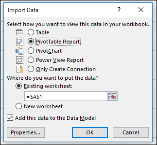
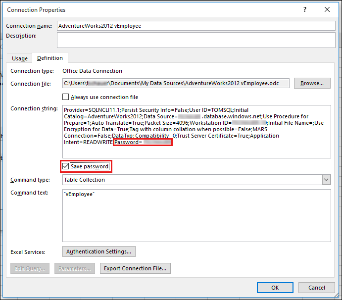

# How to refresh data to a SQL Azure Database in Excel Online

This article was written by [Tom Schauer](https://social.technet.microsoft.com/profile/Tom+Schauer+-+MSFT), Technical Specialist.

This article describes how to connect to Microsoft SQL Azure Database and refresh the data in Excel Online.

1. Open Excel client, click **Data** > **From Other Sources** > **From Data Connection Wizard**.

   

1. Select **Other/Advanced**.

   

1. Select **SQL Server Native Client 11.0**.
   
   > [!NOTE]
   > If you don't have SQL Server Native Client 11.0, you have to install it from [www.microsoft.com/en-us/download/details.aspx?id=35580](https://www.microsoft.com/en-us/download/details.aspx?id=35580).
   
   

1. Enter your SQL Azure Database name, and then click **OK**.

   

1. Select the **Use a specific user name and password** option, and then enter the **User name** and **Password**. Select the correct database under **Select the database** dropdown, and then click **Test Connection** to make sure that the connection is successful.

   > [!IMPORTANT]
   > Select the **Allow saving password** check box.  

   

1. Select the table that you want to use, and then click **Next**.

   

1. On the **Save Data Connection File and Finish** window, click **Finish**.

   

1. Select **Pivot Table Report** (in this example).

   > [!IMPORTANT]
   > For this report to refresh in Excel only, you must select the **Add this data to the Data Model** check box.

   

1. If you are prompted to re-enter the password, re-enter it.

   

1. Make sure that the password is embedded in the connection string. To do this, in the Excel client, select **Data** > **Connections** > **Properties** > **Definition** tab. Make sure that there is a check box next to **Save Password** and also make sure that the password is indeed embedded in the connection string (it should say **Password=<*YourPassword*>** at the end of the connection string), and then click **OK**.

   

1. If you did have to select the **Save password** check box, the connection string will change. Therefore, you will be informed that the connection string is now different from the .odc file. The warning is ok, and you just click **Yes**.

   

1. Now, you see that a Data Model is added to the workbook. This is important to a successful refresh in Excel Online.

   

1. Upload this workbook to Excel Online, and then test refreshing in the browser through **Data** > **Refresh All Connections**.

   