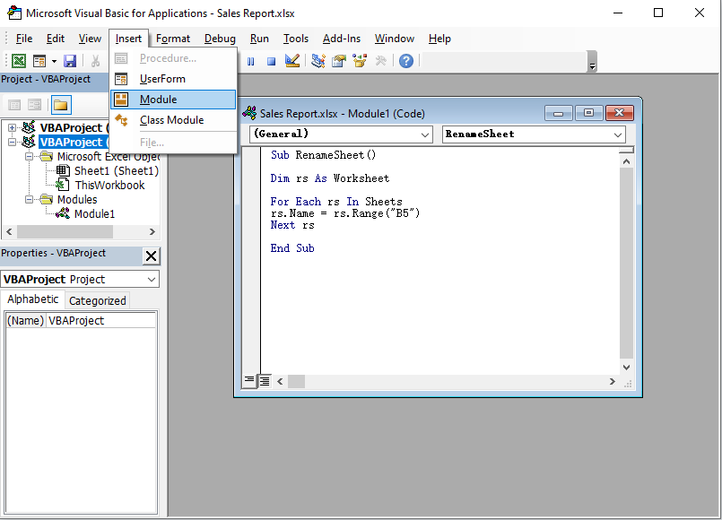

# Step by Step : Rename Excel Sheet with Cell Contents by Using Macro

This article was written by [Raddini Rahayu](https://mvp.microsoft.com/en-us/mvp/raddini%20gusti%20rahayu-4038228), Microsoft MVP.

## Case 

Here is weekly sales activity reports. In example, there are 15 person in this case. Nancy, the admin reports, she is assigned summarizing each sales data into one file where all sales are separated on each sheet. For easly arranging data, each sheet she gave the name matches the sales name on that sheet. At first, Nancy feel comfortable with this, but as more and more data and demands rapid processing, she was so overwhelmed. To overcome this, Nancy want to the name sheets changed automatically according to the sales name on each sheet without manually rename it.


## Solutions

The best solutions to overcome the Nancy's problem is by using macro. This macro designed for each sheet in that file regardless of the number of sheet. The name of each sheet will change according to the sales name that have been determined in the same location on each sheet.

## How to Execute

### First Step

- Designing report formats and specify the cell location where the sales name will be placed. In this case the location is at cell J2. This report format should be the same on each sheet.   
- Keep the sheet names on the default name (Sheet1, Sheet2, Sheet3, etc).

       

### Last Step

#### Macro Coding Step

After we know the cell location where the sales name will be placed, now we can continue the next step, Macro coding.

1. On the Developer tab Code category select Visual Basic, or press key combination Alt+F11on the keyboard, so Visual Basic window is displayed.


2. On the project taskpane click Sales Report.xlsx(Workbook Name), then on Insertmenu select Moduleand write the following script:

    ```vb
    Sub RenameSheet()
    
    Dim rs As Worksheet
    
    For Each rs In Sheets
    rs.Name = rs.Range("B5")
    Next rs
    
    End Sub
    ```
     

3. Press the F5key on the keyboard, if there is no debug close the Visual Basic window and return to Excel. If there is debug, check back your script.   
4. Return to Excel and see what happens, if the codes are correct, now the name of each sheet is renamed in accordance with the existing sales name on each sheet.
   
That's it. Hopefully usefull.

### Community Solutions Content Disclaimer

MICROSOFT CORPORATION AND/OR ITS RESPECTIVE SUPPLIERS MAKE NO REPRESENTATIONS ABOUT THE SUITABILITY, RELIABILITY, OR ACCURACY OF THE INFORMATION AND RELATED GRAPHICS CONTAINED HEREIN. ALL SUCH INFORMATION AND RELATED GRAPHICS ARE PROVIDED "AS IS" WITHOUT WARRANTY OF ANY KIND. MICROSOFT AND/OR ITS RESPECTIVE SUPPLIERS HEREBY DISCLAIM ALL WARRANTIES AND CONDITIONS WITH REGARD TO THIS INFORMATION AND RELATED GRAPHICS, INCLUDING ALL IMPLIED WARRANTIES AND CONDITIONS OF MERCHANTABILITY, FITNESS FOR A PARTICULAR PURPOSE, WORKMANLIKE EFFORT, TITLE AND NON-INFRINGEMENT. YOU SPECIFICALLY AGREE THAT IN NO EVENT SHALL MICROSOFT AND/OR ITS SUPPLIERS BE LIABLE FOR ANY DIRECT, INDIRECT, PUNITIVE, INCIDENTAL, SPECIAL, CONSEQUENTIAL DAMAGES OR ANY DAMAGES WHATSOEVER INCLUDING, WITHOUT LIMITATION, DAMAGES FOR LOSS OF USE, DATA OR PROFITS, ARISING OUT OF OR IN ANY WAY CONNECTED WITH THE USE OF OR INABILITY TO USE THE INFORMATION AND RELATED GRAPHICS CONTAINED HEREIN, WHETHER BASED ON CONTRACT, TORT, NEGLIGENCE, STRICT LIABILITY OR OTHERWISE, EVEN IF MICROSOFT OR ANY OF ITS SUPPLIERS HAS BEEN ADVISED OF THE POSSIBILITY OF DAMAGES.
