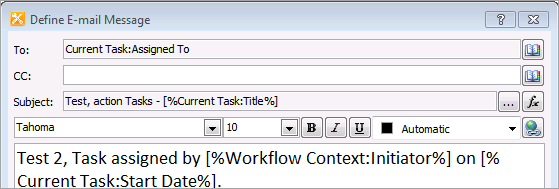
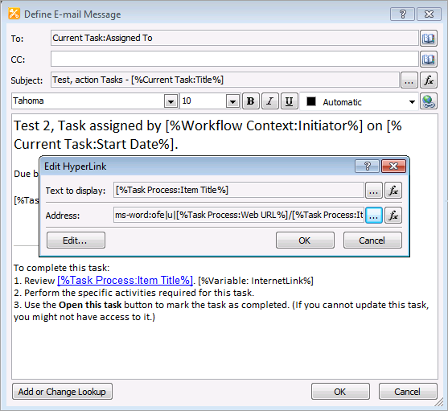
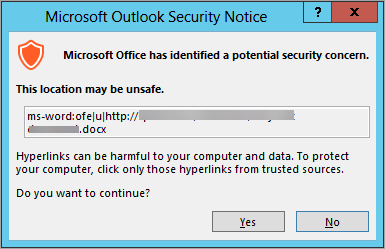

# Force a Word document to open in edit mode from an email link

By default, when you open a Microsoft Word document from a hyperlink in an email message, Word opens the document in read-only mode. However, you can update the hyperlink to force Word to open the document in edit mode. This article describes how to make this change by using a SharePoint workflow email task.

## Update a hyperlink by using a SharePoint workflow email task

1. In SharePoint Designer, open the **Define E-mail Message** dialog box.

1. Select the hyperlink to the document, and then click the hyperlink edit button .

   

1. Add **ms-word:ofe|u|** to the beginning of the hyperlink address, such as the following example:

   **ms-word:ofe|u|[%Task Process:Web URL%]/[%Task Process:Item URL%]**

   

   > [!NOTE]
   > You can use this method for plain hyperlinks. For example, use "ms-word:ofe|u|http://sharepointserver/library/testdocument.docx" instead of "http://sharepointserver/library/testdocument.docx".

1. Save and publish your workflow.

## Add a "ms-word:" registry key to suppress Microsoft Outlook Security Notice

After you update the hyperlink by using the previous steps, you may receive the following warning when you use the new hyperlink:

**Microsoft Outlook Security Notice**

Microsoft Office has identified a potential security concern.

To suppress this notification, add the **ms-word:** registry key, as follows:

**Important**

Follow the steps in this section carefully. Serious problems might occur if you modify the registry incorrectly. Before you modify it, [back up the registry for restoration in case problems occur](https://support.microsoft.com/help/322756).

1. Exit all Microsoft Office applications.
1. Start Registry Editor:
   - In Windows 10, go to **Start**, enter regedit in the **Search** box, and then select **regedit.exe** in the search results.
   - In Windows 8 or Windows 8.1, move your mouse to the upper-right corner, select **Search**, enter regedit in the search text box, and then select regedit.exe in the search results.
   - In Windows 7, select **Start**, enter regedit in the **Start Search** box, and then select regedit.exe in the search results.
1. Locate and then select the following registry subkey (if the subkey does not exist, create it manually):
   **HKEY_CURRENT_USER\Software\Policies\Microsoft\Office\16.0\Common\Security\Trusted Protocols\All Applications**
   > [!NOTE]
   > This subkey is for Office 2016 and later versions (including Office 2019). If you are using Office 2013, change 16.0 to 15.0. If you are using Office 2010, change 16.0 to 14.0.
1. On the **Edit** menu, point to **New**, and then select **Key**.
1. Enter **ms-word:**, and then press Enter.
1. Exit Registry Editor.