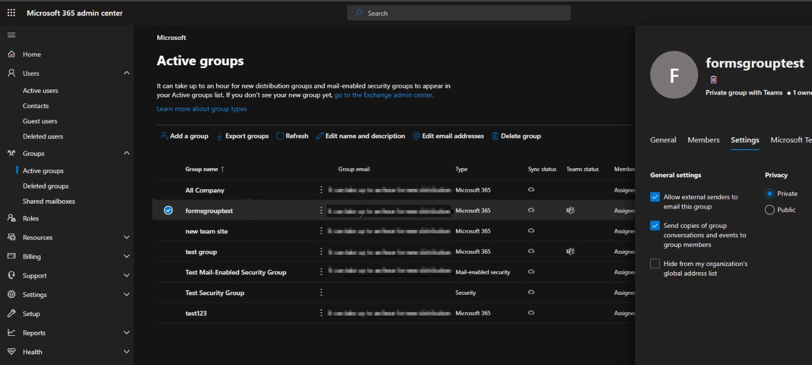

# No email notifications for responses to Group Forms

This article was written by [Zakir Haveliwala](https://social.technet.microsoft.com/profile/Zakir+H+-+MSFT), Senior Support Escalation Engineer.

You might not receive email notifications for responses that you submit to a Group Form, such as a Form that you create in Microsoft Teams. To receive email notifications, do the following:

1. Sign in to Forms at [https://forms.office.com](https://forms.office.com).

2. Scroll down to **My groups**.

   

3. Select the group for which you want to get email notifications.

   

4. On the right side, you see the number of members in the group. Select that number, and then it opens the group email page in Outlook.

   

5. In Outlook web app, select the ellipsis button (...) next to **Send email**, and in the drop-down box select **Edit group**.

    :::image type="content" source="media/no-email-notifications-for-responses-to-group-forms/no-email-notifications-for-responses-to-group-forms-1.png" alt-text="Select the ellipsis and then Edit group.":::

6. Select the **Let people outside the organization email the groups** and **Members will receive all group conversations and events ...** check boxes and then select **Save**.

    :::image type="content" source="media/no-email-notifications-for-responses-to-group-forms/no-email-notifications-for-responses-to-group-forms-2.png" alt-text="Select the two checkboxes.":::

    The global administrator can use these steps instead:

    1. Sign in to [Microsoft 365 admin center](https://admin.microsoft.com) and go to **Groups** > **Active groups**.
    2. Select the appropriate group from the list, and then select the **Settings** tab.
    3. Select the **Allow external senders to email this group** and **Send copies of group conversations and events to group members** check boxes.

    

7. Open the Form, select the ellipsis button (...) on the upper-right corner of your screen, select **Settings**, and then select the **Get email notification of each response** check box.

    :::image type="content" source="media/no-email-notifications-for-responses-to-group-forms/no-email-notifications-for-responses-to-group-forms-3.png" alt-text="Select the ellipsis button, then Settings, then Get email notification of each response.":::

All the users in the group will receive email notifications when a response is submitted to the Form.
