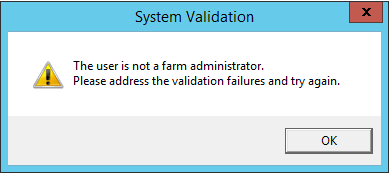
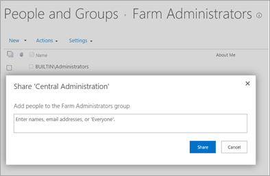
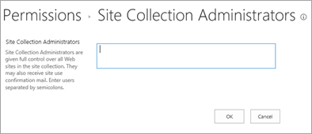

# PowerPivot Configuration Tool shows "The user is not a farm administrator" error

## Symptoms

When you run the PowerPivot Configuration Tool on a SharePoint application server that's running PowerPivot for SharePoint, you may receive the following error:

## Cause

The user is required to be both a farm administrator and a site collection administrator in the SharePoint Central Administration site. The error may occur if the user isn't assigned to one of these groups.

## Resolution

To fix this issue, add the user as both a farm administrator and a site collection administrator.

**Add the user as a farm administrator**

Go to **SharePoint Central Administration** > **Security** > **Manage the farm administrators group**. On the People and Groups-Farm Administrators page, select **New** > **Add Users**, type the user, and then click **Share**.

**Add the user as a site collection administrator in Central Administration**

Go to **SharePoint Central Administration**, click the gear icon on the upper-right, and then select **Site settings**. Then, go to **Users and Permissions** > **Site collection administrators**, type the user and then click **OK**.

