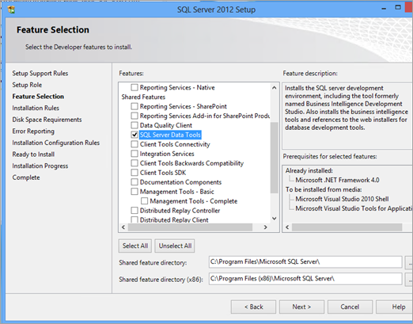
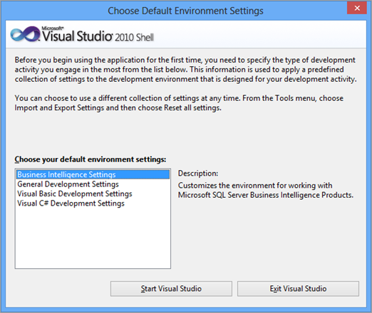
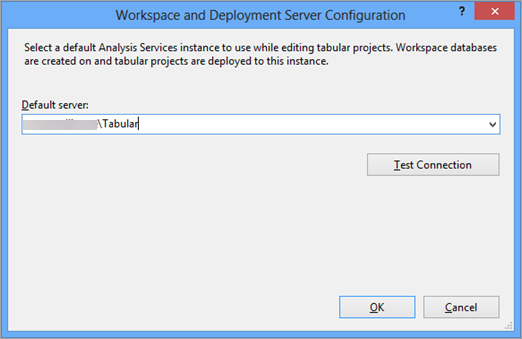
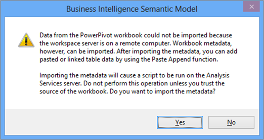
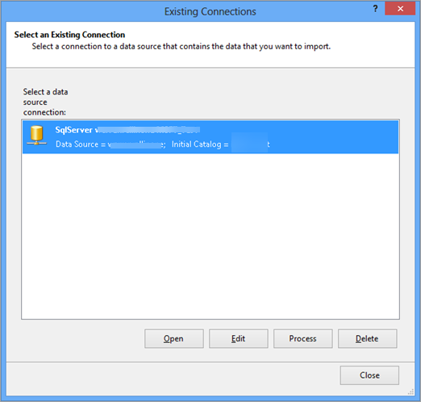
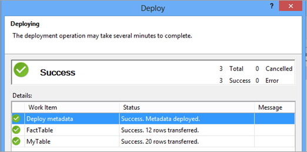
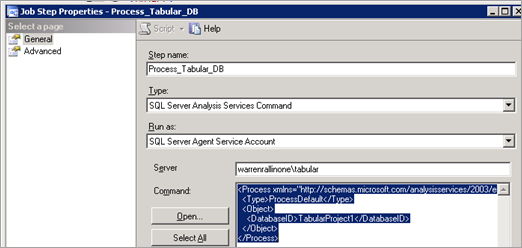

# Upsize PowerPivot 2013 workbooks to SQL Server Analysis Services (SSAS)

This article introduces how to upsize a PowerPivot workbook to a Microsoft SQL Server Analysis Services (SSAS) Tabular instance for knowledge workers or SharePoint administrators.

Assume that you are using PowerPivot as a data source, so no UI is present in the workbook that's hosting the PowerPivot data model. The data will display from another workbook that connects to the PowerPivot workbook as a data source or from some other reporting tool such as Power View or Excel Services.

## What is upsizing PowerPivot? (aka convert PowerPivot to Tabular model, aka convert PowerPivot to SSAS)

Upsizing PowerPivot is moving the solution from a SharePoint centric storage mode to an SSAS centric storage mode.  The result is that the PowerPivot model and data won't be stored in SharePoint.
PowerPivot stores models in Excel Workbooks when you use a SharePoint centric mode and stores the models in native SSAS files when you use SSAS storage mode.

The key is that the same query engine is used regardless of where the model is stored, the Excel application, SharePoint or SSAS.  
## Why do you upsize a PowerPivot workbook?

Consider upsizing your PowerPivot workbook after it exceeds 100 megabytes (MB) for the following reasons:

**Stability**

- SharePoint is not optimized to host very large files and it has a hard limit of 2 gigabytes (GB) for a single file.
- You will find that SharePoint features may fail or behave incorrectly when you use very large files. This is also a burden on the SharePoint system that could adversely affect other users.

**Performance**

- When a PowerPivot workbook is stored in SharePoint the PowerPivot model and all the data must be streamed from the SharePoint database to a special instance of SSAS to build the database.
- If users are experiencing intermittent poor performance, this might be because the cache time has expired and the back-end SSAS database has to be rebuilt.
- In SharePoint 2013, the default behavior of Excel Services data \ "Refresh all connections" is to have the PowerPivot data completely reloaded itself from source data.  For large workbooks, this could cause poor user experience.

**Have a PowerPivot workbook larger than 2GB**

The only option to have a PowerPoint workbook larger than 2GB is to upsize or only use it in the 64-bit of Excel. SharePoint only supports 2GB files or smaller.

## Consider the following before upsizing

1. You must contact your administrator to install and configure a tabular instance of SSAS in your network.
1. You need install **SQL Server Data Tools** on your system.
1. SSAS does not use the SharePoint security system. If you want to restrict who can access the workbook data, you need configure it on the SSAS database.
   - This consists of assigning Windows users or groups' access to the database.
   - You can do this by using **SQL Server Data Tools**.
1. If you don't use the workbook as a data source, you need create a separate workbook to view the data. This would be in cases where both the data and the pivot tables that view the data are stored in the same workbook.

## Steps to upsize a PowerPivot workbook

1. Have your administrator set up a tabular instance of SSAS in your network.
   1. Use the SQL Server 2012 to install [SQL Server Analysis Service](http://msdn.microsoft.com/en-us/library/hh231722.aspx) that hosts Tabular models.
   1. Have the SSAS service run under a domain account. It will need to access the file share that's made in the step 2 below.
   1. Install [SQL Server 2012 Service Pack 1](https://www.microsoft.com/en-us/download/details.aspx?id=35575) if you are using Excel 2013 workbook as the data source.
   1. Enable the "SQL Server Browser" service.
1. Create a file share where both the service account that's used in the step 1 and the users who are building the model have full control.
1. On the client computer that will author the data model, install the SQL Server Data Tools (formerly known as BIDS) from SQL Server 2012.
   1. Run setup, select **Installation** > **New SQL Server stand-alone installation or add features to an existing installation**.
   1. On the **Setup Role** panel, select **SQL Server Feature Installation**.
   1. On the **Feature Selection** panel, select **SQL Server Data Tools**.

      
1. Finish the installation wizard.
1. Install [SQL Server 2012 Service Pack 1](http://www.microsoft.com/en-us/download/details.aspx?id=35575) on the client computer. This supports Office 2013 workbooks.
1. Copy the workbook that you want to upsize to the file share that's created in the step 2.
1. Start **SQL Server Data Tools**.
1. Select **Business Intelligence Settings** in the **Choose Default Environment Settings** prompt window.

   
1. Create a new project through selecting **File** > **New** > **Project**.
1. In the **Business Intelligence \ Analysis Service** template, select **Import from PowerPivot**.
1. Enter a project name. This project will hold the model and build the database on the SSAS server.
1. Enter the tabular mode SSAS server or instance name in the next popup window.

   
1. Verify the connection to make sure that the SSAS server is entered correctly and is functioning correctly.
1. Click **Yes** in the following warning window. This just asks that you trust where the PowerPivot workbook is getting data from and informs you that the data won't be imported. It is fine because the server will fetch data from the data sources that's defined in the PowerPivot model. If you have data in the model that is from a linked sheet that will need to be copied manually into this solution through the **Past Append** function.

   
1. Select the workbook that you want to upsize in the file open dialog box that pops up next. This file should reside on the file share that's created in step 2 and referenced in step 6.
1. If all goes well, several progress bars should pass by in the lower-right corner of the window and you should end up with an open **Model.bim** file.

   

1. Click the **Existing Connections** toolbar button and review any existing connection(s) included in the model. The domain account that's used in step 1 should have read access to all the data sources used.

   
1. Deploy the project to the server through selecting **Build** > **Deploy**. You should get the **Success** message.

   

1. At this point, you have a working data source that you can access from new workbooks and other data source consumers. In Excel, you just treat it like any other Analysis Services data source. For more information about how to connect to an SSAS database, see [Connect to a SQL Server Analysis Services Database (Import)](https://support.office.com/en-us/article/connect-to-a-sql-server-analysis-services-database-import-b6dd7f39-bea5-4e98-9aa1-39fc7b24424b).
1. Set up an automated processing schedule by using the **SQL Server Management Studio** tool because the new SSAS database is not getting refreshed with the latest data and it is a static snapshot of the data at the time you deployed it to the server.  
   1. Make sure that the **SQL Server Agent** service is running on the SSAS server.
   1. Make sure that the account that's running the SQL Server Agent service has permissions to process the new SSAS tabular database. You can create a new role for the database that has "Process" permissions and assign the agent account to it.
   1. Create a new SQL Server Agent job, as follows:

      **Type**: SQL Server Analysis Services Command

      **Run as**: SQL Server Agent Service Account

      **Server**: Name of you SSAS Tabular server

      **Command**:
      ```
      <Process xmlns="http://schemas.microsoft.com/analysisservices/2003/engine">
      <Type>ProcessDefault</Type>
      <Object> <DatabaseID>TabularProject1</DatabaseID> 
      </Object>
      </Process>
      ```
      > [!NOTE]
      > **DatabaseID** should be the name of the SSAS database that you just created.

      
1. Schedule the job to run daily or how frequently you want changes that are made in the source data to reflect in the SSAS tabular database.
1. New data is fetched from the source data sources when the SSAS database is processed.