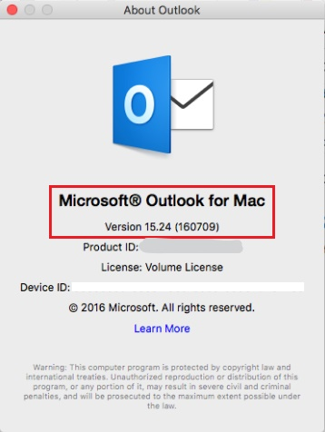
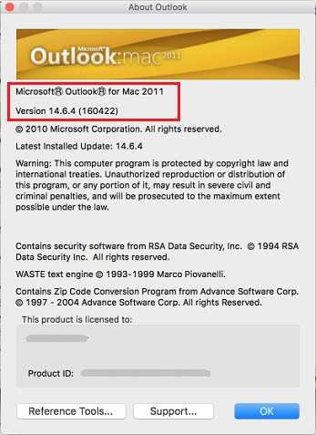

# How to open a shared calendar from an Outlook sharing invitation

_Original KB number:_ &nbsp; 10106

> [!NOTE]
> If you would like to share calendar or folder to others, or change permissions after sharing rather than opening, check the following articles at first:
>
> - Outlook 2016/2013/2010/2007: [Share an Outlook calendar with other people](https://support.microsoft.com/office/share-an-outlook-calendar-with-other-people-353ed2c1-3ec5-449d-8c73-6931a0adab88)
> - Outlook.com: [Share your calendar in Outlook.com](https://support.microsoft.com/office/share-your-calendar-in-outlook-com-0fc1cb48-569d-4d1e-ac20-5a9b3f5e6ff2)
> - Outlook on the Web or Outlook Web App: [Share your calendar in Outlook on the web for business](https://support.microsoft.com/office/share-your-calendar-in-outlook-on-the-web-7ecef8ae-139c-40d9-bae2-a23977ee58d5)
> - Outlook 2016 for Mac: [Share your calendar in Outlook 2016 for Mac](https://support.microsoft.com/office/share-your-calendar-in-outlook-for-mac-1534a3e9-b6d1-420f-88ae-89abb17ad57e)
> - Outlook for Mac 2011: [Share a folder in an Exchange account](https://support.microsoft.com/office/share-a-folder-in-an-exchange-account-645b7a89-2c2e-42b0-92b6-97a703b406b3)

**Who is it for?**

Users of Outlook, Outlook for Mac, Outlook on the Web and Outlook Web App who can't open shared calendars from an invitation.

**How does it work?**

We'll begin by asking you questions about the Outlook version you are using and the issue you're experiencing. Then we'll take you through a series of troubleshooting steps that are specific to your situation.

> [!IMPORTANT]
> The third party mail services such as Gmail,AOL,Yahoo are not supported by Microsoft and this guide might not apply to them.

**Estimated time of completion:**

10-15 minutes.

## Select your version of Outlook

- [Outlook 2016](#open-a-shared-calendar-in-outlook-2016)
- [Outlook 2016 (only for Office 365 users on Monthly Channel)](#open-a-shared-calendar-in-outlook-2016-only-for-office-365-users-on-monthly-channel)
- [Outlook 2013](#open-a-shared-calendar-in-outlook-2013)
- [Outlook 2010](#open-a-shared-calendar-in-outlook-2010)
- [Outlook 2007](#open-a-shared-calendar-in-outlook-2007)
- [Outlook.com](#open-a-shared-calendar-from-outlookcom)
- [Outlook 2016 for Mac](#open-a-shared-calendar-in-outlook-2016-for-mac)
- [Outlook for Mac 2011](#open-a-shared-calendar-in-outlook-for-mac-2011)
- [Outlook on the web](#open-a-shared-calendar-in-outlook-on-the-web)
- [Outlook Web App](#open-a-shared-calendar-in-outlook-web-app)
- [Outlook App on mobile/tablet devices](#workaround-for-opening-shared-calendar-on-mobiletablet-devices)
- [Outlook mobile apps for iOS & Android](#open-a-shared-calendar-in-outlook-mobile-apps-for-ios--android)

### Don't know which version of Outlook you are running

First determine which outlook version you are using.

#### For Windows

If you find Office Account:

If you find Help:

If you do not find either Office Account or Help on the File menu, then follow these steps:

1. Start Outlook.

2. Select **File**, and then find either **Office Account** or **Help**, and follow the steps for which option you find. If you do not find either option, see the steps below.
   1. Select **Office Account**, and then select **About Outlook**.

      :::image type="content" source="media/how-to-open-shared-calendar/about-outlook.png" alt-text="select the About Outlook in Office Account" border="false":::

   2. The product version will be listed here.

      :::image type="content" source="media/how-to-open-shared-calendar/product-version.jpg" alt-text="find the product version 1":::

   3. Select **OK**.

   Or

   1. Select **Help**, and then select **Additional Version and Copyright Information**.

      :::image type="content" source="media/how-to-open-shared-calendar/additional-version-and-copyright-information.png" alt-text="select the Additional Version and Copyright Information":::

   2. The product version will be listed here.

      :::image type="content" source="media/how-to-open-shared-calendar/product-version-outlook-2010.png" alt-text="find the product version 2":::

   3. Select **OK**.

   Or

   1. On the **Help** menu, select **About Microsoft Office Outlook**.

      :::image type="content" source="media/how-to-open-shared-calendar/about-microsoft-office-outlook.png" alt-text="About Microsoft Office Outlook":::

   2. The product version will be listed here.
      :::image type="content" source="media/how-to-open-shared-calendar/product-version-outlook-2007.png" alt-text="find the product version of Outlook 2007 1":::

   3. Select **OK**.

#### For Mac

1. Start Outlook for Mac.
2. On the **Outlook** menu, select **About Outlook**.

   :::image type="content" source="media/how-to-open-shared-calendar/about-outlook-in-outlook-for-mac.png" alt-text="find the product version of Outlook 2007 2" border="false":::

3. The About Outlook window will appear similar to one of the following, depending on your version of Outlook for Mac.

    |Outlook 2016 for Mac|Outlook for Mac 2011|
    |---|---|
    |||

#### For Outlook on the web or Outlook Web App

If you are using browser to connect an Office 365 or Exchange mailbox, select **Outlook On the Web/Outlook Web App**.

:::image type="content" source="media/how-to-open-shared-calendar/outlook-on-the-web.png" alt-text="Outlook On The Web" border="false":::

Or

:::image type="content" source="media/how-to-open-shared-calendar/outlook-web-app.png" alt-text="Outlook Web App" border="false":::

#### For Outlook app on mobile or tablets devices

If you are using Outlook App on mobile devices or tablets, including Windows Phone, iPhone, iPad, Android phones, select the option **Outlook App on mobile/tablet devices** at the bottom.

### Open a shared calendar in Outlook 2010

> [!NOTE]
> If you would like to share an Outlook calendar to other people rather than open a shared calendar from others in Outlook 2010, please check [Share an Outlook calendar with other people](https://support.office.com/article/Share-an-Outlook-calendar-with-other-people-cafb9303-1b1e-40d3-839d-b6abac03a5e8).

To open a shared calendar from the Outlook sharing invitation, select **Open this Calendar** in the sharing invitation.

:::image type="content" source="media/how-to-open-shared-calendar/open-this-calendar-in-sharing-invitaion.png" alt-text="Open this Calendar" border="false":::

**If you see something different, what problem do you encounter?**

- [There is no Open this Calendar option](#there-is-no-open-this-calendar-option)
- [You see nothing when you open the shared calendar](#you-see-nothing-or-you-dont-have-the-necessary-permission-to-open-the-shared-calendar)
- [You don't have the necessary permission to view a shared calendar](#you-see-nothing-or-you-dont-have-the-necessary-permission-to-open-the-shared-calendar)

### Open a shared calendar in Outlook for Mac 2011

> [!NOTE]
> If you would like to share an Outlook calendar to other people rather than open a shared calendar from others in Outlook for Mac 2011, see [See and share multiple calendars](https://support.microsoft.com/office/see-and-share-multiple-calendars-d8f8c7e3-046f-4f0d-8fc5-691114082da4).

The sharing invitation that you receive resembles the following screenshot. Notice that there's no option to open the shared calendar.

:::image type="content" source="media/how-to-open-shared-calendar/no-option-to-open-shared-calendar.png" alt-text="there's no option to open the shared calendar" border="false":::

To open the shared calendar, follow these steps:

1. On the **File** menu, point to **Open**, and then select **Other User's Folder**.

   :::image type="content" source="media/how-to-open-shared-calendar/search-to-open-other-users-folder.png" alt-text="Other User's Folder" border="false":::

2. Select **Find User** .
3. Type the name of the person who granted you access, select **Find**, select the person's name, and then select **OK**.
4. On the **Type** menu, select **Calendar**, and then select **OK**.

   The shared calendar appears in the navigation pane under the **Shared** heading.

**If you cannot open the shared calendar, what problem do you encounter?**

- [The "Open Shared Calendar" is not available or greyed out](#the-open-shared-calendar-is-not-available)
- [You see nothing when you open the shared calendar](#open-a-shared-calendar-in-outlook-web-app)
- [You don't have the necessary permission to view a shared calendar](#you-dont-have-permission-to-view-a-shared-calendar-in-outlook-2016-for-mac-or-outlook-for-mac-2011)
- [You get blank calendar or permission error when open shared calendar on Mac even if you have free/busy permission](#you-get-blank-calendar-or-permission-error-on-mac-even-if-you-have-freebusy-permission-in-outlook-2016-for-mac-or-outlook-for-mac-2011)
- [You cannot open one or more of the shared Calendar folders when you have access to multiple shared Calendar folders](#cant-open-one-or-more-of-the-shared-calendar-folders-in-outlook-2016-for-mac-or-outlook-for-mac-2011)
- [The problem isn't listed above](#workaround-for-opening-shared-calendar-on-mac-system)

### Open a shared calendar in Outlook Web App

> [!NOTE]
> If you would like to share an Outlook calendar to other people rather than open a shared calendar from others in Outlook Web App, please check [Sharing your calendar in Outlook Web App](https://support.microsoft.com/office/share-your-calendar-in-outlook-on-the-web-7ecef8ae-139c-40d9-bae2-a23977ee58d5).

To open a shared calendar from the sharing invitation, select **Accept** to open the shared calendar, and then you will see the shared calendar in the left pane under **Other Calendar** and the events in the right pane.

:::image type="content" source="media/how-to-open-shared-calendar/open-shared-calendar-in-owa.png" alt-text="OWA Shared Calendar Invitation":::

**If you see something different, what problem do you encounter?**

- [There is no Accept option](#there-is-no-accept-option)
- [You see nothing when you open the shared calendar](#you-see-nothing-or-you-dont-have-the-necessary-permission-to-open-the-shared-calendar)
- [You don't have the necessary permission to view a shared calendar](#you-see-nothing-or-you-dont-have-the-necessary-permission-to-open-the-shared-calendar)

### There is no Accept option

To work around this problem, open directly into the shared calendar.

For example, assume that your Outlook on the Web (formerly known as Outlook Web App) URL is `https://yourdomain/owa`, and that a user (user@*yourdomain*.com) shared his or her calendar with you.

:::image type="content" source="media/how-to-open-shared-calendar/your-domain-for-example.png" alt-text="OWA Shared calendar URL" border="false":::

You can use the following URL to open the user's calendar:

`https://yourdomain/owa/user@yourdomain.com/?cmd=contents&module=calendar`

**Did this solve your problem?**

- If yes, see [Additional resources.](#additional-resources)
- If no, see [Additional help.](#additional-help)

### There is no Open this Calendar option

This problem occurs when the person who shared the calendar with you is running a later version of Outlook.

In the invitation, notice whether **Microsoft Exchange** appears before the shared calendar name, as in the following screenshot.

:::image type="content" source="media/how-to-open-shared-calendar/microsoft-exchange-shows-before-shared-calendar-name.png" alt-text="Microsoft Exchange shown before the shared calendar name" border="false":::

#### If Microsoft Exchange appears before the shared calendar name

If **Microsoft Exchange** appears before the shared calendar name, this typically indicates that the shared calendar is an Outlook default calendar. To open it, follow these steps:

1. On the **File** menu, point to **Open**, and then select **Other User's Folder**.

   :::image type="content" source="media/how-to-open-shared-calendar/other-users-folder.png" alt-text="the Other User's Folder window" border="false":::

2. In the **Open Other User's Folder** dialog box, type the name of the user who shares the calendar with you in the **Name** box. In the **Folder type** box, select the type of shared calendar, and then select **OK**.

#### If Microsoft Exchange does not appear before the shared calendar name

If **Microsoft Exchange** does not appear before the shared calendar name, this typically indicates that the shared calendar is not an Outlook default calendar. In this situation, first add the user's Exchange mailbox to your Outlook profile.

1. In Outlook, select **Account Settings** on the **Tools** menu.

2. In the **E-mail Accounts** dialog box, select the **E-mail** tab, select your Exchange Server account, and then select **Change**.

    :::image type="content" source="media/how-to-open-shared-calendar/change-option-on-email-tab.png" alt-text="the Change option on the E-mail tab":::

3. Select **More Settings**.

4. In the **Microsoft Exchange** dialog box, select the **Advanced** tab, and then select **Add**.

    :::image type="content" source="media/how-to-open-shared-calendar/advanced-tab.png" alt-text="select the Advanced tab on Microsoft Exchange":::

5. In the **Add Mailbox** dialog box, type the name of the person who shares the calendar with you, and then select **OK**.

    :::image type="content" source="media/how-to-open-shared-calendar/add-mailbox.png" alt-text="add a mailbox" border="false":::

6. Select **OK** > **Next** > **Finish** > **Close**.

7. In the navigation pane, expand **Mailbox - UserNameOfFolderOwner**, and then select the calendar that the user shared with you.

    :::image type="content" source="media/how-to-open-shared-calendar/expand-mailbox.png" alt-text="expand mailbox and select the shared calendar":::

> [!NOTE]
> If you cannot expand the mailbox, see the [Cannot expand the mailbox of another person](#cannot-expand-the-mailbox-of-another-person) section of this guide for the workaround.

**Did this solve your problem?**

- If yes, see [Additional resources.](#additional-resources)
- If no, see [Additional help.](#additional-help)
- [Cannot expand the mailbox of another person](#cannot-expand-the-mailbox-of-another-person)

### Cannot expand the mailbox of another person

To work around this problem, ask the person who shared the calendar with you to grant you the Reviewer permission for his or her mailbox.

> [!IMPORTANT]
> The following steps are performed on the computer of the person who shared the calendar with you.

1. Use one of the following methods, depending on the version of Outlook that you're running:

    In Outlook 2007, right-click **Mailbox - UserName**, and then select **Change Sharing Permissions**.

    :::image type="content" source="media/how-to-open-shared-calendar/change-sharing-permissions.png" alt-text="the Change Sharing Permissions option" border="false":::

    In Outlook 2010 or Outlook 2013, right-click your email address at the top of the folder list, and then select **Folder Permissions**.

    :::image type="content" source="media/how-to-open-shared-calendar/folder-permissions.jpg" alt-text="the Folder Permissions option":::

2. Select the **Permissions** tab, and then select **Add**.
3. In the **Add Users** dialog box, specify the user with whom you want to share the calendar, select **Add**, and then select **OK**.
4. In the **Name** list, select the name of the user whom you added, select **Reviewer** in the **Permission Level** box, and then select **OK**.

**Did this solve your problem?**

- If yes, see [Additional resources.](#additional-resources)
- If no, see [Additional help.](#additional-help)

### You see nothing or you don't have the necessary permission to open the shared calendar

Ask the person who shared the calendar with you to perform the following steps on his or her computer.

**For Outlook Desktop Client:**

1. Use one of the following methods, depending on the version of Outlook that you're running:

   In Outlook 2016, Outlook 2013 or Outlook 2010, right-click the calendar you want to share, select **Share**, and then select **Calendar Permissions**.

   :::image type="content" source="media/how-to-open-shared-calendar/calendar-permissions.png" alt-text="select the Calendar Permissions option":::

   In Outlook 2007, right-click the shared calendar, and then select **Change Sharing Permissions**.

   :::image type="content" source="media/how-to-open-shared-calendar/change-sharing-permissions.png" alt-text="select the Change Sharing Permissions option":::

   > [!NOTE]
   > If the **Change Sharing Permissions** is grayed out or unavailable, you might be using an internet calendar managed by third-party services, such as Gmail, Yahoo or AOL. Although you can modify most Internet calendars, calendar permissions are not supported.
   >
   > It is also possible that your organization restricts access to sharing permissions in your account for security purposes. In this case, contact your system administrator for help.

2. On the **Permissions** tab, select the user for whom you want to grant the permission.
3. In the **Permission Level** list, select **Reviewer**, and then select **OK**.

   :::image type="content" source="media/how-to-open-shared-calendar/reviewer.png" alt-text="select the Reviewer in the Permission Level list" border="false":::

**For Outlook on the Web or Outlook Web App:**

In Outlook on the Web or Outlook Web App, select  on the left top corner or the bottom in the left pane to open the calendar. Right-click the calendar you want to share to others, and then select **Sharing Permissions.** Next, follow the instructions in [Sharing your calendar in Outlook on the web](https://support.office.com/article/Share-your-calendar-in-Outlook-on-the-web-for-business-7ecef8ae-139c-40d9-bae2-a23977ee58d5).

:::image type="content" source="media/how-to-open-shared-calendar/sharing-permissions.png" alt-text="OWA Calendar permission" border="false":::

**Did this solve your problem?**

- If yes, see [Additional resources.](#additional-resources)
- If no, see [Additional help.](#additional-help)

### Open a shared calendar in Outlook 2016

> [!NOTE]
> If you would like to share an Outlook calendar to other people rather than open a shared calendar from others in Outlook 2016 or Outlook 2013, check [Share an Outlook calendar with other people](https://support.microsoft.com/office/share-an-outlook-calendar-with-other-people-353ed2c1-3ec5-449d-8c73-6931a0adab88).

To open a shared calendar from the Outlook sharing invitation, select **Open this Calendar** in the sharing invitation.

:::image type="content" source="media/how-to-open-shared-calendar/open-this-calendar.png" alt-text="select Open this Calendar in the sharing invitation 1" border="false":::

**If you see something different, what problem do you encounter?**

- [You see nothing when you open the shared calendar](#you-see-nothing-or-you-dont-have-the-necessary-permission-to-open-the-shared-calendar)
- [You don't have the necessary permission to view a shared calendar](#you-see-nothing-or-you-dont-have-the-necessary-permission-to-open-the-shared-calendar)
- [The Outlook stops responding](#outlook-2016-stops-responding-when-you-try-to-open-shared-calendar)
- [The problem isn't listed above](#get-other-errors-when-you-try-to-open-shared-calendar)

### Open a shared calendar in Outlook 2016 for Mac

> [!NOTE]
> If you would like to share an Outlook calendar to other people rather than open a shared calendar from others in Outlook 2016 for Mac, see [Share your calendar in Outlook 2016 for Mac](https://support.microsoft.com/office/share-your-calendar-in-outlook-for-mac-1534a3e9-b6d1-420f-88ae-89abb17ad57e).

The sharing invitation that you receive resembles the following screenshot. Notice that there's no option to open the shared calendar.

:::image type="content" source="media/how-to-open-shared-calendar/sharing-invitation.png" alt-text="sharing invitation":::

To open the shared calendar, follow these steps:

1. At the bottom of the navigation bar, select **Calendar**.

    :::image type="content" source="media/how-to-open-shared-calendar/calendar-in-navigation-bar.png" alt-text="select Calendar at the bottom of the navigation bar" border="false":::

2. On the **Organize** tab, select **Open Shared Calendar**.

    :::image type="content" source="media/how-to-open-shared-calendar/open-shared-calendar-tab.png" alt-text="select Open Shared Calendar" border="false":::

    In the **Search** box, type the name of the person who has granted you access to their calendar, and press Enter.

3. Select their name, and select **Open**.

    :::image type="content" source="media/how-to-open-shared-calendar/open-by-searching-user.png" alt-text="search user name to open a shared calendar 1" border="false":::

    > [!NOTE]
    > The shared calendar appears in the left navigation pane under the **Shared Calendar** heading, with the person's name who shared the calendar below it.

**If you cannot open the shared calendar, what problem do you encounter?**

- [The Open Shared Calendar is not available or greyed out](#the-open-shared-calendar-is-not-available)
- [You don't have the necessary permission to view a shared calendar](#you-dont-have-permission-to-view-a-shared-calendar-in-outlook-2016-for-mac-or-outlook-for-mac-2011)
- [You get blank calendar or permission error when open shared calendar on Mac even if you have free/busy permission](#you-get-blank-calendar-or-permission-error-on-mac-even-if-you-have-freebusy-permission-in-outlook-2016-for-mac-or-outlook-for-mac-2011)
- [You cannot open one or more of the shared Calendar folders when you have access to multiple shared Calendar folders](#cant-open-one-or-more-of-the-shared-calendar-folders-in-outlook-2016-for-mac-or-outlook-for-mac-2011)
- [You see nothing when you open the shared calendar](#open-a-shared-calendar-in-outlook-web-app)
- [The problem isn't listed above](#workaround-for-opening-shared-calendar-on-mac-system)

### The Open Shared Calendar is not available

#### Symptoms

When you open your Calendar in Microsoft Outlook 2016 for Mac or Outlook for Mac 2011, the **Open Shared Calendar** button on the ribbon is unavailable.

:::image type="content" source="media/how-to-open-shared-calendar/open-shared-calendar-button-on-home.png" alt-text= "Open Shared Calendar button is unavailable" border="false":::

Additionally, when you point to **Open** on the **File** menu, the **Calendar** option is unavailable.

:::image type="content" source="media/how-to-open-shared-calendar/calendar-option-not-available.png" alt-text="Calendar option is unavailable":::

#### Cause

This issue occurs if the **Group similar folders, such as Inboxes, from different accounts** check box is selected and the **Hide On My Computer folders** check box is cleared in **General Preferences**.

:::image type="content" source="media/how-to-open-shared-calendar/folder-list-optinos.png" alt-text="options are not selected correctly" border="false":::

#### Workaround

To work around this issue, use one of the following methods:

##### Select the Exchange folder in My Calendars

1. Open the calendar.
2. Expand **My Calendars** to display the Exchange mailbox calendar, the On My Computer calendar, and calendars that are associated with any other accounts that are open in Outlook for Mac.
3. Select the **Exchange** check box.

    :::image type="content" source="media/how-to-open-shared-calendar/exchange-check-box.png" alt-text="search user name to open a shared calendar 2":::

After you do this, the **Open Shared Calendar** button on the ribbon is available.

##### Open another user's Calendar

1. On the **File** menu, point to **Open**, and then select **Other Users Folder**.

    :::image type="content" source="media/how-to-open-shared-calendar/other-users-folder-1.png" alt-text="select Other Users Folder":::

2. Search for and then select the user whose calendar you want to open.
3. In the Folder Type box, select Calendar.

    :::image type="content" source="media/how-to-open-shared-calendar/open-other-users-folder.png" alt-text="search user name to open other user's folder" border="false":::

4. Select **Open**.

##### Change the preferences settings that are related to the On My Computer folders

1. On the **Outlook** menu, select **Preferences**.
2. Select **General**.
3. Clear the **Group similar folders, such as Inboxes, from different accounts** check box.
4. If you want, select the **Hide On My Computer folders** check box.

**Did this solve your problem?**

- If yes, see [Additional resources.](#additional-resources)
- If no, see [Additional help.](#additional-help)

### Open a shared calendar in Outlook 2013

> [!NOTE]
> If you would like to share an Outlook calendar to other people rather than open a shared calendar from others in Outlook 2016 or Outlook 2013, please check [Share an Outlook calendar with other people](https://support.office.com/article/Share-an-Outlook-calendar-with-other-people-ce386fa9-04e3-43a2-8b08-a6b1ce9ca86d).

To open a shared calendar from the Outlook sharing invitation, select **Open this Calendar** in the sharing invitation.

:::image type="content" source="media/how-to-open-shared-calendar/open-this-calendar.png" alt-text="select Open this Calendar in the sharing invitation 2" border="false":::

**If you see something different, what problem do you encounter?**

- [There is no Open this Calendar option](#there-is-no-open-this-calendar-option)
- [You see nothing when you open the shared calendar](#you-see-nothing-or-you-dont-have-the-necessary-permission-to-open-the-shared-calendar)
- [You don't have the necessary permission to view a shared calendar](#cant-open-one-or-more-of-the-shared-calendar-folders-in-outlook-2016-for-mac-or-outlook-for-mac-2011)
- [You receive error message when open this shared calendar](#you-receive-error-message-when-you-open-shared-calendar-in-outlook-2013)

### Open a shared calendar in Outlook 2007

> [!NOTE]
> If you would like to share a Outlook 2007 calendar to other people rather than open a shared calendar from others, see [Share your calendar information](https://support.office.com/article/Share-your-calendar-information-353ed2c1-3ec5-449d-8c73-6931a0adab88).

To open a shared calendar from the Outlook sharing invitation, select **Open this Calendar** in the sharing invitation.

:::image type="content" source="media/how-to-open-shared-calendar/open-this-calendar-in-sharing-invitaion.png" alt-text="select Open this Calendar in the sharing invitation 3" border="false":::

**If you see something different, what problem do you encounter?**

- [There is no Open this Calendar option](#there-is-no-open-this-calendar-option)
- [You see nothing when you open the shared calendar](#you-see-nothing-or-you-dont-have-the-necessary-permission-to-open-the-shared-calendar)
- [You don't have the necessary permission to view a shared calendar](#you-see-nothing-or-you-dont-have-the-necessary-permission-to-open-the-shared-calendar)

### Additional resources

Congratulations! We are glad that this guide helps solved your problem.

Here are some additional resources that you may find useful:

- [How to open another user's calendar in Outlook Web App](/previous-versions/office/exchange-server-2007/bb936726(v=exchg.80))
- [Web Part URLs supported by Exchange Outlook Web App](https://techcommunity.microsoft.com/t5/exchange-team-blog/web-part-urls-supported-by-exchange-2007-outlook-web-access/ba-p/600858)
- [Outlook 2016/2013/2010/2007: Share an Outlook calendar with other people](https://support.microsoft.com/office/share-an-outlook-calendar-with-other-people-353ed2c1-3ec5-449d-8c73-6931a0adab88)

### Additional help

We are sorry that this guide didn't solve your problem. We recommend that you go the [Microsoft Community](https://answers.microsoft.com/) for more help.

Here are some additional resources that you may find useful:

- [How to open another user's calendar in Outlook Web App](/previous-versions/office/exchange-server-2007/bb936726(v=exchg.80))
- [Web Part URLs supported by Exchange Outlook Web App](https://techcommunity.microsoft.com/t5/exchange-team-blog/web-part-urls-supported-by-exchange-2007-outlook-web-access/ba-p/600858)
- [Outlook 2016/2013/2010/2007: Share an Outlook calendar with other people](https://support.microsoft.com/office/share-an-outlook-calendar-with-other-people-353ed2c1-3ec5-449d-8c73-6931a0adab88)

### Workaround for opening shared calendar on Mobile/Tablet devices

If you are using Outlook App on mobile or tablet devices, such as Windows Phone, iPhone, iPad, Android Phones, you cannot see other user's calendars on these devices as they only sync your own calendars. The workaround is that you need to use Outlook on the web or Outlook Web App to view the shared calendar, or view it when on a Desktop Outlook for Windows or Mac client.

To use Outlook on the web or Outlook Web App to open the shared calendar from an invitation, sign in with your exchange or office 365 account, you will see the share invitation like this:

:::image type="content" source="media/how-to-open-shared-calendar/open-shared-calendar-in-owa.png" alt-text="OWA shared calendar invitation":::

Select **Accept** to open the shared calendar, and then you will see the shared calendar listed in the left pane under **Other Calendars** and the events on this calendar in the right pane.

:::image type="content" source="media/how-to-open-shared-calendar/other-calendars.png" alt-text="OWA shared calendar list":::

**Did this solve your problem?**

- If yes, see [Additional resources.](#additional-resources)
- If no, see [Additional help.](#additional-help)

### Outlook 2016 stops responding when you try to open shared calendar

This issue might occur when you upgrade to Outlook 2016 without fully uninstall the previous Outlook version, which makes Outlook 2016 offline. The solution is completely removing the older Outlook version and restart Outlook 2016. Follow the instructions:

1. Tap Windows key, search **Control Panel** and open it.
2. Select **Programs** > **Program and Features**.
3. Check the list to find the older Outlook version, right-click on it and choose **Uninstall** to remove it.
4. Reboot your computer and restart Outlook 2016.

**Did this solve your problem?**

- If yes, see [Additional resources.](#additional-resources)
- If no, see [Additional help.](#additional-help)

### Get other errors when you try to open shared calendar

If the other solution doesn't work for you and you get a different error message, try the instructions below:

1. Make sure you have installed [the latest Outlook version](/outlook/troubleshoot/deployment/install-outlook-latest-updates) and fully patched.
2. Enable **Download shared folders**.
   1. Select the **File** tab.
   2. Select **Account Settings**, and then select **Account Settings**.

        :::image type="content" source="media/how-to-open-shared-calendar/account-settings.png" alt-text="Account Settings" border="false":::

   3. On the **E-mail** tab, select the Exchange account, and then select **Change**.
   4. Select **More Settings**, select **Advanced** tab, select **Download shared folders**

        :::image type="content" source="media/how-to-open-shared-calendar/download-shared-folders.png" alt-text="Download shared folders" border="false":::

   5. Select **OK**, select **Next**, select **Finish**, and then select **Close** in the Account Settings window.
   6. Quit and restart Outlook.

3. If still doesn't work, try to turn off Cache Exchange Mode with following steps:

   > [!CAUTION]
   > We do not recommend turn off cache Exchange mode, especially you are using Office 365 mailbox. If you take this action, do remember to turn it on after resolving shared calendar issue.

    1. Select the **File** tab.
    2. Select **Account Settings**, and then select **Account Settings**.

       :::image type="content" source="media/how-to-open-shared-calendar/account-settings.png" alt-text="Account Settings" border="false":::

    3. On the **E-mail** tab, select the Exchange account, and then select **Change**.
    4. Under **Offline Settings**, clear the **Use Cached Exchange Mode** check box.

        :::image type="content" source="media/how-to-open-shared-calendar/use-cached-exchange-mode.png" alt-text="clear the Use Cached Exchange Mode check box" border="false":::

    5. Quit and restart Outlook.

**Did this solve your problem?**

- If yes, see [Additional resources.](#additional-resources)
- If no, see [Additional help.](#additional-help)

### You receive error message when you open shared calendar in Outlook 2013

**What error message do you receive?**

- [Could not read the Calendar. Network Problems are preventing connection to Microsoft Exchange](#solution-for-receiving-error-messages-when-open-shared-calendar-in-outlook-2013)
- [Outlook is trying to retrieve data from the Microsoft Exchange server outlook.office365.com](#solution-for-receiving-error-messages-when-open-shared-calendar-in-outlook-2013)
- [Microsoft Outlook Sorry, we're having trouble opening this item. This could be temporary, but if you see it again you might want to restart Outlook. Network problems are preventing connection to Microsoft Exchange](#solution-for-receiving-error-messages-when-open-shared-calendar-in-outlook-2013)
- [Microsoft Outlook Cannot save free/busy information. We can't complete this because we can't contact the server right now. Please try again later.](#solution-for-receiving-error-messages-when-open-shared-calendar-in-outlook-2013)
- [Microsoft Outlook Could not read the calendar. We can't complete this because we can't contact the server right now. Please try again later.](#solution-for-receiving-error-messages-when-open-shared-calendar-in-outlook-2013)
- [Microsoft Outlook We can't complete this because we can't contact the server right now. Please try again later.](#solution-for-receiving-error-messages-when-open-shared-calendar-in-outlook-2013)
- [The error isn’t listed above](#general-troubleshooting-for-other-errors-when-open-shared-calendar-in-outlook-2013)

### Solution for receiving error messages when open shared calendar in Outlook 2013

This problem occurs when the following conditions are true:

- You have Outlook 2013 configured to use a MAPI over HTTP connection.
- Your primary mailbox is in cached mode.
- The **Download Shared Folders** option is disabled.

To resolve this issue, use this workaround to enable **Download Shared Folders** in Outlook 2013:

1. In Outlook, select **File**, select **Account Settings**, and then select **Account Settings** (again).
2. Select the Microsoft Exchange account, and then select **Change**.
3. Select **More Settings**.
4. Select the **Advanced** tab. Select the **Download Shared Folders** option.
5. Select **OK**, select **Next**, select **Finish**, and then select **Close** in the Account Settings window.

**Did this solve your problem?**

- If yes, see [Additional resources.](#additional-resources)
- If no, see [Additional help.](#additional-help)

### General troubleshooting for other errors when open shared calendar in Outlook 2013

If you get other errors, try the following instruction for general troubleshooting:

1. Ensure the user has shared the calendar with you, with proper permissions. You can check [Share an Outlook calendar with other people](https://support.office.com/article/Share-an-Outlook-calendar-with-other-people-353ed2c1-3ec5-449d-8c73-6931a0adab88) to get instructions about how to share calendar and grant proper permission.

2. Check the right bottom corner in Outlook to see if the status looks like below to make sure Outlook is connected to the network and able to receive mail successfully, and isn't too busy performing other tasks such as updating folders.

    If you see , it indicates that the Outlook 2013 is connected to the network and Exchange server successfully.
    If you see , it indicates that the Outlook 2013 isn't connected to the network or Exchange server, check your network cable connection or contact your Network Admin.

3. Try again later to see if the shared calendar works.

**Did this solve your problem?**

- If yes, see [Additional resources.](#additional-resources)
- If no, see [Additional help.](#additional-help)

### You don't have permission to view a shared calendar in Outlook 2016 for Mac or Outlook for Mac 2011

When you try to open a shared Calendar folder in Microsoft Outlook 2016 for Mac or Outlook for Mac 2011, you receive the following error message even though you were granted permission to the folder:

> Outlook cannot open the folder. You do not have permission to open this folder. Contact\<Calendar owner's name> for permission.

This issue occurs because the owner of the folder that you want to access shares the sub calendar folder with you but does not share their default (primary) Calendar folder. To fix this issue, the calendar owner must share both the primary and the secondary Calendar folders with you. For more information, see ["You do not have permission" error message when you try to open a shared Calendar folder in Outlook for Mac](https://support.microsoft.com/help/2743752).

**Did this solve your problem?**

- If yes, see [Additional resources.](#additional-resources)
- If no, see [Additional help.](#additional-help)

### You get blank calendar or permission error on Mac even if you have free/busy permission in Outlook 2016 for Mac or Outlook for Mac 2011

A user grants you Free/Busy permission to their calendar, but when you try to open that user's calendar in Microsoft Outlook 2016 for Mac or Outlook for Mac 2011, you receive the following error message:

> Outlook cannot open the folder. You do not have permission to open this folder. Contact \<user_name> for permission.

This issue occurred because the Free/Busy feature is only available in Outlook 2010 and Outlook 2013 for Windows. To open a shared calendar in Outlook for Mac, the user must grant you permissions of **Reviewer** or higher. Or, you can view the user's Free/Busy information by creating a new meeting request and then adding that user in the Scheduling Assistant. For more information, see [User with Free/Busy permission can't open another calendar in Outlook for Mac](https://support.microsoft.com/help/2876443).

**Dis this solve your problem?**

- If yes, see [Additional resources.](#additional-resources)
- If no, see [Additional help.](#additional-help)

### Can't open one or more of the shared Calendar folders in Outlook 2016 for Mac or Outlook for Mac 2011

In Outlook 2016 for Mac and Outlook for Mac 2011, you cannot open a shared Calendar folder that is not a subcalendar of the user's shared default Calendar folder.

- Calendar
- Second Calendar
- Third Calendar

  :::image type="content" source="media/how-to-open-shared-calendar/third-calendar.png" alt-text="the Third calendar":::

In this example, the **Second Calendar** folder is a subcalendar of the user's shared default **Calendar** folder. Therefore, you can open the **Second Calendar** folder in Outlook for Mac. However, the **Third Calendar** folder is not a subcalendar under the default **Calendar** folder. Therefore, you cannot open this folder in Outlook for Mac. To resolve this issue, have the calendar owner create all shared calendars under the default **Calendar** folder.

**Did this solve your problem?**

- If yes, see [Additional resources.](#additional-resources)
- If no, see [Additional help.](#additional-help)

### Workaround for opening shared calendar on Mac system

We recommend using Outlook on the Web or Outlook Web App as a workaround to open shared calendar in Mac system.

Log in Outlook on the Web or Outlook Web App with your Exchange or Office 365 account in browser, select **Accept** in the invitation email, and then you will see the shared calendar in the left pane under **Other Calendar** and the events in the right pane.

:::image type="content" source="media/how-to-open-shared-calendar/open-shared-calendar-in-owa.png" alt-text="opening shared calendar on Mac system":::

> [!NOTE]
> If you don't know the Outlook web url, please contact your system admininistrator for help.

**If you see something different, what problem do you encounter?**

- [There is no Accept option](#there-is-no-accept-option)
- [You see nothing when you open the shared calendar](#you-see-nothing-or-you-dont-have-the-necessary-permission-to-open-the-shared-calendar)
- [You don't have the necessary permission to view a shared calendar](#you-see-nothing-or-you-dont-have-the-necessary-permission-to-open-the-shared-calendar)

### Open a shared calendar in Outlook 2016 (only for Office 365 users on Monthly Channel)

To open a shared calendar from the Outlook sharing invitation, select the **Accept** button in the sharing invitation. The shared calendar will be added to your **Calendar** pane under the **Shared Calendars** section.

:::image type="content" source="media/how-to-open-shared-calendar/open-shared-calendar.png" alt-text="A screenshot of opening a shared calendar in Outlook 2016 for O365 users":::

**Did this solve your problem?**

- If yes, see [Additional resources.](#additional-resources)
- If no, see [Additional help.](#additional-help)

### Open a shared calendar in Outlook on the web

To open a shared calendar from the sharing invitation, select the **Accept** button in the sharing invitation. The shared calendar will be added to your **Calendar** pane under the **People's calendars**  section.

:::image type="content" source="media/how-to-open-shared-calendar/open-shared-calendar-in-outlook-on-the-web.png" alt-text="A screenshot of opening a shared calendar in Outlook on the web" border="false":::

**Did this solve your problem?**

- If yes, see [Additional resources.](#additional-resources)
- If no, see [Additional help.](#additional-help)

### Open a shared calendar in Outlook mobile apps for iOS & Android

To open a shared calendar from the Outlook sharing invitation, select **Accept** button in the sharing invitation. The **Accept** button will then change to **View** and you can then select it to view shared calendar. You can also locate the Calendar pane in your Outlook app to view a shared calendar by selecting the hamburger menu icon and then selecting that shared calendar from the list of calendars that is displayed in that menu.

:::image type="content" source="media/how-to-open-shared-calendar/open-shared-calendar-using-mobile-apps.png" alt-text="A screenshot of opening a shared calendar in Outlook mobile apps" border="false":::

**Did this solve your problem?**

- If yes, see [Additional resources.](#additional-resources)
- If no, see [Additional help.](#additional-help)

### Open a shared calendar from Outlook.com

When you share your `Outlook.com` calendar with people, they can add it directly to their calendar view in Outlook. Depending on the permission that you give them, they can view your calendar or edit it.

For detailed information about how to share a calendar in `Outlook.com`, refer to [Share your calendar in Outlook.com](https://support.microsoft.com/office/share-your-calendar-in-outlook-com-0fc1cb48-569d-4d1e-ac20-5a9b3f5e6ff2).

**Did this solve your problem?**

- If yes, see [Additional resources.](#additional-resources)
- If no, see [Additional help.](#additional-help)
