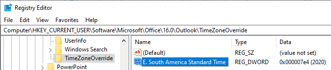

# Calendar items for next year may display an incorrect time in Outlook

## Symptoms

After time zone or daylight savings time changes are made by a government, some calendar items scheduled for in the next year may appear at an incorrect time when viewed in Outlook.

## Cause

This happens because Outlook doesn't apply time zone rules for recurring meetings until the year that the time zone definition changes are set to occur.

## Workarounds

**Option 1**: Wait until it is the year of the time zone definition change. As soon as it's the year of the time zone definition change, your meetings will display at the correct time in Outlook.

**Option 2**: Use Outlook on the web (OWA) to view Outlook calendar items. OWA isn't affected by this situation.

**Option 3**: Install the latest build of Office 365 Subscription products (Version 1910 (Build 12130.20410)) or Windows Installer (MSI) based version of Outlook 2016, and then set the **TimeZoneOverride** registry key. This workaround enables you to configure the year that Outlook uses when it applies time zone rules for recurring meetings by using the **TimeZoneOverride** registry key setting.

To work around the Brazil issues that are described in the **More Information** section below, set the year that Outlook uses to 2020 in the **TimeZoneOverride** registry key.

To apply this workaround to Brazil, follow these steps:

1. Install the applicable update for Office.
    1. **For Office 365 Subscription installations**
        1. Install Office 365 Version 1910 (Build 12130.20410) or later versions.
        2. In Outlook, select **File** > **Office Account**.
        3. Select **Update Options** > **Update Now**. 

            **Note** If **Update Now** is not available, select **Enable updates**. Then go to step 1.
        1. After the update is applied, select **File** > **Office Account**, and then verify the version that is listed is Version 1910 (Build 12130.20410) or later versions. If it is not, select **Update Options** > **Update Now** again to install the latest update.
    1. **For Windows Installer (MSI) based version of Outlook 2016**
        1. Download and install [KB 4484172](https://support.microsoft.com/help/4484172).
        2. Verify that Outlook.exe is version 16.4939.1001 or later versions:
            1. Find Outlook.exe at either C:\Program Files\Microsoft Office\Office16 or C:\Program Files (x86)\Microsoft Office\Office16.
            2. Right-click Outlook.exe and then click **Properties**.
            3. View the **Details** tab to verify that the file version is 16.4939.1001 or later versions.
1. Set the **TimeZoneOverride** registry key:
    1. Click **Start**, click **Run**, type regedit in the **Open** box, and then click **OK**.
    1. Locate **HKEY_CURRENT_USER\Software\Microsoft\Office\16.0\Outlook**, and then select the **Outlook** node in the navigation pane.
    1. On the **Edit** menu, select **New** > **Key**.
    1. Type **TimeZoneOverride** and then press **Enter**.
    1. Select the **TimeZoneOverride** registry key that you just created.
    1. On the **Edit** menu, select **New** > **DWORD (32-bit) Value**.
    1. Type **E. South America Standard Time** and press **Enter**.
    1. Double-click **E. South America Standard Time**. Set **Base** to **Decimal**, and type **2020** in the **Value data**, then click **OK**. 

The final registry data should be displayed as follows:

> [!NOTE]
> - You should remove the **E. South American Standard Time** registry value after January 1, 2020.
> - Meetings that occur in early 2019 will appear an hour off when this workaround is applied.

## More information

For example, in 2019 the government of Brazil announced that it would not change its clocks for the upcoming daylight savings time period, which was scheduled to last from November 3, 2019, to February 16, 2020. Recurring meetings for January 7, 2020, through February 15, 2020, received by users in 2019 in the Brazil time zone may appear one hour off when viewed in the Outlook calendar until December 31, 2019. These meetings will then appear at the correct time on or after January 1, 2020. 
