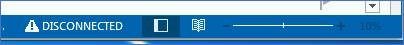
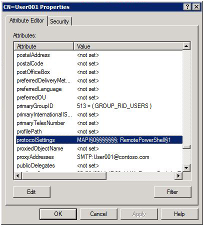

# Connection issues between Outlook and Exchange when MAPI is disabled for a user

_Original KB number:_ &nbsp; 2996728

## Symptoms

Consider the following scenario:

- You try to create a new Outlook profile and you receive the following error message:

    > The action cannot be completed. The connection to Microsoft Exchange is unavailable. Outlook must be online or connected to complete this action.

- You are unable to connect to your Exchange mailbox with an existing Outlook profile and **Disconnected** displays in the Outlook Status Bar:

    

    

- You are unable to open Public Folders or an Online Archive, and you receive the following error message:

    > Cannot expand the folder. Microsoft Exchange is not available. Either there are network problems or the Exchange server is down for maintenance.

## Cause

You don't have MAPI enabled in your protocol settings.

## Resolution

To resolve this issue, run the following from the Windows PowerShell cmdlet from Exchange Management Console:

```powershell
Set-CasMailbox User1@contoso.com -MapiEnabled $True
```

## More information

You can verify MAPI is enabled by checking the protocol settings for the user:



For more information about protocol settings and Adsiedit, see [ADSI Edit (adsiedit.msc)](/previous-versions/windows/it-pro/windows-server-2003/cc773354(v=ws.10)).
