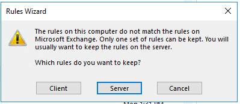
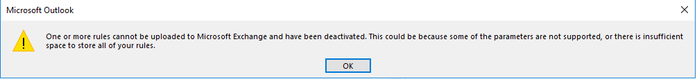
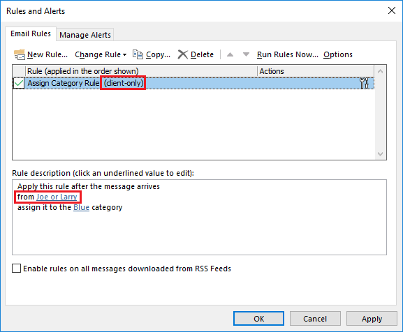

# Error occurs when you create or change client-only rules which apply to emails received from 20 or more people

## Symptoms

In Outlook, you either create a new client-only message rules rule or change an existing rule. When you save the rule or open the Manage Rules & Alerts window to view the rules, you receive one or both of the following error messages:

```
The rules on this computer do not match the rules on Microsoft Exchange. Only one set of rules can be kept. You will usually want to keep the rules on the server. Which rules do you want to keep?
```



```
One or more rules cannot be uploaded to Microsoft Exchange and have been deactivated. This could be because some of the parameters are not supported, or there is insufficient space to store all of your rules.
```



## Cause

This issue happens when a client-only rule is created or changed to contain a total of 20 or more people, which are selected from the Global Address List (GAL).

For example, the rule shown in the following screen shot is “(client-only)”, this rule will work because it only has 2 people who were selected from the GAL in the “from” rule criteria. However, if the “from” criteria contained 20 or more people, this issue would occur.



Note: This issue will occur when the rule’s action causes the rule to be a client-only rule, such as any of the following:

- Assign it to the category
- Permanently delete it
- Flag message for follow up at this time
- Clear the Message Flag
- Print it
- Play a sound
- Mark it as read
- Display a specific message in the New Items Alert window
- Display a Desktop Alert

## Workaround

To work around this issue, you can use one of the following methods:

- Create multiple rules and add 19 or less people per rule
- Create a [Distribution Group](https://docs.microsoft.com/exchange/recipients-in-exchange-online/manage-distribution-groups/manage-distribution-groups) or [Office 365 Group](https://support.office.com/article/create-a-group-in-outlook-04d0c9cf-6864-423c-a380-4fa858f27102) in the GAL of the people who you want to use in the client-only rule, then add that Distribution List in the rule
