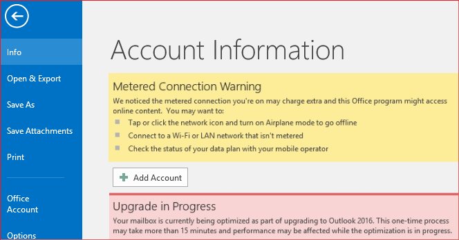
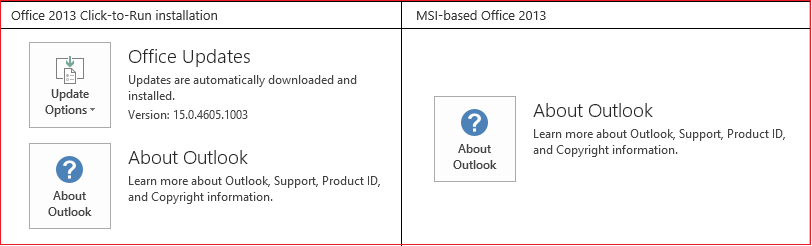

# Can't send or receive email in Outlook and "Metered Connection Warning" is triggered

## Symptoms

In Outlook for Microsoft 365, Microsoft Outlook 2016, or Microsoft Outlook 2013, you experience the following symptoms:

- New email messages are not received.
- When you try to send an email message, it is not sent. Instead, it remains in the Outbox.
- When you try to configure a new Outlook profile by using an IMAP account, you receive the following error message:

    > Internal MAPI error: The profile does not contain the requested service. Contact your administrator.

- When you select **File** in Outlook, the following warning messages are displayed:

    > Metered Connection Warning  
    We noticed the metered connection you're on may charge extra and this Office program might access online content. You may want to:  
    Tap or click the network icon and turn on Airplane mode to go offline  
    Connect to a WiFi or LAN network that isn't metered  
    Check the status of your data plan with your mobile operator   Upgrade in Progress

    > Your mailbox is currently being optimized as part of an upgrade to Outlook 2016. This one-time process may take more than 15 minutes to finish, and performance may be affected while the optimization is in progress.

    

## Resolution

To fix this issue for Office for Microsoft 365, make sure that your installation is at Version 2008 (Build 13127.20508) or a later version. If it is not, update your Office installation. To do this, follow these steps.

1. Open any Office application, such as Outlook or Word.
2. Select **File**, and then select **Office Account** or **Account**.
3. Examine the version number that is listed under **Office Updates**.
4. Select **Update Options**, and then select **Update Now**.

For more information about update channels for Office 365 clients, see [Update history for Microsoft 365 Apps (listed by date)](https://docs.microsoft.com/officeupdates/update-history-microsoft365-apps-by-date).

## Workaround

### For Outlook for Microsoft 365 and Outlook 2016

#### Method 1: Delete the SecurityManager key in the registry

The issue may be caused by registry values under this subkey:

`HKLM\SOFTWARE\Microsoft\Office\ClickToRun\REGISTRY\MACHINE\Software\Microsoft\SecurityManager\CapAuthz\ApplicationsEx`

To work around this issue, delete the **SecurityManager** key and its subkeys in the registry.

> [!IMPORTANT]
> Follow the steps in this section carefully. Serious problems might occur if you modify the registry incorrectly. Before you modify it, [back up the registry](https://support.microsoft.com/help/322756) for restoration in case problems occur.

1. Exit Outlook.
2. Start **Registry Editor**. To do this, use one of the following procedures, as appropriate for your version of Windows:
   - **Windows 10, Windows 8.1, and Windows 8**: Press Windows logo key+R to open a **Run** dialog box. Type **regedit.exe** and then select **OK**.
   - **Windows 7**: Select **Start**, type **regedit.exe** in the search box, and then press Enter.
3. In Registry Editor, locate the following subkey in the registry:

    `HKLM\SOFTWARE\Microsoft\Office\ClickToRun\REGISTRY\MACHINE\Software\Microsoft\SecurityManager\CapAuthz\ApplicationsEx`

4. Right-click the **SecurityManager** key, and select **Permissions**.
5. Select **Advanced**, and select the **Replace all child object permission entries with inheritable permission entries from this object** check box.
6. Select **OK**.
7. Select **yes** when you receive the following prompt: "**This will replace explicitly defined permissions on all descendants of this object with inheritable permissions from \<parent key>. Do you wish to continue?**
8. Select **OK**.
9. Right-click on **SecurityManager**, select **Delete** to delete the **SecurityManager** key and the subkeys.
10. Exit **Registry Editor**.
11. [Repair the Office application](https://support.microsoft.com/office/repair-an-office-application-7821d4b6-7c1d-4205-aa0e-a6b40c5bb88b), and check whether the issue is resolved.

#### Method 2: Stop third-party applications that access MAPISVC.inf file

The issue may also be caused by third-party applications that can access MAPISVC.inf and prevent Outlook from setting up the Account Manager. Stopping these applications and their processes should mitigate the issue.

You can use [Process Monitor](https://docs.microsoft.com/sysinternals/downloads/procmon) to see what processes are accessing MAPISVC.inf. The process **SHARING_VIOLATION on MAPISVC.inf** shown in Process Monitor indicates this is at least part of the problem. For instance, RepMgr.exe (C:\Program Files\Confer\RepMgr.exe) is an application known to cause this issue.

**Third-party information disclaimer**

The third-party products that this article discusses are manufactured by companies that are independent of Microsoft. Microsoft makes no warranty, implied or otherwise, about the performance or reliability of these products.

### For Outlook 2013

If you cannot install the update that is mentioned in the 'Resolution' section, or if you are running Outlook 2013, you can work around this issue by using one of the following methods.

#### Method 1: Verify permissions in the registry

In some cases, this issue is related to a permissions issue in the registry. To determine the cause of the issue and fix it, follow these steps:

1. Exit Outlook.
2. Start **Registry Editor**. To do this, use one of the following procedures, as appropriate for your version of Windows:
   - **Windows 10, Windows 8.1 and Windows 8**: Press Windows logo key+R to open a **Run** dialog box. Type **regedit.exe**, and then select **OK**.
   - **Windows 7**: Select **Start**, type **regedit.exe** in the search box, and then press Enter.

3. In Registry Editor, locate and right-click the following subkey in the registry, and then select **Permissions**:

    `HKEY_CLASSES_ROOT\Installer\Components\F1291BD604B860441AB89E60BDEE0F9C`

4. Under Group or user names, find your own user name or a group that you're a member of (such as Users or Administrators).

    If you're unsure about which groups your user account is a member of, follow these steps:
   - Open **Control Panel**.
   - From **Category** view, select **User Accounts**, and then select **User Accounts** again.
   - Select **Manage User Accounts**.
   - In the **User Accounts** window, find your **User Name**, and review the groups that are listed in the **Group** column.

        > [!NOTE]
        > You may have to expand the **Group** column to view all the groups.
   - When you are finished, select **Cancel**.

5. If you do not see a group that you're a member of or your own user name listed in the permissions, select **Add**, and then add your own user account.
6. Select **OK**.
7. Select your user name or the group that you're a member of.
8. View the permissions for your user name or group, and make sure that the **Read** permission has **Allow** selected.
9. Select **OK**.
10. Exit Registry Editor.

#### Method 2: Run a repair of Office

Follow the steps in the following article to run a repair of Office. This method is most appropriate for MSI-based installations of Office. To determine whether your Office installation is Click-to-Run or MSI-based, see the "More information" section.

[Repair an Office application](https://support.office.com/article/repair-an-office-application-7821d4b6-7c1d-4205-aa0e-a6b40c5bb88b)

## More information

To determine whether your Office installation is Click-to-Run or MSI-based, follow these steps: 

1. Start Outlook.
2. On the **File** menu, select **Office Account**.
3. For Office Click-to-Run installations, an **Update Options** item is displayed. For MSI-based installations, the **Update Options** item is not displayed.

