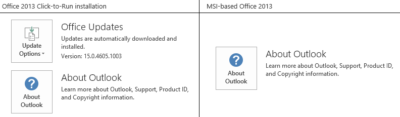

# Can't send or receive email in Outlook and "Metered Connection Warning" is triggered

## Symptoms

In Outlook for Microsoft 365, Microsoft Outlook 2016, or Outlook 2013, you experience the following symptoms:

- New email messages are not received.   
- When you send an email message, it is not sent and remains in the Outbox.   
- When you try to configure a new Outlook profile with an IMAP account, you receive the following error message:

    > Internal MAPI error: The profile does not contain the requested service. Contact your administrator.

- When you click **File** in Outlook, the following warning messages are displayed:

    > Metered Connection Warning  
    We noticed the metered connection you're on may charge extra and this Office program might access online content. You may want to:  
    Tap or click the network icon and turn on Airplane mode to go offline  
    Connect to a WiFi or LAN network that isn't metered  
    Check the status of your data plan with your mobile operator   Upgrade in Progress

    > Your mailbox is currently being optimized as part of upgrading to Outlook 2016. This one-time process may take more than 15 minutes and performance may be affected while the optimization is in progress.

    

## Resolution

To fix this issue, make sure that your Office 2016 Click-to-Run installation is at version 1611 (Build 7571.2072) or a later version. If it is not at this version or a later version, update your Office 2016 installation. To do this, follow these steps.

1. Open any Office application, such as Outlook or Word.   
2. Click **File**, and then click **Office Account** or **Account**.   
3. View the version that is listed under **Office Updates**.   
4. If the version is not at 1611 (Build 7571.2072) or a later version, click **Update Options**, and then click **Update Now**.   

For more information about update channels for Office 365 clients, see [Version numbers of update channels for Office 365 clients](https://technet.microsoft.com/library/mt592918.aspx).

## Workaround

### For Outlook for Microsoft 365

If you are running Outlook for Microsoft 365, the issue may be caused by registry keys under:

`HKLM\SOFTWARE\Microsoft\Office\ClickToRun\REGISTRY\MACHINE\Software\Microsoft\SecurityManager\CapAuthz\ApplicationsEx`

To work around this issue, delete the **SecurityManager** key and its subkeys in registry.

> [!IMPORTANT]
> Follow the steps in this section carefully. Serious problems might occur if you modify the registry incorrectly. Before you modify it, [back up the registry](https://support.microsoft.com/help/322756) for restoration in case problems occur.

1. Exit Outlook.
2. Start **Registry Editor**. To do this, use one of the following procedures, as appropriate for your version of Windows:   
   - **Windows 10, Windows 8.1 and Windows 8**: Press Windows Key + R to open a **Run** dialog box. Type **regedit.exe** and then select **OK**.   
   - **Windows 7**: Select **Start**, type **regedit.exe** in the search box, and then press **Enter**.
3. In Registry Editor, locate the following subkey in the registry.

    `HKLM\SOFTWARE\Microsoft\Office\ClickToRun\REGISTRY\MACHINE\Software\Microsoft\SecurityManager\CapAuthz\ApplicationsEx`

4. Right-click on **SecurityManager** key, and then select **Permissions**.
5. Select **Advanced**, then select the checkbox **Replace all child object permission entries with inheritable permission entries from this object**.
6. Select **OK**.
7. You will get a prompt that says "**This will replace explicitly defined permissions on all descendants of this object with inheritable permissions from \<parent key>.  Do you wish to continue?**", select **Yes**.
8. Select **OK**.
9. Right-click on **SecurityManager**, select **Delete** to delete the **SecurityManager** key and the subkeys.
10. Exit **Registry Editor**.
11. [Repair the Office application](https://support.microsoft.com/office/repair-an-office-application-7821d4b6-7c1d-4205-aa0e-a6b40c5bb88b) and check if the issue is resolved.

### For Outlook 2013

If you cannot install the update mentioned in the 'Resolution' section, or if you are running Outlook 2013, you can work around this issue by using one of the following methods:

#### Method 1: Verify permissions in the registry

In some cases, this problem is related to a permissions issue in the registry. To determine whether this is the cause of the issue and to fix it, follow these steps:

1. Exit Outlook.   
2. Start **Registry Editor**. To do this, use one of the following procedures, as appropriate for your version of Windows:   
   - **Windows 10, Windows 8.1 and Windows 8**: Press Windows Key + R to open a **Run** dialog box. Type **regedit.exe** and then click **OK**.   
   - **Windows 7**: Click **Start**, type **regedit.exe** in the search box, and then press **Enter**.   

3. In Registry Editor, locate and right-click the following subkey in the registry, and then click Permissions:

    `HKEY_CLASSES_ROOT\Installer\Components\F1291BD604B860441AB89E60BDEE0F9C`

4. Under Group or user names, find your own user name or a group that you're a member of (such as Users or Administrators).

    If you're unsure about which groups your user account is a member of, follow these steps:   
   - Open **Control Panel**.   
   - From **Category** view, select **User Accounts**, and then select **User Accounts** again.   
   - Select **Manage User Accounts**.   
   - In the **User Accounts** window, find your **User Name**, and review the groups that are listed in the **Group** column.

        > [!NOTE]
        > You may have to expand the **Group** column to view all the groups.   
   - Select **Cancel** when finished.

5. If you do not see your own user name or a group that you're a member of listed in the permissions, select **Add**, and then add your own user account.   
6. Select **OK**.   
7. Select your user name or the group that you're a member of.   
8. View the permissions for your user or group, and make sure that the **Read** permission has **Allow** selected.   
9. Select **OK**.   
10. Exit Registry Editor.   

#### Method 2: Run a repair of Office

Follow the steps in this article to run a repair of Office. This method is most appropriate for MSI-based installations of Office. To determine whether your Office installation is Click-to-Run or MSI-based, see the 'More Information' section.

[Repair an Office application](https://support.office.com/article/repair-an-office-application-7821d4b6-7c1d-4205-aa0e-a6b40c5bb88b)

## More information

To determine whether your Office installation is Click-to-Run or MSI-based, follow these steps: 

1. Start Outlook.   
2. On the File menu, click Office Account.   
3. For Office Click-to-Run installations, an Update Options item is displayed. For MSI-based installations, the Update Options item is not displayed.

