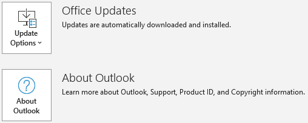
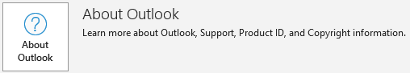

# A program is trying to send an e-mail message on your behalf warning in Outlook

_Original KB number:_ &nbsp; 3189806

## Symptoms

In Microsoft Outlook 2019, Outlook for Office 365, Outlook 2016, and Outlook 2013, when you send an email message from another program such as Microsoft Excel, you receive the following warning message:

> A program is trying to send an e-mail message on your behalf. If this is unexpected, click Deny and verify your antivirus software is up-to-date.

## Cause

This warning message is displayed when a program tries to access your Outlook client to send an email message on your behalf, and your antivirus software is detected to be inactive or out-of-date.

## Resolution Method 1 - Enable or update your antivirus application

To learn how Outlook detects your antivirus status, follow these steps:

1. In Outlook, select **File**, and then select **Options**.
2. Select **Trust Center**, and then select **Trust Center Settings**.
3. Select **Programmatic Access**.
4. View the **Antivirus status** that's listed in this window. If the status is anything other than **Valid**, follow the appropriate steps to enable your antivirus program, or update your antivirus program as necessary.

   :::image type="content" source="media/a-program-is-trying-to-send-an-email-message-on-your-behalf/antivirus-status.png" alt-text="Antivirus status" border="false":::

## Resolution Method 2 - Change the Programmatic Access Security setting in Outlook

1. In Outlook, select **File**, and then select **Options**.
2. Select **Trust Center**, and then select **Trust Center Settings**.
3. Select **Programmatic Access**.
4. Select the option that you prefer. If you want to stop these warning messages permanently, select the **Never warn me about suspicious activity (not recommended)** option.

    :::image type="content" source="media/a-program-is-trying-to-send-an-email-message-on-your-behalf/never-warn-me-about-suspicious-activity-not-recommended-option.png" alt-text="Never warn me about suspicious activity (not recommended)" border="false":::

    > [!NOTE]
    > If these options are not available, exit Outlook, and then start Outlook again in elevated mode. To do this, type Outlook on the desktop or in the **Start Search** box, right-click the **Microsoft Outlook** search result, select **Properties**, select the **Compatibility** tab, and then select **Run this program as an administrator**.

5. Select **OK** two times.

The registry data that is associated with the Programmatic Access Security options is as follows.

**Office Click-to-Run Installations:**

Same Bitness (32-bit Office running on 32-bit Windows or 64-bit Office running on 64-bit Windows):

`HKEY_LOCAL_MACHINE\SOFTWARE\Microsoft\Office\ClickToRun\REGISTRY\MACHINE\Software\Microsoft\Office\<x.0>\Outlook\Security`

Different Bitness (32-bit Office running on 64-bit Windows):

`HKEY_LOCAL_MACHINE\SOFTWARE\Microsoft\Office\ClickToRun\REGISTRY\MACHINE\Software\Wow6432Node\Microsoft\Office\<x.0>\Outlook\Security`

**Office MSI-Based installations:**

Different Bitness (32-bit Office running on 64-bit Windows):

`HKEY_LOCAL_MACHINE\SOFTWARE\Wow6432Node\Microsoft\Office\<x.0>\Outlook\Security`

Same bitness (32-bit Office running on 32-bit Windows or 64-bit Office running on 64-bit Windows):

`HKEY_LOCAL_MACHINE\SOFTWARE\Microsoft\Office\<x.0>\Outlook\Security`

> [!NOTE]
> The <x.0> placeholder represents your version of Office (16.0 = Office 2016, Office 2019, or Outlook for Office 365, 15.0 = Office 2013)

DWORD: **ObjectModelGuard**  

Values:  
**0** = Warn me about suspicious activity when my antivirus software is inactive or out-of-date (recommended)  
**1** = Always warn me about suspicious activity  
**2** = Never warn me about suspicious activity (not recommended)

## More information

To determine whether your Office installation is Click-to-Run or MSI-based, follow these steps:

1. Start Outlook.
2. On the **File** menu, select **Office Account**.
3. For Office Click-to-Run installations, an **Update Options** item is displayed. For MSI-based installations, the **Update Options** item isn't displayed.

    |Click-to-Run Office installation|MSI-based Office installation|
    |---|---|
    |||
    |||
