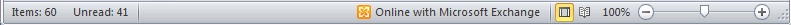
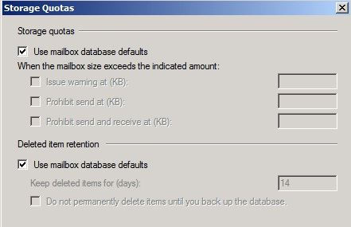
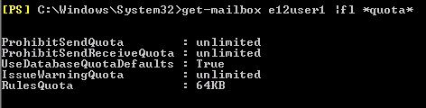
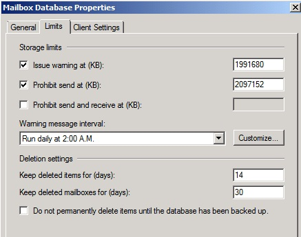
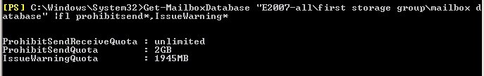
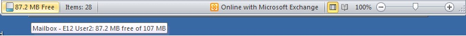

# Mailbox Quota Information is not displayed on the Status bar in Outlook

_Original KB number:_ &nbsp; 982997

## Symptoms

After you configure Outlook 2010 or later versions to display Quota Information on the Status bar, you should see something that resembles the following example when you right-click the Status bar:

:::image type="content" source="./media/mailbox-quota-information-not-displayed/customize-status-bar.jpg" alt-text="Screenshot of Customize Status Bar.":::

However, Quota Information may not be displayed on the Status bar. When this occurs, you see a Status bar that resembles the following example:



## Cause

This issue may occur for one of the following causes.

### Cause 1

Your mailbox is located on Microsoft Exchange Server 2003.

### Cause 2

Your mailbox is located on Microsoft Exchange Server 2007 or on Microsoft Exchange Server 2010. Additionally, you don't have certain mailbox or store limits configured (depending on your Outlook profile configuration):

- *Cached mode profile configuration*  

    If your Outlook profile is configured in cached mode, you will need to have the following three properties configured for your mailbox:

  - Issue warning at
  - Prohibit send at
  - Prohibit send and receive at

- *Online mode profile configuration*  

    If your Outlook profile is configured in online mode, you will want to have the following two properties configured for your mailbox:

  - Prohibit send at
  - Prohibit send and receive at

To examine these settings, follow these steps:

- On an individual mailbox

  - Exchange Management Console

      1. Under **Recipient Configuration**, select **Mailbox**.
      2. Select the mailbox, and in the **Actions** pane, click **Properties**.
      3. On the **Mailbox Settings** tab, select **Storage Quotas**, and then click **Properties**.

            The following example shows a mailbox that does not have any specific limits set on it ("Use mailbox database defaults" = *enabled*).

            

  - Exchange Management Shell

    Run a command that resembles the following example:

    ```powershell
    Get-Mailbox <mailbox_identity> | FL *quota*
    ```

    In the following example, the results indicate a mailbox that does not have specific limits set on it ("UseDatabaseQuotaDefaults" = True).

    

- On a mailbox store

  - Exchange Management Console

    1. Under **Server Configuration**, select **Mailbox**.
    2. In the top pane, select the mailbox server.
    3. In the bottom pane, on the **Database Management** tab, select the **Mailbox Database** object.
    4. Under **Mailbox Database**, in the **Actions** pane, select **Properties**.
    5. On the **Limits** tab, examine the limits that are configured for the database.

        In the following example, only the Issue warning at and **Prohibit send at**  limits are set.

        

  - Exchange Management Shell

    Run a command that resembles the following example:

    ```powershell
    Get-MailboxDatabase <mailbox_database_identity> | FL ProhibitSend*,IssueWarning*
    ```

    In the following example, the results indicate that the mailbox database does not have a Send and Receive quota set on it ("ProhibitSendReceiveQuota" = unlimited).

    

## More information

The following example demonstrates the Quota Information that is displayed on the Status bar in Outlook when the necessary quotas are configured for a mailbox on Exchange Server 2007 or on Exchange Server 2010. The tool tip below the Status bar is displayed when you move the mouse pointer over the quota text on the Status bar.



For additional symptoms when you are working with mailbox limits and quotas, see [The Mailbox Cleanup Wizard does not start in Outlook 2010 or Outlook 2013 when the mailbox is full](https://support.microsoft.com/help/2632283).
