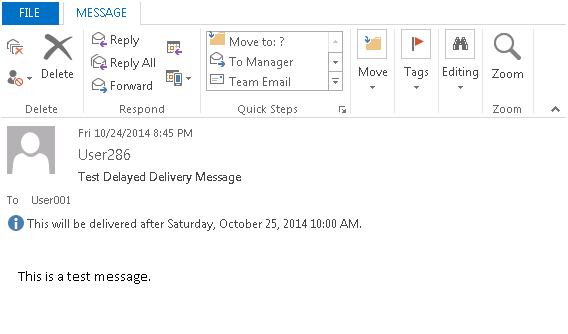

# The Send button is missing from a delayed delivery message in Outlook

_Original KB number:_ &nbsp; 3009042

## Symptoms

When you open a message in the Outlook Outbox to which a delayed delivery was applied, you can't edit the message body, and the **Send** button is missing from the message:

## Cause

This behavior occurs if the following conditions are true:

- You're connecting to an Exchange Server 2013 mailbox.
- You're connecting by using an Online Mode Outlook profile.

## Resolution

To work around this issue, close and reopen the affected message. After you take this action, you will be able to edit and resend the message as expected.

> [!NOTE]
> If you open and close the message but don't reopen the message and then click **Send** again, the message will remain in the Outbox and won't be sent at the delayed delivery time. A message that's set correctly for delivery will appear with an italic subject line and with an outgoing message icon, as follows:

## More information

To configure a message for delayed delivery, follow these steps:

1. In the message that you want to delay, click the **Options** tab on the ribbon.
2. Select **Delay Delivery**, and make sure that the **Do not deliver before** option is selected on the **Properties** dialog box and that the desired date and time for future delivery are selected, as follows:

