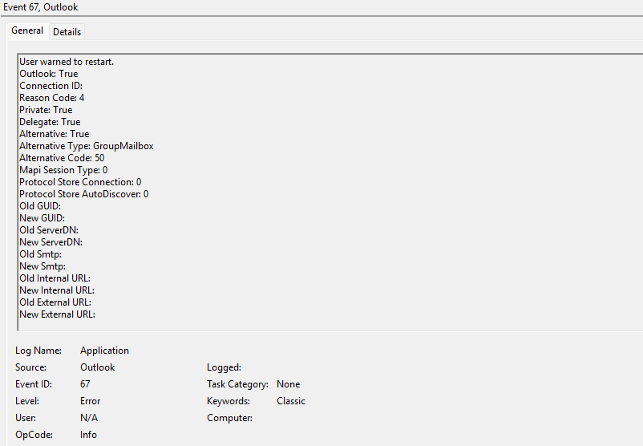

## Summary

This article explains that users of classic Outlook for Windows might receive a message to restart Outlook due to changes made by the Exchange administrator. The message is associated with Event 67 and recommends that administrators correlate this event with the audit log to identify the cause of the message.

## Symptoms

While working in classic Outlook for Windows, users might receive the following message:

> The Microsoft Exchange administrator has made a change that requires you quit and restart Outlook.

Users should select **OK** to dismiss the message and then manually restart Outlook. Outlook doesn't automatically restart.

## Cause

There is no single cause for this specific dialog to appear. However, when it does occur, Event 67 is recorded in the Event Viewer.

To access Event 67, use the following steps.

1. On the affected user's computer, select the **Start** menu or press the **Windows** key on the keyboard.
1. Type **Event Viewer** in the search bar and select it from the search results.
1. Select **Windows Logs** > **Application**.
1. In the **Event ID** column, find and select **Event ID 67**.

   The **General** and **Details** tabs in the **Properties** pane provide information about the event.

   

## Resolution

Correlate the details provided in Event 67 with the information in the administrator audit log to identify the changes that might have caused the message to display in Outlook.
