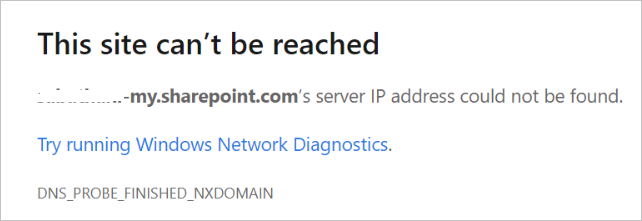

# Error 'DNS_PROBE_FINISHED_NXDOMAIN' when accessing OneDrive or Sharepoint

## Symptom

When you try to access **OneDrive** or **SharePoint**, you receive following error:

## Cause

Your subscription to either **OneDrive** or **SharePoint** might have expired.

## Resolution

### Reactivate your subscription

To reactivate your Microsoft 365 subscription, see [Reactive your subscription](https://docs.microsoft.com/microsoft-365/commerce/subscriptions/reactivate-your-subscription)

### Flush the DNS cache

If your subscription is active and you are still facing the issue, that could be a backlog in the local systems DNS cache which can be removed.

To flush the local systems DNS cache:

1. Select the **Start button**.

2. Type **cmd** and open the **Command Prompt** app.

3. In the **Command Prompt** window, enter the command `ipconfig /flushdns`.

4. Select **Enter** on the keyboard.

Once the DNS has been flushed, try to access **OneDrive** or **SharePoint** again.

If you are still unable to access your service, contact [Microsoft technical support](https://go.microsoft.com/fwlink/?linkid=869559).

## More information

Still need help? Go to [SharePoint Community](https://techcommunity.microsoft.com/t5/sharepoint/ct-p/SharePoint).
