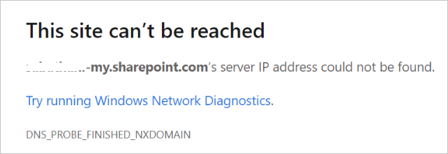

# Error 'DNS_PROBE_FINISHED_NXDOMAIN' when accessing SharePoint or OneDrive

## Symptom

When you try to access **SharePoint** or **OneDrive**, you receive following error:

## Cause

Your subscription to either **SharePoint** or **OneDrive** might have expired.

## Resolution

### Reactivate your subscription

To reactivate your Microsoft 365 subscription, see [Reactive your subscription](https://docs.microsoft.com/microsoft-365/commerce/subscriptions/reactivate-your-subscription)

### Flush the DNS cache

If your subscription is active and you are still facing the issue, that could be a backlog in the local systems DNS cache which can be removed.

To flush the local systems DNS cache:

1. Select the **Start button**.

2. Type **cmd** and open the **Command Prompt** app.

3. In the **Command Prompt** window, enter the command `ipconfig /flushdns`.

4. Select **Enter** on the keyboard.

Once the DNS has been flushed, try to access **SharePoint** or **OneDrive** again.

If you are still unable to access your service, contact [Microsoft technical support](https://go.microsoft.com/fwlink/?linkid=869559).

## More information

For more information about permission levels in SharePoint Online, see [Understanding permission levels](https://support.office.com/article/understanding-permission-levels-in-sharepoint-87ecbb0e-6550-491a-8826-c075e4859848?ocmsassetID=HA102772294&CorrelationId=8cb2ee53-10d3-48ec-baee-588885e94ba3&ui=en-US&rs=en-US&ad=US).

For more information about "Access Denied" errors in SharePoint or OneDrive for Business, see the following articles:

- [Error when an external user tries to access SharePoint Online or OneDrive for Business](error-when-external-user-tries-to-access-sharepoint-onedrive.md)
- [Error when trying to approve a SharePoint Approval Workflow task](approval-workflow-access-denied-error.md)
- [Error when trying to access a shared folder or "Access Requests" list](access-requests-list-error-access-denied.md)
- [Users can't access a shared folder in SharePoint Online](cannot-access-shared-folder.md)

Still need help? Go to [SharePoint Community](https://techcommunity.microsoft.com/t5/sharepoint/ct-p/SharePoint).
