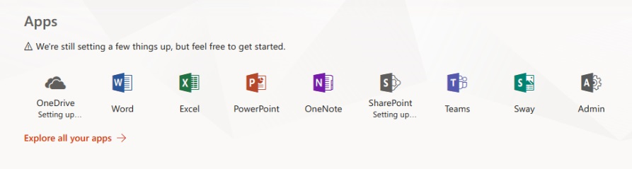
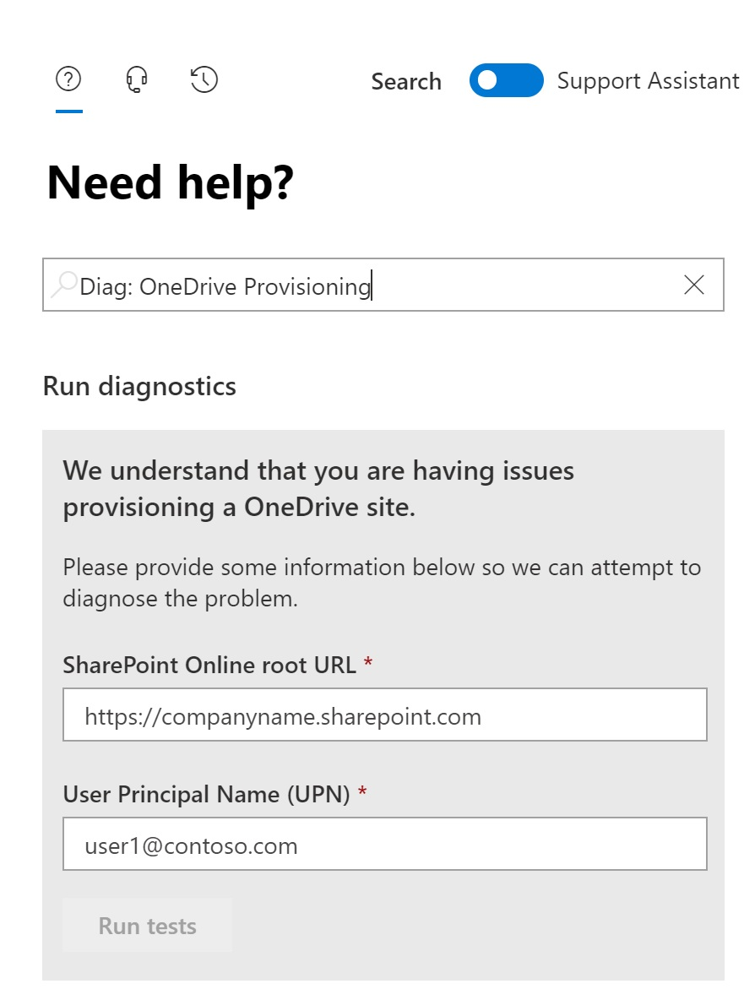

# OneDrive for Business stopped at "Setting up..." screen

# Symptoms

When installing OneDrive for Business, the app might be stopped at the “Setting up..” screen for more than 24 hours.


# Resolution

Listed below are ways to resolve this issue.

## Verify the services health

See the Microsoft Knowledge Base article ["Setting up..." messages in the Microsoft 365 admin center](https://support.microsoft.com/help/2635238/setting-up-messages-in-the-office-365-admin-center) to verify if any of Microsoft’s services (in this case OneDrive and SharePoint Online) are experiencing problems.

If the health of all affected services appear valid, and if more than 24 hours have passed since you first saw this issue, contact Office 365 Technical Support after performing the other actions in this article.

## Remove and re-add licenses

In some situations, the user's license might not have been assigned correctly. This reason alone can cause the behavior. We recommend that you remove and re-add the OneDrive and/or SharePoint license assigned to the user. To do so perform the below steps:
1.	Sign in to portal.office.com with an admin account.
2.	Select **Admin** to open the Office 365 Admin Center.
3.	Within the **Admin Center**, navigate to **Users** and then to **Active users**.
4.	Search for the user with the issue and select the profile.
5.	Go to **Licenses and Apps**.
6.	Remove and re-add the license and/or plan after saving the changes.
7.	Confirm that the issue is resolved. You may have to wait several hours for the change to take effect. 

## User provisioning

Due to the connection between OneDrive and SharePoint, it is necessary for users to have their profile provisioned within SharePoint itself in order for OneDrive to be able to provision the personal site.

> [!NOTE]
> In this situation, the same "Setting up..." message may also appear for SharePoint.

In order to verify if the user has a current profile created within SharePoint, perform the following steps:

1.	Sign in to portal.office.com with an admin account.
2.	Select **Admin** to open the Office 365 Admin Center.
3.	Go to the **Admin Center** and open **SharePoint**.
4.	Select **More features** and then **User profiles**.
5.	Select **Manage User Profiles**.
6.	Search for the user with the issue and verify that the profile appears.
If the profile doesn't exist, perform a sync from the Active Directory. You can also contact Office 365 Technical Support for additional help. 

## Personal Site Capabilities

Another reason for provisioning issues on OneDrive sites is the lack of enough capabilities to the site to be provisioned. This value can be found within the user's profile in SharePoint. For more information about the Personal Site Capabilities property and what each number represents, see the Microsoft support article [PersonalSiteCapabilities enumeration](https://docs.microsoft.com/previous-versions/office/sharepoint-csom/jj163383%28v%3Doffice.15%29).

To perform this verification and/or change of the value follow the below steps:
1.	Sign in to portal.office.com with an admin account.
2.	Select **Admin** to open the Office 365 Admin Center.
3.	Go to the **Admin Center** and open **SharePoint**.
4.	Select **More features** and then **User profiles**.
5.	Select **Manage User Profiles**.
6.	Search for the user and select **Edit My Profile**.
7.	Within the user profile, verify the **Personal Site Capabilities** property's value. In order for OneDrive to be provisioned, the user must have at minimum the value 4, which represents "Storage".

> [!IMPORTANT]
> If the user has the **Guest** capability, alone or combined (Example: property with the value 36 (32 guest + 4 storage)), this will also prevent the OneDrive site from provisioning. 

## Users permissions

The Personal Site Capabilities explained in the previous section are determined by the **Manage User Permissions** settings also within SharePoint Admin Center.

In order to verify if everything is set correctly, follow these steps:

1.	Sign in to portal.office.com with an admin account.
2.	Select **Admin** to open the Office 365 Admin Center.
3.	Go to the **Admin Center** and open **SharePoint**.
4.	Select **More features** and then **User profiles**.
5.	Select **Manage User Permissions**.
6.	Verify that the group "Everyone except external users" has been added (or the user who should be part of this group).
7.	Also verify that the level of permissions assigned to the user and/or group. The box next to "Create Personal Site (required for personal storage, newsfeed, and followed content)" should be checked.

## Site ownership

In some situation, the OneDrive site might have already been provisioned but the user may have lost its ownership, which caused this behavior.

If you have the [SharePoint Online Management Shell](https://www.microsoft.com/download/details.aspx?id=35588) (which contains the Windows PowerShell module to manage SharePoint Online), you can verify the site status and attempt to give user the ownership of their OneDrive for Business personal site.


- To verify if the site exists:<br/>
    ```
    Get-SPOSite -Site https://contoso-my.sharepoint.com/personal/user_contoso_onmicrosoft_com 
    ```
    [Get-SPOSite documentation](https://docs.microsoft.com/powershell/module/sharepoint-online/get-sposite?view=sharepoint-ps )

- To attempt to restore ownership: 
    ```
    Set-SPOSite -Identity https://contoso-my.sharepoint.com/personal/user_contoso_onmicrosoft_com -Owner user@contoso.onmicrosoft.com 
    ```
    [Set-SPOSite documentation](https://docs.microsoft.com/powershell/module/sharepoint-online/set-sposite?view=sharepoint-ps)


## Self diagnostics

Office 365 admin users have access to diagnostics that can be run within the tenant to verify possible issues with the OneDrive provision.

To do this, follow these steps:
1.	Navigate to the Office 365 Admin Center and select **Need help?** 
2.	In the search bar type "Diag:" to see all the available diagnostics.
3.	The "Diag: OneDrive Provisioning" diagnostic will perform a large range of verifications.


 

Need more help? 
Contact Microsoft Technical Support. 
