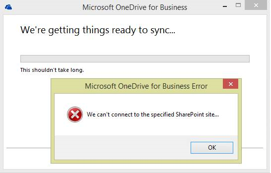

# OneDrive for Business sync returns the error "We can't connect to the specified SharePoint site"

## Symptoms

When you click **Sync Now** in Microsoft SharePoint or in OneDrive for Business, the following error is returned: 

"We can't connect to the specified SharePoint site"

## Cause

This issue occurs if one of the following registry values is configured as follows:

- HKEY_CURRENT_USER\Software\Microsoft\Office\15.0\Common\SignIn
  
  Name: SignInOptions

  Type: DWORD

  Value: 3   
- HKEY_CURRENT_USER\Software\Policies\Microsoft\Office\15.0\Common\SignIn

  Name: SignInOptions

  Type: DWORD

  Value: 3   

SignInOptions=3 restricts you from signing in to SharePoint or SharePoint Online by using either a Microsoft or an organizational ID. 

## Resolution

> [!IMPORTANT]
> Follow the steps in this section carefully. Serious problems might occur if you modify the registry incorrectly. Before you modify it, [back up the registry for restoration ](https://support.microsoft.com/help/322756) in case problems occur.

To resolve this issue, follow these steps:

1. Click **OK** to close the sync window.
2. Start Registry Editor. To do this, use one of the following procedures, as appropriate for your version of Windows:

   - Windows 8: Press Windows Key+R.   
   - Windows 7: Click Start, type regedit.exe in the search box, and then press Enter.

3. In Registry Editor, locate and then click the following subkey:

   HKEY_CURRENT_USER\Software\Microsoft\Office\15.0\Common\SignIn   
4. Locate and then double-click the following value:

   **SignInOptions**   
5. In the Value Data box, type **0**, and then click OK.
6. Exit Registry Editor.   

NoteIf the SignInOptionsvalue is located under the \Policieshive, it may have been created by Group Policy. In this situation, your administrator must modify the policy to change this setting.

## More Information

The SignInOptionssetting controls whether users can provide credentials to Office by using either their Microsoft Account ID or the user ID that was assigned by their organization (Org ID) for accessing Office 365. This setting can be configured by using the following values:

- 0 = Both ID types allowed   
- 1 = Only Microsoft Account IDs allowed   
- 2 = Only Org IDs allowed    
- 3 = Users cannot sign in by using either type of ID   
