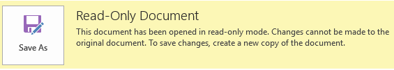

# Some Office files open in read-only mode in SharePoint Server 2013

This article was written by [Adam Rhinesmith](https://social.technet.microsoft.com/profile/Adam+R+-+MSFT), Support Escalation Engineer.

## Symptoms

Some Office documents are opened correctly in Microsoft SharePoint Server 2013, but some are opened in read-only mode.

Sometimes, this is shown as a limitation of the size of the document. For example, documents over 6 megabytes (MB) are opened in read-only mode, but documents smaller than 6 MB are opened correctly.



## Cause

This issue can occur if the **FileWriteChunkSize** property is changed in the SharePoint Server 2013 farm.

## Resolution

Check the value of **FileWriteChunkSize** in SharePoint Management Shell (Specify your own Web Application URL) by using the following commands:
```
$webapp = Get-SPWebApplication http://sp2013

$webapp.WebService.FileWriteChunkSize | Write-Host
```
If the value is not equal to 64320, reset the value of **FileWriteChunkSize** to the default value of 64320 by using the following commands:
```
$webapp.WebService.FileWriteChunkSize = 64320

$webapp.WebService.update()
```
> [!NOTE]
> The value of SPWebApplication.WebService.FileWriteChunkSize should be left at its original state and not modified.