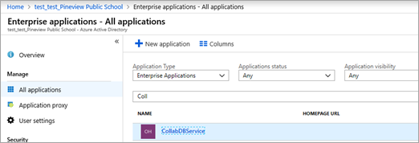
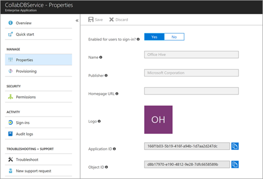

# Microsoft Forms shows "Sorry, something went wrong"

This article was written by [Warren Rath](https://social.technet.microsoft.com/profile/Warren_R_Msft), Support Escalation Engineer.

## Symptoms

Microsoft Forms shows the following error for all users in a SharePoint Online tenant:

**Sorry, something went wrong.**

You may see the following error in a web traffic trace captured when the error occurs:

**Required resource is disabled. Inner Message: AADSTS500014: The service principal for resource 'https://lists.office.com' is disabled.**

This indicates that a subscription within the tenant has lapsed, or that the administrator for this tenant has disabled the application, preventing tokens from being issued for it.

## Resolution

To resolve this issue, enable the **CollabDBService** service for Microsoft Forms with the following steps:

1. Sign in to [Microsoft Azure](https://portal.azure.com/).
1. In the left pane, select **Azure Active Directory**.
1. Select **Enterprise Applications**.
1. In the **Search** field, type **CollabDBService**.

   

1. Select **CollabDBService** in the result list.
1. Under **MANAGE**, select **Properties**.
1. For the **Enabled for users to sign-in** option, select **Yes**, and then click **Save**.

   

For more information, see [Turn off or turn on Microsoft Forms](https://support.office.com/article/turn-off-or-turn-on-microsoft-forms-8dcbf3ab-f2d6-459a-b8be-8d9892132a43).
