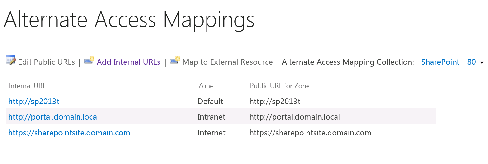

# Behavior when using Office Online Server and SharePoint with multiple zones

This article was written by [Adam Rhinesmith](https://social.technet.microsoft.com/profile/Adam+R+-+MSFT), Support Escalation Engineer.

## Issue

The configuration of Office Online Server with multiple alternate access mappings and zones in SharePoint Server.

## Behavior

Office Online Server will use the default zone set in SharePoint Server for the respective web application.

For example:

The default zone URL is http://sp2013t. So this is the URL that Office Online Server will use to contact the SharePoint Server.

You can test and make sure that the URL can be accessed from the Office Online Server, if it's not, you will have to correct the connectivity here, or Office Online Server won't work correctly.
