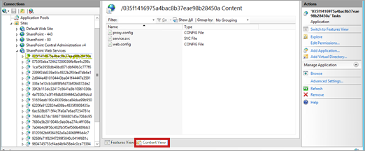
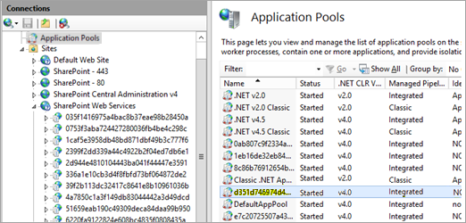

# "Retrieving the COM class factory for component failed 800703fa" in Excel Services and PowerPivot

This article was written by [Zakir Haveliwala](https://social.technet.microsoft.com/profile/Zakir+H+-+MSFT), Senior Support Escalation Engineer.

## Symptoms

When you open a workbook in a browser by using Excel Services, or when a scheduled data refresh fails in PowerPivot for SharePoint, you may receive the following error in the Universal Logging System (ULS) logs:

**Retrieving the COM class factory for component with CLSID {BDEADF26-C265-11D0-BCED-00A0C90AB50F} failed due to the following error: 800703fa**

## Resolution

1. Open **Internet Information Services (IIS) Manager**.
1. Expand **SharePoint Web Services** on the left pane.
1. Select the first **ID** under **SharePoint Web Services**, and then select **Content View** at the bottom of the center pane.

   

1. Select each ID until you see **ExcelService.asmx** (for Excel Services error) or **SSASMidTierService.svc** (for PowerPivot error) on the center pane.
1. Select **Advanced Settings** on the right pane, note the value in **Application Pool**, and then click **Cancel**.

   

1. Select **Application Pools** on the left pane and select the application pool that you noted in step 5.

   
1. Select **Advanced Settings** on the right pane.
1. Set the value of **Load User Profile** to True, and then click **OK**.

   
1. Open a **Command Prompt** and run the **iisreset** command to restart Internet Information Services (IIS).