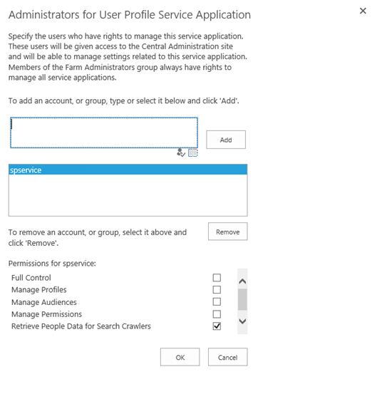
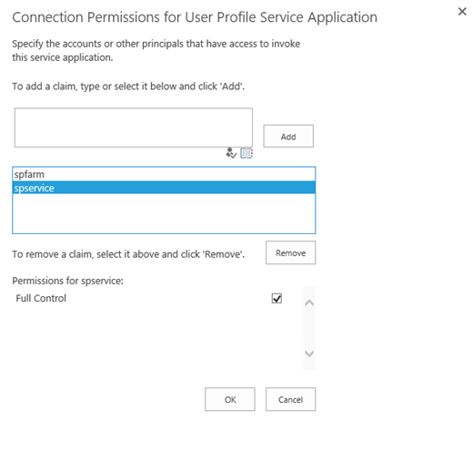

# "A schedule cannot be enabled for a workbook" when you try to schedule a data refresh by using PowerPivot

This article was written by [Zakir Haveliwala](https://social.technet.microsoft.com/profile/Zakir+H+-+MSFT), Senior Support Escalation Engineer.

## Symptoms

When you try to schedule a data refresh on a PowerPivot workbook in Microsoft SharePoint 2016, you may see either of the following errors:

- **Sorry, something went wrong.**
- **A schedule cannot be enabled for a workbook with no external data sources.**

The SharePoint Unified Logging Service (ULS) logs may show the following error:

**UserProfileDBCache_WCFLogging :: ProfileDBCacheServiceClient.GetUserData threw exception: Access is denied.**

This issue occurs when the account that's running the PowerPivot System Service in SharePoint (PowerPivot application pool) does not have permissions on the User Profile Service Application.

## Resolution

To fix this issue, add the required permissions with the following steps:

1. In **SharePoint Central Administration**, go to **Application Management** > **Manage service applications**, and then select **User Profile Service Application**. Then click **Administrators**.

   

1. Add the PowerPivot system service account, select the **Full Control** check box, and then click **OK**.

   

1. Select **Permissions**.

   

1. Add the PowerPivot System Service account, select the **Full Control** check box, and then click **OK**.

   

1. Restart the PowerPivot System Service on all the SharePoint servers that are running this service.