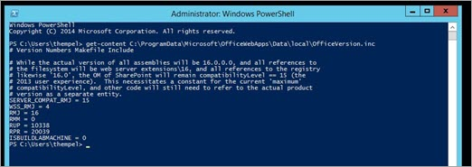
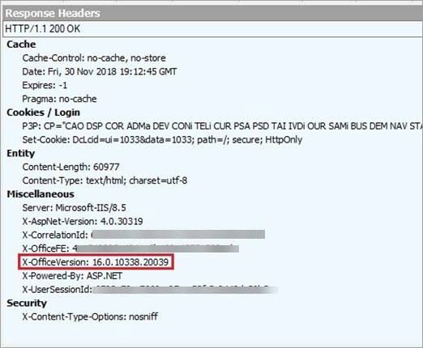

# How to determine the build version of Office Online Server

This article introduces two ways to determine the build version of your Office Web Apps 2013 or Office Online Server.

## Method 1: Run the "Get-Content" cmdlet in an Admin PowerShell window if you have access to the servers

To get the build version, run the following cmdlet:
```
get-content C:\ProgramData\Microsoft\OfficeWebApps\Data\local\OfficeVersion.inc
```
The build version that begins with 15.0 is Office Web Apps 2013.The build version that begins with 16.0 is Office Online Server.

**Office Web Apps 2013**


**Office Online Server**



## Method 2: Run a network trace if you don't have access to the servers directly

To get the build version, you can run a network trace while opening a document in a browser and inspect the response header.

There are many network tracing tools that you can use. However, if the SharePoint and Office Web Apps farms are running HTTPS, Fiddler is the easiest tool for the job. You can check the **X-OfficeVersion** in the **Response Headers** to determine the build version.


