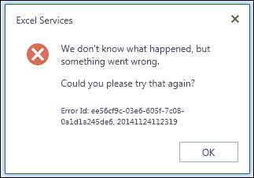
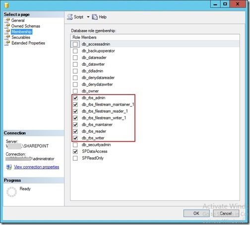

# "We don't know what happened, but something went wrong." error in Excel Web Access Web Parts

## Symptoms

When you try to view a Microsoft Excel workbook in the Excel Web Access Web Part, you receive the following error:



In the Unified Logging Service (ULS) logs, the following log is displayed:

```
The EXECUTE permission was denied on the object 'rbs_fn_get_blob_reference', database 'SharePoint_Content_80', schema 'mssqlrbs'.
```

## Resolution

To resolve this issue, grant the following permissions for the Application Pool account on the content database:

- db_rbs_admin
- db_rbs_filestream_maintaner_1
- db_rbs_filestream_reader_1
- db_rbs_filestream_writer_1
- db_rbs_maintainer
- db_rbs_reader
- db_rbs_writer

