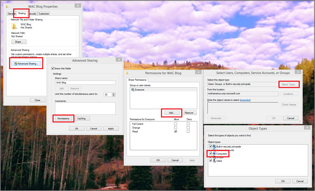
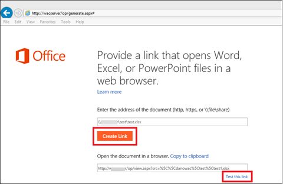
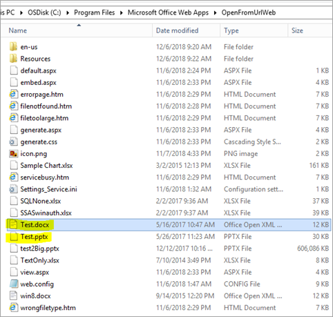

# Test viewing Office documents by using Office Web Apps or Office Online Server viewer

Microsoft Office Web Apps Server or Office Online Server has a built-in Office file viewer for testing viewing Office files in a browser,independent of any integration such as SharePoint Server, Skype for Business Server, or Exchange Server. This article introduces how to test viewing Office documents by using Office Web Apps or Office Online Server viewer, as follows:

1. By default, the **OpenFromURLEnabled** parameter is set to **False** in a new Office Web Apps farm. To set it to **True**, run the following command in PowerShell on an Office Web Apps (WAC) server:

   **Set-OfficeWebAppsFarm -OpenFromURLEnabled**

1. Add a workbook to a folder and then share the folder on the WAC server. For example, create a folder named "Test" on the root of Drive C ( C:\Test\Test1.xlsx).
If this location is on another server and not on the WAC Server, you need to share this folder with the WAC server (the **Computer** Account), as follows:
   
   
   After you have selected **Computers**, you need type the WAC server name and then check the name to make sure that the server name can be resolved.
   
   
1. You need generate a "http://" URL to that folder.  To do this, open the Internet Explorer browser and browse to "http://<ServerName>/op/generate.aspx".

   > [!NOTE]
   > Use the URL that is next to "InternalURL" when you run the **Get-OfficeWebAppsFarm** cmdlet. If you are not using an "InternalURL", you will have to use "ExternalURL". In the following example, the URL is "http://wacserver/op/generate.aspx".
1. Enter the UNC location (\\<Servername>\test\test1.xlsx) of the workbook in the generate.aspx page.  In the following example, the UNC location is "\\wacserver\test\test1.xlsx".
1. Click "Create Link" and then click "Test this link."

   

   If this works, the WAC server can render the workbook.

   Alternatively, these steps can be performed by copying an Office document to the "%systemdrive%\Program Files\Microsoft Office Web Apps\OpenFromUrlWeb" directory on the Office Online Server.  Then you can use "http://wacserver/op/filename" in place of the value in step 4.
   

> [!NOTE]
> To make this testing feature work with Windows Server 2012 R2, [Microsoft .NET Framework 4.5.2](https://www.microsoft.com/en-us/download/details.aspx?id=42643) is needed.

## More information

The new .NET Framework version 4.6 and later versions include a new Just-In-Time (JIT) compiler. This will cause a "page can't be displayed" error with the generate.aspx. To resolve this issue, reference [Office viewers or Office Web Apps shows the "This page can't be displayed" error](office-viewers-or-office-web-apps-shows-this-page-cant-be-displayed-error.md).