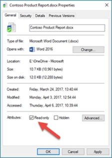

# SharePoint files open as read-only and won't check in or out

This article was written by [Warren Rath](https://social.technet.microsoft.com/profile/Warren_R_Msft), Support Escalation Engineer.

## Symptoms

At times, you may find that a SharePoint file will open only as a read-only file and cannot be checked in or out. For example, after you synchronize a SharePoint document library that requires checkout to a local folder through Microsoft OneDrive for Business, you may discover that a file located either online or in the local synced folder opens as read-only and can't be checked in or checked out using Office applications.

## Cause

There are several reasons why a file may open as read only:

- If you’ve synced through OneDrive for Business, this is a limitation. See [Libraries with specific columns for more information](https://support.office.com/en-us/article/invalid-file-names-and-file-types-in-onedrive-onedrive-for-business-and-sharepoint-64883a5d-228e-48f5-b3d2-eb39e07630fa?ui=en-US&rs=en-001&ad=US#librariesspecificcolumns).
- Due to added security, such as when you open files from the internet.
- Antivirus programs may open potentially unsafe files as read-only. Check with your antivirus provider to learn how to adjust these settings. BitDefender, for example, has content on adding application exclusions here: [How to add application or process exclusions in Bitdefender Control Center](https://www.bitdefender.com/support/how-to-add-application-or-process-exclusions-in-bitdefender-control-center-1119.html).
- If you have libraries with **Checkout**, **Required columns**, or when **Only users who can edit** in Version Settings of a SharePoint document library, these items will be synchronized as read-only.
- An Office document opens in Protected View even though you enable the "Open Office documents as read/write while browsing" policy setting. For more information, see [An Office document opens in Protected View even though you enable the "Open Office documents as read/write while browsing" policy setting](https://support.microsoft.com/help/983047/an-office-document-opens-in-protected-view-even-though-you-enable-the).

## Resolution

To resolve this issue, one of the following methods may help:

- If you synced through OneDrive for Business:
   - Do not sync SharePoint document libraries that require checkout.
   - Disable the [Use Office applications to sync Office files that I open](https://support.office.com/article/use-office-applications-to-sync-office-files-that-i-open-8a409b0c-ebe1-4bfa-a08e-998389a9d823) setting on the **Office** tab in OneDrive sync settings.
   > [!NOTE]
   > This setting is controlled by the **[EnableAllOcsiClients](https://docs.microsoft.com/onedrive/use-group-policy#EnableAllOcsiClients)** policy. If you disable this setting, co-authoring will not work for any files that are opened from a local synced folder. However, co-authoring will work for any files that are opened from online.
- Instead of selecting the document title, select **Open Menu** (the three dots), and then select **Edit**.
- If the file is stored on OneDrive and your OneDrive storage space is full, you will be unable to save the document until your storage space is below your allowance. Check your free space on OneDrive by selecting the OneDrive icon in the notification center and choosing **Manage storage**, or go to http://onedrive.live.com, sign in, and note the amount of used space in the lower-left corner of the screen.
- If Office is not activated, or if your subscription has expired, you might be in read-only **Reduced Functionality Mode**. For information on how to Activate Office, see [Unlicensed Product and activation errors in Office](https://support.office.com/article/unlicensed-product-and-activation-errors-in-office-0d23d3c0-c19c-4b2f-9845-5344fedc4380).
- Right-click the file and choose **Properties**. If the Read-only attribute is checked, uncheck it and select **OK**. 

### Other methods to try
- Restart your computer.
- [Check that all Office updates are installed](https://support.office.com/article/Update-Office-with-Microsoft-Update-f59d3f9d-bd5d-4d3b-a08e-1dd659cf5282).
- [Perform an Online repair of Office](https://support.office.com/Article/Repair-an-Office-application-7821d4b6-7c1d-4205-aa0e-a6b40c5bb88b).
