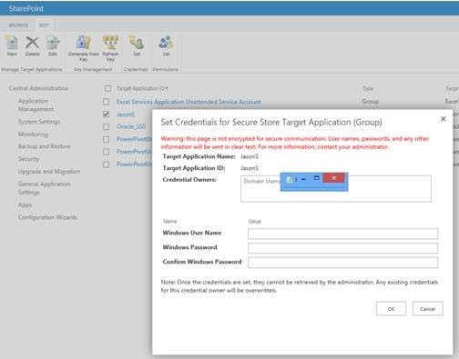
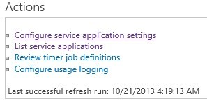
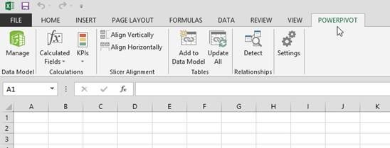
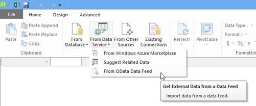
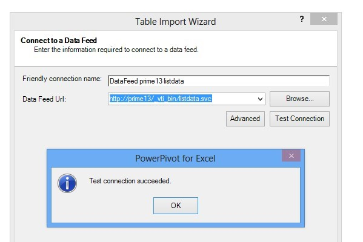
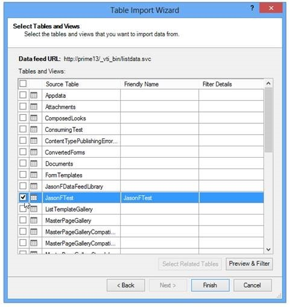
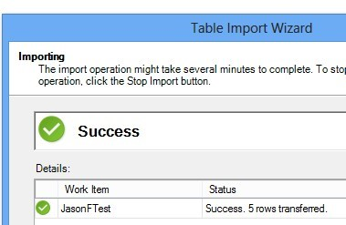

# PowerPivot scheduled data refresh from a SharePoint list by using OData data feed connection (PowerPivot 2012 SP1 for SharePoint 2013)

This article was written by [Zakir Haveliwala](https://social.technet.microsoft.com/profile/Zakir+H+-+MSFT), Senior Support Escalation Engineer.

To set up PowerPivot for SharePoint scheduled data refresh for a PowerPivot workbook that has a connection to a SharePoint list, don't use the List.atomsvc file that is created by using Export as Data Feed, because it can cause issues.

Another way that you can set up PowerPivot for SharePoint scheduled data refresh for a PowerPivot workbook that has a connection to a SharePoint list is to make an OData data feed connection directly to the SharePoint list data service.
To do this, follow these steps:

1. Create a new Secure Store Service target application ID
    - Make it type Group.
    - Add the domain group named Domain Users to the Members group for the ID.
    - Set the ID's credentials to a domain account and password that for sure has permissions to access the SharePoint list that you will be refreshing from.

         

2. In Central Administration, edit the PowerPivot service application settings and set the PowerPivot Unattended Data Refresh Account to use the Secure Store Service target application ID created earlier.

     

     

3. Create a new workbook with Excel 2013, click the PowerPivot add-in tab at the top, then click Manage on the far left.
   
   

1. Select From Data Service > From OData Data Feed.

     

1. Type in the Data Feed URL like http://YourSPservername/_vti_bin/listdata.svc and then click Next to connect to the service and view the items that appear.

     

1. Select your SharePoint list and click Finish and then Close.

     

1. Set up your workbook the way that you would like. You can then upload the workbook to the PowerPivot Gallery and schedule a data refresh.

      
