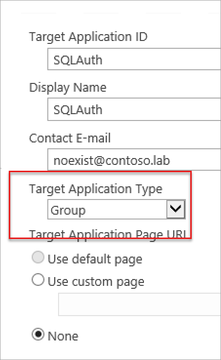
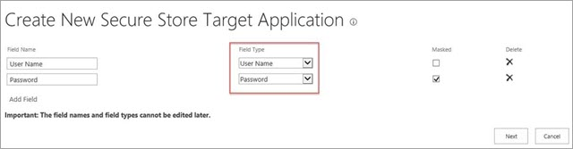
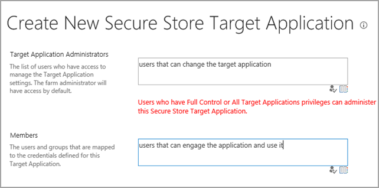
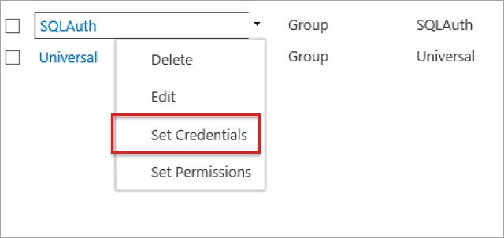
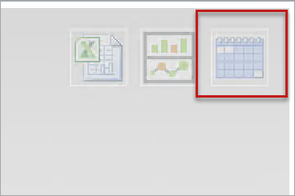
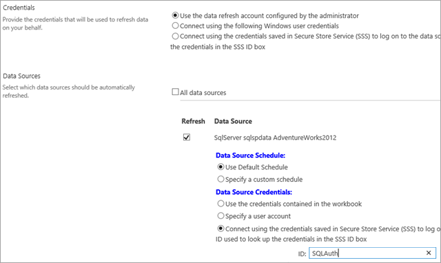
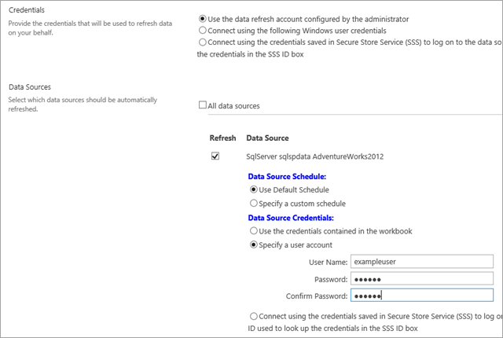

# Schedule data refresh to a data source with non-Windows Authentication

This article was written by [Tom Schauer](https://social.technet.microsoft.com/profile/Tom+Schauer+-+MSFT), Technical Specialist.

This article introduces configuration requirements and methods for scheduling PowerPivot workbooks that connect to data sources with non-Windows authentications in PowerPivot for Microsoft SharePoint (from 2010 to 2016).

> [!NOTE]
> Make sure that the basic data refresh, for example, basic SQL or Analysis Services data source that uses the Secure Store with Windows Authentication is functional in the farm before you try this configuration.

## Prerequisites

1. The PowerPivot unattended account must be configured with a valid Windows account that has **Contribute** access to the workbook that you are trying to refresh (Technically, you can also use a second **Secure Store** account that uses Windows Credentials. But we will keep it simple for this example).
1. If you are using a third-party provider (Oracle for example), you must be able to make a successful data connection from the PowerPivot Analysis Services instance(s) to the data source.
1. The account that you are using to schedule the data refresh must have at least read rights to the data that you are trying to refresh.
1. The workbook can't have its authentication mode changed at any point. If the data model is built by using Windows Authentication, and then is changed to use SQL Server Authentication or any other authentication modes, it can cause authentication problems and needs to be rebuilt to be supported.

## Methods for setting a scheduled data refresh to a data source with non-Windows Authentication

**Method 1: Use Secure Store**

1. Create a new Secure Store Target Application by using a Group type.

   

1. On the next page, make sure that you change the middle field to "User Name" and "Password". When you use non-Windows credentials, they are the only valid fields that you can choose. The fields on the left of the page are editable to whatever you want them to be.

   

1. Set the target application administrators and members. The members group is the group of users who have access to use the Secure Store Target Application on the site.

   

1. On the main Secure Store page, set the credentials on the new Target Application that you just created.

   

1. As soon as the credentials are set, we can go back to the workbook in the gallery and set the schedule.

   

1. Leave the first set of radio buttons alone as they are options for Windows Authentication only. Select the third option under **Data Source Credentials** and type the name of your Secure Store Target Application in the **ID** text box.

   > [!NOTE]
   > Make sure that you test this as a user account and not an administrator.

   

**Method 2: Specify a User Account**

1. Click the set schedule icon for the workbook in the gallery.

   

1. Leave the first set of radio buttons alone as they are options for Windows Authentication only. Select the second option **Specify a user account** under **Data Source Credentials** and type the login name and password of the account that has access to this specific data source.

   

> [!NOTE]
> This method creates a temporary Secure Store ID that is used specifically by the workbook. The ID is removed when the schedule is purged or changed in any way.