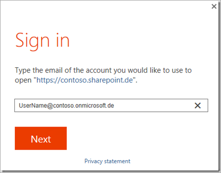
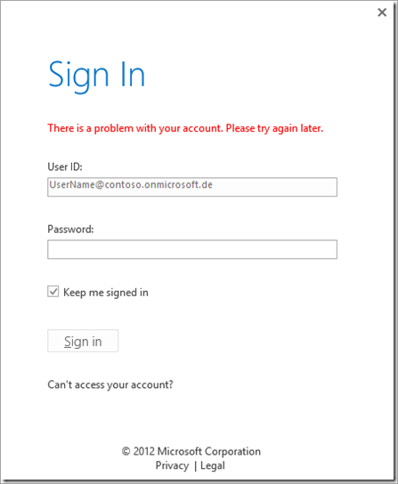
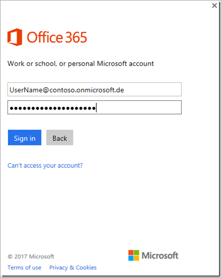
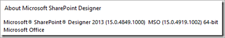

# SharePoint Designer 2013 login Issues in a cloud scenario

This article was written by [Joerg Sinemus](https://social.msdn.microsoft.com/profile/Joerg+Sinemus), Escalation Engineer.

Microsoft SharePoint Designer 2013 can be used to create workflows, change design of classic pages and do much more. When you work SharePoint Designer 2013 with Office 365 SharePoint Online, you may get some login issues. To avoid login issues, make sure that SharePoint Designer 2013 and Office are up to date by using Windows Update.

## Symptoms

Assume that you install SharePoint Designer 2013 on Windows Server 2012 R2, Windows Server 2016, or Windows 10. You may also install Office 2013 or Office 2016. You open a SharePoint Site such as "https://contoso.sharepoint.de" by using SharePoint Designer 2013, the following sign-in dialog box may appear:



When you click **Next** and type the password in the prompt dialog box, you receive the following error:

**There is a problem with your account. Please try again later.**



This issue may occur when you work with SharePoint Server on-premises and modern authentication.

## Cause

Office 2013, including SharePoint Designer 2013, is not configured to use ADAL. You may find the ADAL.DLL (current build version 1.0.2019.909) in the folder "C:\Program Files (x86)\Common Files\Microsoft Shared\OFFICE15\ " or similar, depending on 32-bit or 64-bit of Windows or SharePoint Designer 2013. However, that DLL won't be loaded when you have a look by using [ProcessExplorer](https://technet.microsoft.com/sysinternals/processexplorer.aspx).

## Resolution

To fix this issue, set the value of the **EnableADAL** registry key to 1 and check the **Version** registry key. For the two registry keys, see [Enable Modern Authentication for Office 2013 on Windows devices](https://docs.microsoft.com/office365/admin/security-and-compliance/enable-modern-authentication?redirectSourcePath=%252fen-us%252farticle%252fEnable-Modern-Authentication-for-Office-2013-on-Windows-devices-7dc1c01a-090f-4971-9677-f1b192d6c910&view=o365-worldwide).

After you set the registry key, restart SharePoint Designer 2013. Then the sign-in dialog box will be displayed as follows:



This issue occurs with tests in the Microsoft Cloud Germany (MCG) (also called Microsoft Cloud Deutschland (MCD)).

### Connection issues

If SharePoint Designer is experiencing connection issues to SharePoint sites, try the following common solutions.

1. Verify that SharePoint Designer 2013 is updated with [SharePoint Designer Service Pack 1](https://nam06.safelinks.protection.outlook.com/?url=https%3A%2F%2Fsupport.microsoft.com%2Fen-us%2Fhelp%2F2817441%2Fdescription-of-microsoft-sharepoint-designer-2013-service-pack-1-sp1&data=02%7C01%7Cv-todmc%40microsoft.com%7C61653ab0d1ad4dff583908d771dfd9bd%7C72f988bf86f141af91ab2d7cd011db47%7C1%7C0%7C637103078547623035&sdata=V%2FbGTcY9w1pNxUD4YJ%2FkA91WFQTzXqpxzOkFyDWEro4%3D&reserved=0) and the [August 2, 2016, Update for SharePoint Designer 2013](https://nam06.safelinks.protection.outlook.com/?url=https%3A%2F%2Fsupport.microsoft.com%2Fen-us%2Fhelp%2F3114721%2Faugust-2-2016-update-for-sharepoint-designer-2013-kb3114721&data=02%7C01%7Cv-todmc%40microsoft.com%7C61653ab0d1ad4dff583908d771dfd9bd%7C72f988bf86f141af91ab2d7cd011db47%7C1%7C0%7C637103078547633035&sdata=3GXQpEjlg4eW5R578kCfx3GZI%2BKSG8yByor15QyWPf4%3D&reserved=0).

2. Clear the local cache files:

   1. Close SharePoint Designer 2013.
   2. On the local computer, remove all files found in each of the following folders.
   ```
   %APPDATA%\Microsoft\Web Server Extensions\Cache
   %APPDATA%\Microsoft\SharePoint Designer\ProxyAssemblyCache
   %USERPROFILE%\AppData\Local\Microsoft\WebsiteCache
   ```

   3. Open SharePoint Designer 2013 and enter the account again to see if it works.

3. [Enable Modern Authentication for Office 2013 on Windows Devices](https://nam06.safelinks.protection.outlook.com/?url=https%3A%2F%2Fdocs.microsoft.com%2Fen-us%2Foffice365%2Fadmin%2Fsecurity-and-compliance%2Fenable-modern-authentication%3FredirectSourcePath%3D%2Farticle%2FEnable-Modern-Authentication-for-Office-2013-on-Windows-devices-7dc1c01a-090f-4971-9677-f1b192d6c910%26view%3Do365-worldwide&data=02%7C01%7Cv-todmc%40microsoft.com%7C61653ab0d1ad4dff583908d771dfd9bd%7C72f988bf86f141af91ab2d7cd011db47%7C1%7C0%7C637103078547633035&sdata=jzYI8CAZa5PtUl4Jblv%2FpopBc2eWvABUulC1RcevvJc%3D&reserved=0).

4. Administrators will need to **Allow Custom Script** in the SharePoint Admin Center settings to allow the SharePoint Designer connection. See [Allow or prevent custom script](https://nam06.safelinks.protection.outlook.com/?url=https%3A%2F%2Fdocs.microsoft.com%2Fen-us%2Fsharepoint%2Fallow-or-prevent-custom-script&data=02%7C01%7Cv-todmc%40microsoft.com%7C61653ab0d1ad4dff583908d771dfd9bd%7C72f988bf86f141af91ab2d7cd011db47%7C1%7C0%7C637103078547643024&sdata=xKXHncZeN8VWXxv1auCY%2BDF0S1arTdJ%2FB%2BmRh%2BHzFyg%3D&reserved=0) for more information.

## More information

If all related products are installed correctly and registry keys are set, but the login still doesn't work and you see earlier build numbers than those in the following screenshot, make sure that your Office and SharePoint Designer 2013 are up to date by using Windows Update.



You can also install the latest updates for  SharePoint Designer 2013 and Office 2013 that contain ADAL.LL manually to troubleshoot this issue.

> [!NOTE]
> The latest ADAL.DLL may be available in [July 5, 2016, update for Office 2013 (KB3085565)](https://support.microsoft.com/help/3085565). And the latest SharePoint Designer 2013 update may be [August 2, 2016, update for SharePoint Designer 2013 (KB3114721)](https://support.microsoft.com/help/3114721).