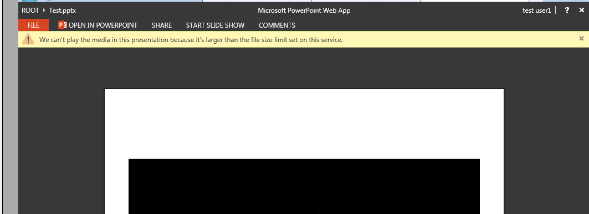

# Increasing the size limit of embedded media for the PowerPoint Web App

This article was written by [Adam Rhinesmith](https://social.technet.microsoft.com/profile/Adam+R+-+MSFT), Support Escalation Engineer.

## Symptoms

The Office Web Apps Server is limited to 50MB for embedded media in the PowerPoint Web App. You may experience the following error:



## Resolution

To work round this issue, you can increase the size of the limit as follows:
1. On the Office Web Apps Server(s), edit the following file:
    
    C:\Program Files\Microsoft Office Web Apps\PPTConversionService\Settings_Service.ini
2. Add the following lines at the bottom of the file and then save it:
    
    PowerPointEditServerMaxFileSizeBytes=(System.UInt64)153600000
    
    PowerPointServerMediaEmbeddedMaxSize=(System.UInt64)153600000
3. Open an Admin PowerShell window on the Office Web Apps Server(s) and the run the following cmdlet:
    
    ```powershell
    Restart-service WACSM
    ```
This should allow up to 150MB videos to be embedded. You can adjust the byte value to meet your needs.
