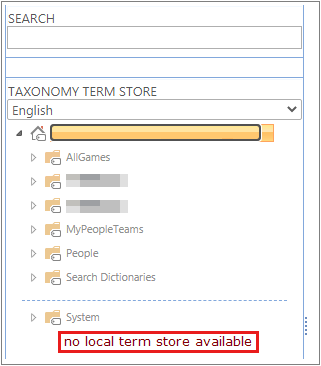
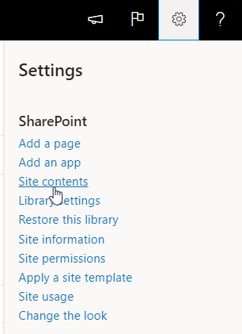
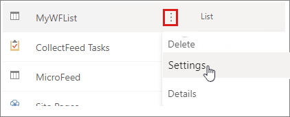
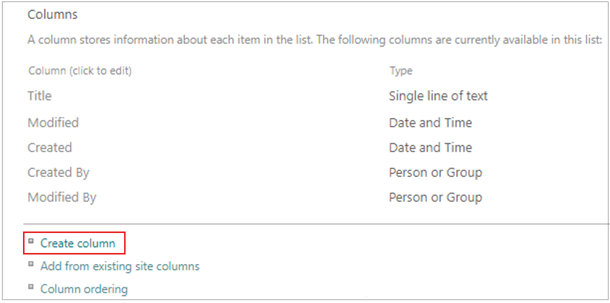

# Create a default Site collection Term Set if none is present

This article describes how to create a default Site collection Term Set if none is present.

## Symptom

In a site collection, when you go to **Term Store Management** during a site collection, you don't see a **term set** specific to that respective site collection.

## Cause

By design, the **local term store** is not available as a default on all sites.

The local term store is only available when publishing is enabled in the site.

## Resolution

Activate the local term store in site which is missing.

If you need a local term store and don't want to activate the publishing feature, or if the feature isn't available (as it is on modern communication sites), follow these steps:

1. On any site, select the **Gear icon** at the top-right corner of the window, and select **Site contents** from the drop-down menu.

   
  
2. Find any list or library, and select the **ellipsis**, then select **Settings**.

   

3. In the List settings, go to the **Columns** section and select **Create column**.

   

4. Choose a name for the column, such as **LocalMMS** or **NewMMS**.

5. Change the column type from **Single line of text** to **Managed Metadata**.

   

6. Scroll down to **Term Set Settings** and choose **Customize your term set:**. You can provide description if you would like, but you should see the name of the column you put above there.

   

7. Select the **OK** button.

   

8. Return to the **Taxonomy Term Store** in Site settings, and verify that you can locate the new local term store at the site collection level.

   
