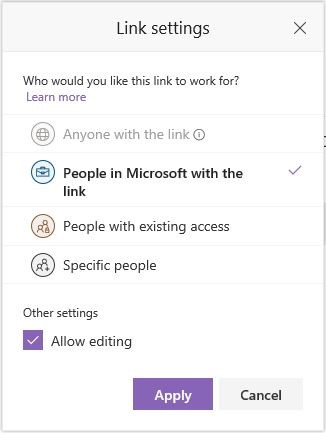

# Sharing options are greyed out when sharing from SharePoint Online or OneDrive

## Symptoms
Sharing options are grayed out when attempting to share from SharePoint Online or OneDrive.

## Cause
This issue can occur if you do not have sharing settings enabled properly for the site or organization. 

For example:
1.	Select the file or folder you want to share, and then select **Share**.
2.	Select the dropdown list to change the type of link. In the **Link settings** screen, you can change who is able to access the link and edit the item you’re sharing.
3.	If one of the sharing options is grayed out, your organization's administrators may have restricted it. 

 
## Resolution
To resolve this issue, follow the steps below to ensure the proper sharing settings are enabled for your organization and site collection. 

### Check the external sharing settings for your organization
1.	Sign in to https://admin.microsoft.com as a global or SharePoint admin. (If you see a message that you don't have permission to access the page, you don't have Office 365 administrator permissions in your organization.) 

> [!NOTE]
> - If you have Office 365 Germany, sign in at https://portal.office.de. 
> - If you have Office 365 operated by 21Vianet (China), sign in at https://login.partner.microsoftonline.cn/. Then select the Admin tile to open the admin center.

2.	In the left pane, under **Admin centers**, select **SharePoint**. (You might need to select **Show all** to see the list of admin centers.) 

> [!NOTE]
> If the classic SharePoint admin center appears, select **Open it now** at the top of the page to open the new SharePoint admin center.

3.	In the left pane of the new SharePoint admin center, under **Policies**, select **Sharing**.
4.	Under **External sharing**, specify your sharing level for SharePoint and OneDrive. 

### Check the external sharing settings for the site that you want to share from
**If you're sharing from a SharePoint site:**
1.	In the SharePoint admin center, click **Try it now** to open the new SharePoint admin center.
2.	In the left pane of the new SharePoint admin center, select **Active sites**.
3.	Select the site that you want to share from, and then under **External sharing** click **Change**.
4.	Make sure that either **New and existing guests** or **Anyone** is selected, and then select **Save** if you made changes.

Try sharing again.

**If you're sharing from OneDrive:**
1.	In the Microsoft 365 admin center, in the left pane, under **Admin centers**, select **OneDrive**. (You might need to select **Show all** to see the list of admin centers.)
2.	Under **External sharing**, select either **New and existing external users** or **Anyone** for **OneDrive**.
3.	Select **Save**.

Try sharing again.

## More information
For more information on external sharing settings, see [Turn external Sharing on or Off](https://docs.microsoft.com/sharepoint/turn-external-sharing-on-or-off). 

For information on the various Sharing settings within M365, see [Microsoft 365 guest sharing settings reference](https://docs.microsoft.com/Office365/Enterprise/microsoft-365-guest-settings). 
