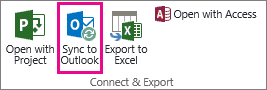
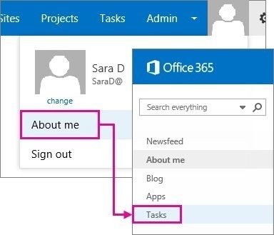
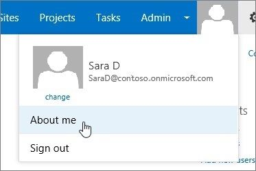
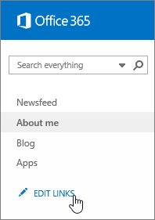
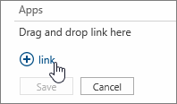
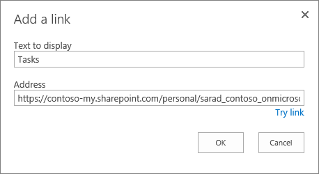
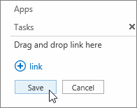

# The "Sync to Outlook" button and the "Tasks" link are missing in SharePoint Online

## Problem

In Microsoft SharePoint Online, the following options are missing:

- The **Sync to Outlook** button in any SharePoint Online tasks list.
   
  

- The **Tasks** link in the **About me** section of the user profile page.

  

- The **Sync to Outlook** button is present on the personal site tasks list but the control is disabled.

## Solution

If you want to continue using your **Tasks** page, you have to manually restore the link to your personal site. To do this, follow these steps:

1. In Office 365, click your profile picture, and then click **About me**.

   

1. On the **Quick Launch** bar, click **EDIT LINKS**.

   

1. Click **link**.

   

1. In the **Text to display** box, type Tasks.

1. In the Address box, type the following URL. Replace the placeholder text by using information that's specific to your account.

    https://**CompanyName**-my.sharepoint.com/personal/UserName_**CompanyName**_onmicrosoft_com/AllTasks.aspx
    
    For example, the URL for user SaraD at Contoso will resemble the following:
    
    https://contoso-my.sharepoint.com/personal/sarad_contoso_onmicrosoft_com/AllTasks.aspx
    
    

1. Click **OK**, and then click **Save** to save your changes.

   

## More information

The **Tasks** menu option has been removed from SharePoint Online. Additionally, the **Sync to Outlook** button on the personal site **Tasks** page is no longer available. The button may be present in the ribbon but the control is unavailable and doesn't function.

The personal **Tasks** page will also continue to be available for one year following the announcement that was made on September 4, 2014. After that time, this functionality will be removed and will no longer be available or supported. 

Still need help? Go to [Microsoft Community](https://answers.microsoft.com/).
